# VADA 재정 기준 문서

> 상태: 도메인 규칙 정리 완료 · 학교 감사 기준 확인 대기 · 화면 구현 보류
>
> 최초 정리: 2026-07-29
>
> 최종 갱신: 2026-07-31
>
> 적용 원칙: 이 문서의 확정 사항이 다른 재정 문서·화면정의서·와이어프레임과 충돌하면 이 문서를 우선한다.

## 1. 문서 운영 규칙

1. 재정 관련 확정 사항은 이 문서 한 곳에 누적한다.
2. 대화에서 확정된 내용만 `확정`으로 기록한다.
3. 아직 선택하지 않은 내용은 `미결정 사항`에 기록하고 확정 내용처럼 구현하지 않는다.
4. 기존 문서나 화면과 충돌하는 결정은 `충돌·정리 기록`에 남긴다.
5. 재정 도메인과 흐름이 충분히 정립되기 전에는 관련 화면을 추가로 구현하지 않는다.
6. 구현을 시작할 때는 이 문서에서 화면별 요구사항과 상태 전이를 파생한다.
7. 감사보고서 생성 기능은 메뉴·버튼·문서·내보내기 등 어떤 형태로도 추가하지 않는다.
8. 각 처리 단위·상태·행위·표시 명칭은 소유 단위, 정확한 의미와 다른 개념과의 경계를 정의한다.
9. 주요 흐름, 상태 소유 관계, 정상 전이와 예외 전이는 처음 읽는 사람도 재정 알고리즘을 이해할 수 있도록 도식과 함께 설명한다.
10. 확정 사항이 바뀌면 관련 정의·표·도식을 함께 갱신하며, 도식이 본문의 확정 규칙과 다른 상태로 남지 않게 한다.
11. 새 상태·처리 단위·기능·화면을 제안하기 전에 기존 원본 상태, 계산된 표시와 감사 기록으로 해결할 수 없는지 먼저 검토하고 필요성이 입증되지 않으면 추가하지 않는다.

### 1.1 문서 읽는 순서와 현재 규칙의 위치

| 먼저 확인할 내용 | 위치 | 역할 |
|---|---|---|
| 전체 알고리즘과 처리 단위 | 2장 | 요청부터 정산까지의 큰 흐름과 상태 소유 관계 |
| 용어와 기록 단위의 정의 | 3장 | 구매 요청·품목·승인 묶음·실행분·증빙 묶음의 정확한 경계 |
| 역할별 권한과 책임 | 4장 | 요청·검토·구매·정산에서 역할별로 허용된 행위와 책임 |
| 실제 업무 규칙 | 5~10장 | 검토·보완·주문·취소·환불·반환·증빙·예산의 현행 상세 규칙 |
| 역할별 표시와 칸반 계산 | 11장 | 같은 원본 상태를 일반 사용자와 재정부에 다르게 보여주는 방법 |
| 화면과 메뉴 구성 | 12장 | 재정부·일반 사용자 화면과 메뉴 구성 원칙 |
| 감사 기록 | 13장 | 삭제하지 않고 보존해야 하는 처리자·시각·사유·금액·관계 이력 |
| 결정 원장과 범위 경계 | 14~17장 | 결정 과정, 활성 미결정·보류·외부 확인 대기, 기존 문서 충돌과 구현 시작 조건 |

- 2~13장은 현재 적용하는 상세 규칙이다.
- 14장은 결정 당시의 순서와 맥락을 보존하는 원장이며, 과거 결정이 나중에 수정된 경우 2~13장의 현행 규칙과 더 늦은 결정이 우선한다.
- 15장의 보류 사항은 현재 기능이나 상태로 해석하지 않는다.
- 16장은 기존 문서·구현과 충돌한 결정의 정리 기록이다.
- 17장은 구현을 보류한 범위와 구현을 시작하기 위한 조건을 정한다.
- 18장은 문서가 변경된 사실을 추적하는 이력이며 업무 규칙을 중복 정의하지 않는다.

## 2. 핵심 원칙

### 2.1 처리 단위

재정 흐름은 다음 세 문장으로 정의한다.

> 묶어서 요청하고, 각각 처리하고, 다시 묶어서 증빙한다.

| 단계 | 처리 단위 | 원칙 |
|---|---|---|
| 요청 작성·제출 | 구매 요청 | 한 행사에서 필요한 여러 품목을 하나의 요청으로 묶을 수 있다. |
| 검토·승인·보완·반려 | 구매 품목 | 같은 요청 안에서도 품목별 처리 결과와 진행 속도가 다를 수 있다. |
| 구매 진행 허용·보관 | 구매 승인 묶음 | 같은 시점에 구매 진행이 허용된 승인 품목을 원래 요청과 연결해 별도 묶음으로 보관한다. |
| 주문·배송·수령·이행 | 구매 실행분 | 구매 승인 묶음 생성 시 품목별 전체 승인 범위의 초기 구매 실행분을 하나씩 만들고, 이후 실제 구매 진행은 실행분별 원본 상태로 관리하며 구매 품목에서는 이를 집계한다. |
| 증빙 정리 | 증빙 묶음 | 같은 구매처·결제·영수증에 속하는 구매 실행분을 다시 선택해 묶을 수 있다. |
| 실제 지출 반영 | 증빙 묶음과 연결 구매 실행분 | 증빙 묶음을 완료하되 연결된 구매 실행분과 원래 품목에만 정산 결과를 반영한다. |

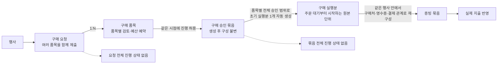
```mermaid
flowchart LR
    EVENT["행사"] --> REQUEST["구매 요청<br/>여러 품목을 함께 제출"]
    REQUEST -->|"1:N"| ITEM["구매 품목<br/>품목별 검토·예산 예약"]
    ITEM -->|"같은 시점에 진행 허용"| APPROVAL["구매 승인 묶음<br/>생성 후 구성 불변"]
    APPROVAL -->|"품목별 전체 승인 범위로<br/>초기 실행분 1개 자동 생성"| EXECUTION["구매 실행분<br/>주문 대기부터 시작하는 원본 단위"]
    EXECUTION -->|"같은 행사 안에서<br/>구매처·영수증·결제 관계로 재구성"| EVIDENCE["증빙 묶음"]
    EVIDENCE --> SPEND["실제 지출 반영"]

    REQUEST -.-> REQUEST_NOTE["요청 전체 진행 상태 없음"]
    APPROVAL -.-> APPROVAL_NOTE["묶음 전체 진행 상태 없음"]
```

### 2.2 전체 재정 알고리즘

정상 흐름은 아래와 같다. 구매 요청과 구매 승인 묶음은 관계를 보존하는 묶음이고, 실제 검토는 구매 품목, 주문 이후 진행은 구매 실행분, 증빙 정리는 증빙 묶음이 원본 단위다.

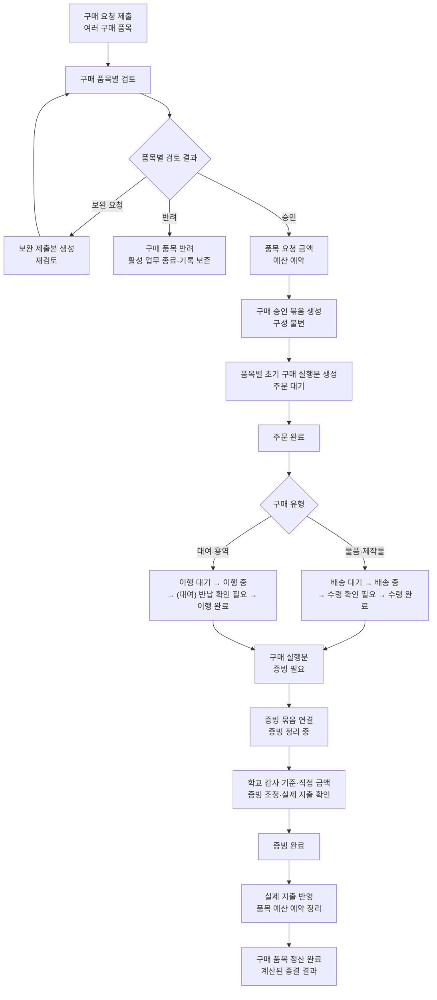
```mermaid
flowchart TD
    REQUEST["구매 요청 제출<br/>여러 구매 품목"] --> REVIEW["구매 품목별 검토"]
    REVIEW --> DECISION{"품목별 검토 결과"}
    DECISION -->|"보완 요청"| SUPPLEMENT["보완 제출본 생성<br/>재검토"]
    SUPPLEMENT --> REVIEW
    DECISION -->|"반려"| REJECT["구매 품목 반려<br/>활성 업무 종료·기록 보존"]
    DECISION -->|"승인"| RESERVE["품목 요청 금액<br/>예산 예약"]
    RESERVE --> APPROVAL["구매 승인 묶음 생성<br/>구성 불변"]
    APPROVAL --> EXECUTION["품목별 초기 구매 실행분 생성<br/>주문 대기"]
    EXECUTION --> ORDER["주문 완료"]
    ORDER --> TYPE{"구매 유형"}
    TYPE -->|"물품·제작물"| RECEIVE["배송 대기 → 배송 중<br/>→ 수령 확인 필요 → 수령 완료"]
    TYPE -->|"대여·용역"| FULFILL["이행 대기 → 이행 중<br/>→ (대여) 반납 확인 필요 → 이행 완료"]
    RECEIVE --> NEED["구매 실행분<br/>증빙 필요"]
    FULFILL --> NEED
    NEED --> BUNDLE["증빙 묶음 연결<br/>증빙 정리 중"]
    BUNDLE --> CHECK["학교 감사 기준·직접 금액<br/>증빙 조정·실제 지출 확인"]
    CHECK --> COMPLETE["증빙 완료"]
    COMPLETE --> BUDGET["실제 지출 반영<br/>품목 예산 예약 정리"]
    BUDGET --> SETTLED["구매 품목 정산 완료<br/>계산된 종결 결과"]
```

보완·선진행, 주문 취소·재주문, 수령 문제, 물품 반환과 증빙 정정은 이 정상 흐름을 지우거나 처음부터 다시 시작하지 않는다. 해당 사실이 발생한 처리 단위의 원본과 이력을 유지한 채 필요한 후속 업무만 계산한다.

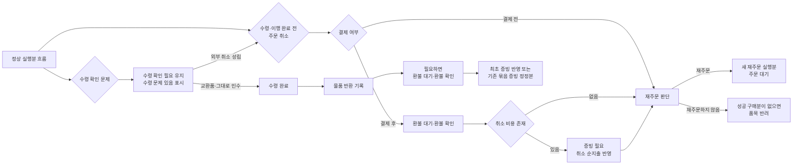
```mermaid
flowchart LR
    NORMAL["정상 실행분 흐름"] --> CANCEL{"수령·이행 완료 전<br/>주문 취소"}
    CANCEL --> PAID{"결제 여부"}
    PAID -->|"결제 전"| REORDER["재주문 판단"]
    PAID -->|"결제 후"| REFUND["환불 대기·환불 확인"]
    REFUND --> COST{"취소 비용 존재"}
    COST -->|"있음"| CANCEL_EVIDENCE["증빙 필요<br/>취소 순지출 반영"]
    COST -->|"없음"| REORDER
    CANCEL_EVIDENCE --> REORDER
    REORDER -->|"재주문"| NEW_EXECUTION["새 재주문 실행분<br/>주문 대기"]
    REORDER -->|"재주문하지 않음"| ITEM_RESULT["성공 구매분이 없으면<br/>품목 반려"]

    NORMAL --> RECEIVE_PROBLEM{"수령 확인 문제"}
    RECEIVE_PROBLEM --> HOLD["수령 확인 필요 유지<br/>수령 문제 있음 표시"]
    HOLD -->|"교환품·그대로 인수"| RECEIVED["수령 완료"]
    HOLD -->|"외부 취소 성립"| CANCEL

    RECEIVED --> RETURN["물품 반환 기록"]
    RETURN --> RETURN_REFUND["필요하면<br/>환불 대기·환불 확인"]
    RETURN_REFUND --> RETURN_EVIDENCE["최초 증빙 반영 또는<br/>기존 묶음 증빙 정정본"]
```

구체적인 처리 단위 예시는 다음과 같다.

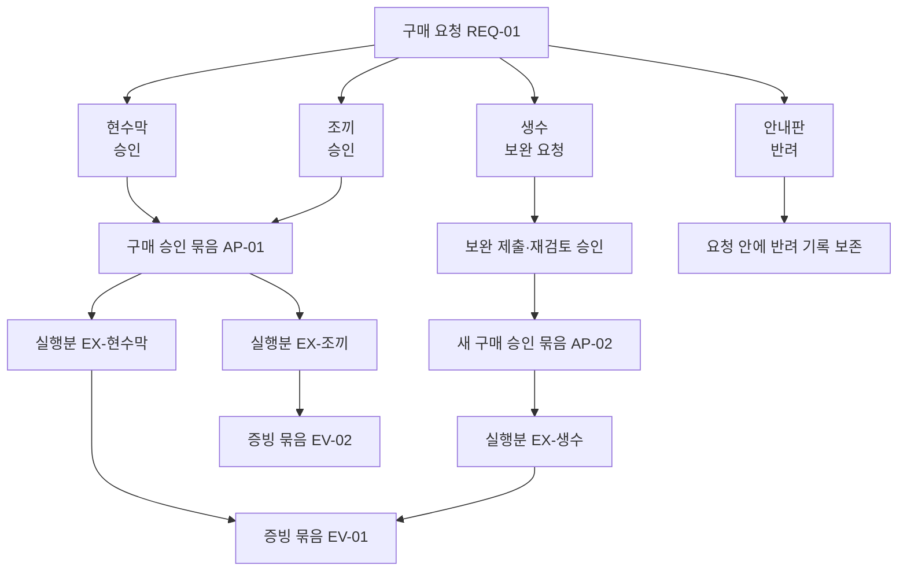
```mermaid
flowchart TD
    REQ["구매 요청 REQ-01"] --> BANNER["현수막<br/>승인"]
    REQ --> WATER["생수<br/>보완 요청"]
    REQ --> SIGN["안내판<br/>반려"]
    REQ --> VEST["조끼<br/>승인"]

    BANNER --> APPROVAL1["구매 승인 묶음 AP-01"]
    VEST --> APPROVAL1
    APPROVAL1 --> EX_BANNER["실행분 EX-현수막"]
    APPROVAL1 --> EX_VEST["실행분 EX-조끼"]

    WATER --> RESUBMIT["보완 제출·재검토 승인"]
    RESUBMIT --> APPROVAL2["새 구매 승인 묶음 AP-02"]
    APPROVAL2 --> EX_WATER["실행분 EX-생수"]

    EX_BANNER --> EVIDENCE1["증빙 묶음 EV-01"]
    EX_WATER --> EVIDENCE1
    EX_VEST --> EVIDENCE2["증빙 묶음 EV-02"]

    SIGN --> ARCHIVE["요청 안에 반려 기록 보존"]
```

`EV-01`처럼 같은 행사 안의 서로 다른 구매 승인 묶음 실행분을 함께 정리할 수 있고, 서로 다른 구매 요청의 실행분도 실제 구매처·결제·영수증 관계가 맞으면 같은 증빙 묶음에 연결할 수 있다. 반대로 하나의 승인 묶음에 속한 실행분도 실제 거래가 다르면 여러 증빙 묶음으로 나뉜다.

세부 규칙은 보완·선진행 6~7장, 주문 취소·재주문·환불 8.5~8.10, 물품 반환 8.11, 증빙·정정 9장, 역할별 칸반 계산 11장을 따른다.

### 2.3 상태 원본

| 원본 소유 단위 | 상태·관계 축 | 원본 값·관계 | 원본 상태가 아닌 것 |
|---|---|---|---|
| 구매 요청 | 없음 | 제출 관계와 소속 품목만 보존 | 부분 승인·구매 중·정산 중 같은 요청 전체 진행 상태 |
| 구매 품목 | 검토 상태 | 검토 대기, 보완 요청, 승인, 반려, 요청 취소 | 주문·배송·수령·이행·증빙 상태 |
| 구매 품목 | 승인·예산 | 승인 범위, 예산 예약 | 실행분별 구매 결과와 실제 지출 상태 |
| 구매 승인 묶음 | 없음 | 소속 요청·품목·초기 실행분 관계 | 묶음 전체 진행 상태. `철회됨`은 주문 전 전체 철회의 행정 표시 |
| 구매 실행분 | 주문 상태 | 주문 대기, 주문 완료, 구매 불가, 주문 취소 | 재주문 보류·재주문 판단·환불 대기·환불 확인 |
| 구매 실행분 | 물품 수령 상태 | 해당 없음, 배송 대기, 배송 중, 수령 확인 필요, 수령 완료 | 수령 문제 있음, 주문 취소 후 도착 |
| 구매 실행분 | 대여·용역 이행 상태 | 해당 없음, 이행 대기, 이행 중, 반납 확인 필요, 이행 완료 | 반납 지연 연체료, 파손·분실 배상, 이행 완료 후 용역 대금 조정 |
| 구매 실행분 | 증빙 상태 | 해당 없음, 증빙 필요, 증빙 정리 중, 증빙 완료 | 일부 증빙 완료·정산 완료 |
| 증빙 묶음 | 증빙 진행 | 증빙 정리 중, 증빙 완료와 불변 완료본·정정본 | 작성 취소됨 칸반 상태 |

`재주문 보류`, `재주문 판단`, `환불 대기`, `환불 확인`은 원본 사실과 남은 조건에서 계산한 재정부 처리 단계다. `수령 문제 있음`, `주문 취소 후 도착`은 보조 표시다. `일부 증빙 완료`, `증빙 완료`, `정산 완료`는 구매 품목 수준의 집계 또는 종결 결과다.

- 구매 요청은 품목을 제출하기 위한 행정적 묶음이다.
- 구매 요청은 제출 이후 검토·구매·배송·정산 등의 통합 진행 상태를 갖지 않는다.
- 구매 요청 아카이브에서는 요청에 속한 각 구매 품목의 상태를 표시한다.
- `요청 취소`는 주문 완료 전 원래 요청자가 품목별로 구매 요청을 철회한 원본 종결 상태이며 구매 요청 전체의 상태가 아니다.
- 검토 상태, 승인 범위와 예산 예약의 원본은 구매 품목에 둔다.
- 검토 이후 주문·수령 또는 이행·증빙 상태의 원본은 구매 실행분에 둔다.
- 구매 승인 묶음이 생성되면 포함된 각 구매 품목의 전체 승인 범위에 해당하는 초기 구매 실행분을 하나씩 자동 생성한다.
- 초기 구매 실행분의 주문 상태는 `주문 대기`, 수령·이행 상태와 증빙 상태는 각각 `해당 없음`으로 시작한다.
- 구매 품목에는 주문·수령 또는 이행·증빙 상태를 중복 저장하지 않고 소속 구매 실행분의 원본 상태에서 진행 결과를 집계한다.
- 구매 품목의 집계 결과는 직접 수정할 수 없으며 소속 구매 실행분의 원본 상태가 바뀌면 다시 계산한다.
- 구매 실행분의 원본 증빙 상태 `증빙 완료`는 원칙적으로 종결 상태이지만, 완료 후 물품 반환의 확정 금액을 반영해야 하면 예외적으로 `증빙 필요`로 되돌아갈 수 있다. 이는 완료본 무효화가 아니라 새 반영 업무가 생긴 것이며 세부는 9.2를 따른다.
- 구매 승인 묶음도 통합 진행 상태를 갖지 않고 소속 품목·구매 실행분의 현재 상태를 보여준다.
- 일반 사용자용 대표 상태와 재정부용 처리 상태를 별도로 저장하지 않는다.
- 품목의 원본 상태를 역할에 맞는 문구로 계산해 보여준다.
- 일반 사용자용 대표 진행 상태는 요청자에게 필요한 조치와 정상 흐름을 중단한 예외를 우선하며, 그 외 정상 흐름에서는 마지막으로 달성된 업무 결과를 보여준다.
- 재정부용 처리 단계는 담당자가 현재 처리해야 하는 다음 미완료 업무를 보여준다.
- 주문·수령 또는 이행·증빙처럼 서로 다른 상태 축은 동시에 존재할 수 있으며 하나의 통합 상태로 합치지 않는다.
- 칸반 카드의 열 위치는 원본 상태가 아니라 각 보드의 목적에 맞게 계산한 표시 결과다.
- 같은 카드는 하나의 보드에서 반드시 하나의 열에만 배치하며 여러 원본 상태의 세부 내용은 카드나 상세에서 함께 표시할 수 있다.

### 2.4 상태와 칸반 위치

- `원본 상태`는 구매 품목·구매 실행분·증빙 묶음 등 해당 처리 단위의 실제 진행 사실을 나타내는 기준 상태다.
- `대표 진행 상태`는 원본 상태를 계산해 일반 사용자에게 필요한 조치·예외 또는 정상 흐름에서 마지막으로 달성된 업무 결과를 보여주는 표시다.
- `처리 단계`는 원본 상태를 계산해 재정부가 현재 처리해야 하는 다음 미완료 업무를 보여주는 표시다.
- `주문 취소 요청`은 요청자가 재정부에 외부 주문 취소 처리를 요구하는 후속 요청 기록이며 구매 실행분의 원본 주문 상태가 아니다.
- `칸반 위치`는 특정 보드에서 카드가 놓이는 하나의 열이며 별도 원본 상태로 저장하지 않는다.
- 같은 대상도 일반 사용자 보드와 재정부 보드의 목적이 다르면 서로 다른 대표 문구로 표시될 수 있지만, 같은 보드 안에서는 하나의 열에만 속한다.
- 원본 상태가 변경되면 칸반 위치를 다시 계산하며, 칸반 위치만 독립적으로 변경해 원본 상태와 다르게 만들지 않는다.
- `재정부 업무 영역`은 재정부의 처리 단계를 업무 목적별로 나누어 보여주는 상위 표시 구분이며 원본 상태, 처리 단계, 권한 단위나 독립된 도메인 경계가 아니다.
- 재정부 업무 영역은 `요청 검토`, `구매 준비`, `물품 배송·수령`, `대여 이행`, `용역 이행`, `환불`, `증빙`의 일곱 가지로 구성한다. 배송·수령·이행은 구매 유형에 따라 물품 배송·수령, 대여 이행, 용역 이행 세 영역으로 나눈다(대여는 반납 확인 필요를 거치고 용역은 반납이 없다).
- 각 업무 영역은 자신에게 속한 처리 단계를 별도의 칸반 보드로 보여주며, `환불` 업무 영역은 자동 계산되는 `환불 대기`와 `환불 확인` 두 칸반 열로 구성한다.
- 모든 업무 영역은 같은 구매 요청·구매 품목·구매 승인 묶음·구매 실행분·증빙 묶음의 원본 상태와 관계를 공동으로 사용한다.
- 한 업무 영역의 처리가 원본 상태나 관계를 바꾸면 별도 전달·동기화 상태 없이 모든 업무 영역의 처리 단계와 칸반 위치를 다시 계산한다.
- 같은 구매 품목·구매 실행분·증빙 묶음의 활성 카드는 다섯 재정부 업무 영역 전체에서 최우선 다음 업무를 기준으로 한 영역과 그 안의 한 칸반 열에만 표시한다.
- 같은 구매 요청에 속하더라도 서로 다른 구매 품목이나 구매 실행분은 각자의 최우선 다음 업무에 따라 서로 다른 업무 영역에 동시에 존재할 수 있다.
- 주문 취소 실행분과 연결된 재주문 실행분처럼 별도 처리 단위인 카드는 같은 품목에 속해도 서로 다른 업무 영역에 표시할 수 있으며 이를 같은 카드의 중복으로 보지 않는다.

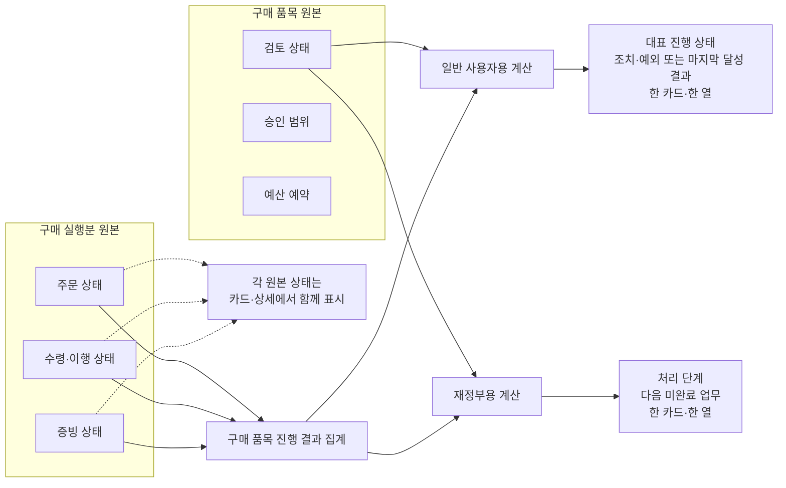
```mermaid
flowchart LR
    subgraph ITEM_SOURCE["구매 품목 원본"]
        REVIEW["검토 상태"]
        SCOPE["승인 범위"]
        BUDGET["예산 예약"]
    end

    subgraph EXECUTION_SOURCE["구매 실행분 원본"]
        ORDER["주문 상태"]
        RECEIVE["수령·이행 상태"]
        EVIDENCE["증빙 상태"]
    end

    ORDER --> ITEM_AGG["구매 품목 진행 결과 집계"]
    RECEIVE --> ITEM_AGG
    EVIDENCE --> ITEM_AGG

    REVIEW --> USER_CALC["일반 사용자용 계산"]
    ITEM_AGG --> USER_CALC

    REVIEW --> FINANCE_CALC["재정부용 계산"]
    ITEM_AGG --> FINANCE_CALC

    USER_CALC --> USER_COLUMN["대표 진행 상태<br/>조치·예외 또는 마지막 달성 결과<br/>한 카드·한 열"]
    FINANCE_CALC --> FINANCE_COLUMN["처리 단계<br/>다음 미완료 업무<br/>한 카드·한 열"]

    ORDER -.-> DETAIL["각 원본 상태는<br/>카드·상세에서 함께 표시"]
    RECEIVE -.-> DETAIL
    EVIDENCE -.-> DETAIL
```

주문 취소·환불·재주문 관계와 증빙 단계의 구매 실행분 카드·증빙 묶음 카드 표시는 확정된 원칙과 현재 상태 표에서 계산한다. 그 밖의 정상 흐름도 일반 사용자의 마지막 달성 결과와 재정부의 다음 미완료 업무라는 확정 원칙 및 현재 상태 표에서 계산하며, 모든 상태 조합의 전체 우선순위를 별도 미결정 사항으로 두지 않는다.

#### 보드별 상태 선택 원칙

- 일반 사용자 `품목 현황`은 요청자에게 응답이 필요한 상태나 정상 흐름을 중단한 예외가 있으면 이를 정상 진행 결과보다 우선 표시한다.
- 일반 사용자에게 필요한 조치·예외가 없다면 정상 흐름에서 마지막으로 달성된 업무 결과를 대표 진행 상태로 표시한다.
- `증빙 필요`처럼 아직 시작되지 않은 재정부 내부 후속 작업만으로 일반 사용자 카드를 다음 결과 단계로 이동하지 않는다.
- 재정부 `처리 단계`는 달성된 이전 결과보다 현재 남아 있는 다음 처리 업무를 우선 표시한다.
- 학교 감사 기준상 요구 항목과 실제 지출이 확인되고 품목 예산 예약까지 정리된 `정산 완료`는 구매 실행분이나 증빙 묶음의 원본 상태 또는 처리 단계가 아니라 원본 상태·실제 지출·예산 처리 결과에서 계산하는 구매 품목의 종결 결과다.
- `정산 완료` 대상은 재정부의 다음 업무가 없으므로 활성 `처리 단계`에서 제외하되 일반 사용자 `처리 완료`, 아카이브·상세와 사용 내역에서는 결과와 이력을 계속 표시한다.
- 구매 품목의 원본 검토 상태 `반려`는 해당 품목을 더 이상 구매하지 않기로 확정한 종결 상태이므로 별도 `반려 완료` 처리 단계를 두지 않는다.
- 승인 후 반려는 성공적으로 구매된 실행분이 없고 환불·취소 비용 증빙·실제 지출·예산 예약 정리를 모두 끝낼 수 있는 처리에서만 전환하며, 전환 후 활성 `처리 단계`에서 제외하고 기록은 아카이브·상세에 보존한다.
- 구매 실행분의 원본 주문 상태 `주문 완료`는 달성 결과이므로 재정부 처리 단계로 사용하지 않는다.
- 구매 실행분의 원본 주문 상태 `주문 취소`도 외부 취소가 성립했다는 사실이므로 그 자체를 재정부 처리 단계로 사용하지 않는다.
- 주문 취소 실행분은 일반 사용자 `품목 현황`에서 같은 이름의 대표 진행 상태 `주문 취소`로 표시한다.
- 새 재주문 실행분은 실제 주문 전까지 일반 사용자 대표 진행 상태 `구매 준비`를 재사용하고, 카드·상세에 `재주문` 관계를 표시한다.
- 일반 사용자에게 `환불 대기`·`환불 확인`·`증빙 필요`·`재주문 보류`를 별도 대표 진행 상태나 칸반 열로 노출하지 않고 카드·상세의 보조 정보로만 제공한다.
- 증빙 묶음에 연결되지 않은 증빙 대상 실행분은 재정부 활성 처리 보드에서 실행분별 `증빙 필요` 카드로 표시한다.
- 실행분이 증빙 묶음에 연결되는 순간 해당 실행분의 개별 활성 카드를 제외하고 증빙 묶음 카드 하나가 `증빙 정리 중` 업무를 대표한다.
- 연결된 실행분의 원본 증빙 상태와 품목·요청 관계는 삭제하지 않고 증빙 묶음 상세와 기존 아카이브에서 계속 조회한다.
- 주문 취소 실행분의 재정부 처리 단계는 결제 여부, 환불 확인 업무와 결과, 재주문 판단, 취소 비용 증빙 등에서 현재 남아 있는 정확한 후속 업무를 계산해 표시한다.
- 결제 후 주문 취소 실행분의 환불 결과가 미확정이고 판매자의 환불·응답 등 외부 결과가 남아 있으면 `환불 대기`, 필요한 외부 자료가 갖춰져 재정부의 최종 대조·확정만 남으면 `환불 확인`으로 계산한다.
- `환불 대기`와 `환불 확인`은 원본 상태가 아니라 공통 환불 자료에서 자동 계산하는 재정부 칸반 열이며 수동 이동하지 않는다.
- 환불 지연은 `환불 대기`의 경과 정보로 표시하고 `환불 지연`·`환불 완료` 열은 만들지 않는다.
- 수령 완료 후 물품 반환의 환불 추적에도 주문 취소와 같은 `환불 대기`·`환불 확인` 계산 규칙을 재사용하며 반환 전용 환불 상태·처리 단계·칸반 열을 만들지 않는다.
- 물품 반환의 환불 결과가 미확정인 경우에만 해당 구매 실행분을 `환불` 업무 영역의 `환불 대기` 또는 `환불 확인`에 표시한다.
- 물품 반환 기록을 만들 때 최종 환불 결과와 근거가 이미 확인되면 같은 처리에서 환불 확인 업무를 끝내고 활성 환불 카드 없이 다음 미완료 업무를 다시 계산한다.
- 이전에 정산 완료돼 활성 업무 영역에서 제외된 구매 실행분도 물품 반환의 환불 결과가 미확정이면 새 후속 업무로 `환불 대기` 또는 `환불 확인`에 다시 표시하되 기존 주문·수령·정산 이력을 되돌리지 않는다.
- `환불 대기`와 `환불 확인`은 주문 취소 후 도착한 물품의 반송·처분이 미해결인 경우를 제외하고 해당 취소 실행분의 재주문 판단·취소 비용 증빙·품목 반려 판단보다 우선하며, 등록된 환불 내역과 추가 환불 예정 여부는 카드·상세의 보조 정보로 표시한다.
- 물품 반환에도 기존 `전액 환불`, `일부 환불`, `환불 없음`을 최종 환불 결과로 재사용하되 원본 상태·처리 단계·칸반 열로 만들지 않는다.
- 물품 반환의 최종 환불 결과가 확정되면 그 결과와 기존 증빙·실제 지출·예산 상태에서 다음 업무 영역을 계산한다.
- 환불 결과가 확정되고 취소 수수료·환불 불가액이 남은 주문 취소 실행분은 기존 원본 증빙 상태와 재정부 처리 단계 `증빙 필요`로 전환하며 별도 `취소 비용 증빙` 상태·열을 만들지 않는다.
- 전액 환불되고 취소 비용이 없는 실행분은 실제 지출 0원으로 증빙 대상에서 제외하고 `증빙 필요`로 전환하지 않는다.
- 취소 비용이 남은 실행분과 연결된 재주문 실행분은 미리 생성할 수 있지만, 취소 실행분의 `증빙 완료`, 취소 순지출액 실제 지출 반영과 행사 사용 가능 예산 확인 전에는 실제 주문하거나 `주문 완료`로 전환할 수 없다.
- 미리 생성된 재주문 실행분의 원본 주문 상태는 `주문 대기`로 유지하되 실제 주문 차단 조건이 하나라도 남아 있으면 재정부 처리 단계 `재주문 보류`에 둔다.
- `재주문 보류`에서는 환불 결과 미확정, 취소 비용 증빙·실제 지출 미완료, 행사 사용 가능 예산 미확인 등 현재 남은 차단 사유를 모두 카드·상세에 표시한다.
- 모든 차단 조건이 해소되면 별도 보류 해제 처리 없이 기존 `주문 대기` 처리 단계로 자동 재계산하며, 차단 조건을 바꾼 원본 처리자·시각과 변경 이력을 감사 기록으로 사용한다.
- 취소 실행분의 환불·취소 비용 증빙·실제 지출·예산 문제가 모두 정리됐지만 재주문 여부가 결정되지 않았으면 `재주문 판단`을 재정부 처리 단계로 계산한다.
- `재주문 판단` 결과는 새 재주문 실행분 생성 또는 사유를 포함한 `재주문하지 않음` 결정 기록이며, 별도 원본 주문 상태를 만들지 않는다.
- 주문 완료 처리 후 물품·제작물 실행분은 `배송 대기`, 대여·용역 실행분은 `이행 대기`를 다음 미완료 업무로 표시한다.
- 선택되지 않은 다른 원본 상태는 사라지지 않고 카드 보조 정보와 상세에서 함께 표시한다.
- 담당자 변경은 원본 상태나 처리 단계가 아니므로 담당자만 바뀌었다는 이유로 칸반 위치를 변경하지 않는다.

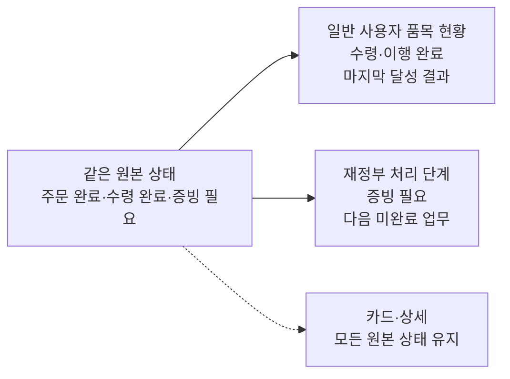
```mermaid
flowchart LR
    SOURCE["같은 원본 상태<br/>주문 완료·수령 완료·증빙 필요"]
    SOURCE --> USER["일반 사용자 품목 현황<br/>수령·이행 완료<br/>마지막 달성 결과"]
    SOURCE --> FINANCE["재정부 처리 단계<br/>증빙 필요<br/>다음 미완료 업무"]
    SOURCE -.-> DETAIL["카드·상세<br/>모든 원본 상태 유지"]
```

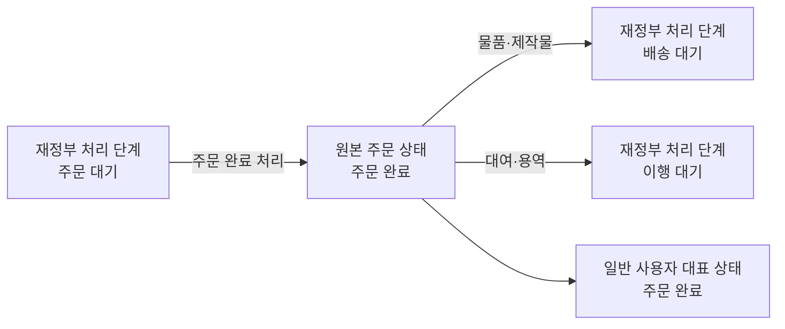
```mermaid
flowchart LR
    WAIT["재정부 처리 단계<br/>주문 대기"] -->|"주문 완료 처리"| ORDERED["원본 주문 상태<br/>주문 완료"]
    ORDERED -->|"물품·제작물"| DELIVERY["재정부 처리 단계<br/>배송 대기"]
    ORDERED -->|"대여·용역"| SERVICE["재정부 처리 단계<br/>이행 대기"]
    ORDERED --> USER["일반 사용자 대표 상태<br/>주문 완료"]
```

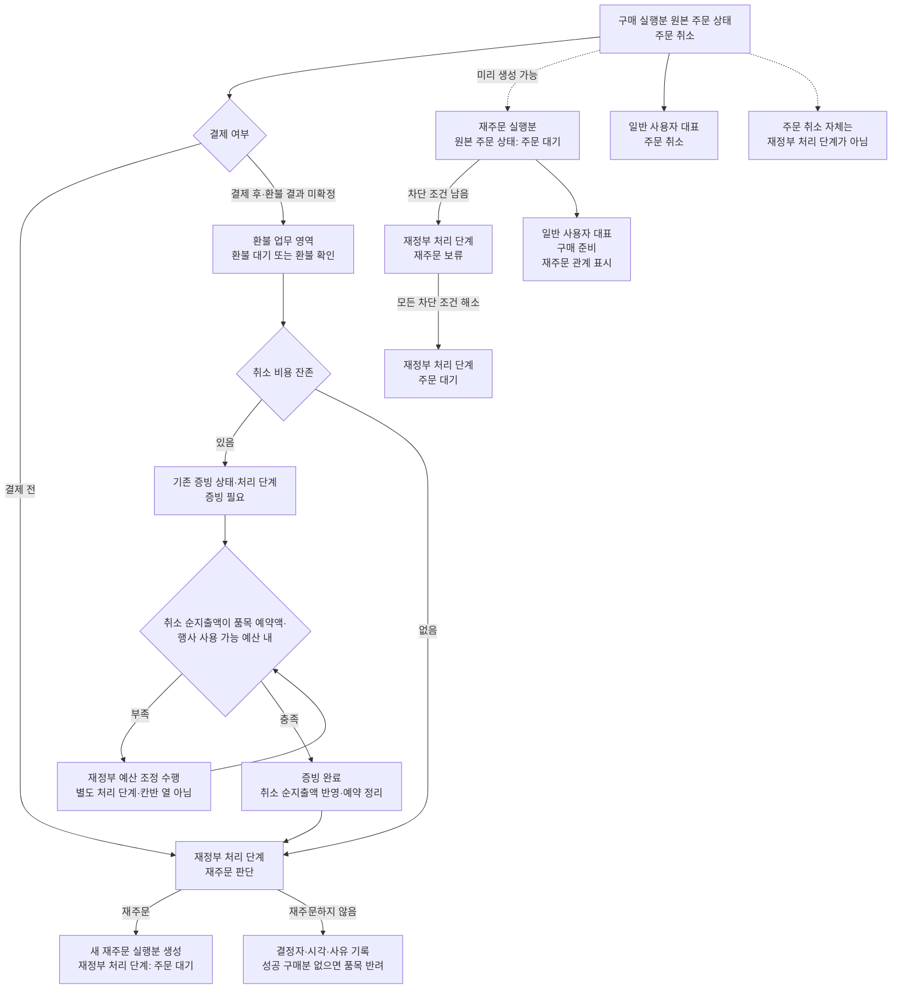
```mermaid
flowchart TD
    CANCEL["구매 실행분 원본 주문 상태<br/>주문 취소"] --> PAID{"결제 여부"}
    PAID -->|"결제 전"| DECIDE["재정부 처리 단계<br/>재주문 판단"]
    PAID -->|"결제 후·환불 결과 미확정"| REFUND["환불 업무 영역<br/>환불 대기 또는 환불 확인"]
    REFUND --> COST{"취소 비용 잔존"}
    COST -->|"있음"| EVIDENCE["기존 증빙 상태·처리 단계<br/>증빙 필요"]
    EVIDENCE --> BUDGET{"취소 순지출액이 품목 예약액·<br/>행사 사용 가능 예산 내"}
    BUDGET -->|"부족"| ADJUST["재정부 예산 조정 수행<br/>별도 처리 단계·칸반 열 아님"]
    ADJUST --> BUDGET
    BUDGET -->|"충족"| SPEND["증빙 완료<br/>취소 순지출액 반영·예약 정리"]
    SPEND --> DECIDE
    COST -->|"없음"| DECIDE
    CANCEL -.->|"미리 생성 가능"| PREPARED["재주문 실행분<br/>원본 주문 상태: 주문 대기"]
    PREPARED -->|"차단 조건 남음"| HOLD["재정부 처리 단계<br/>재주문 보류"]
    HOLD -->|"모든 차단 조건 해소"| READY["재정부 처리 단계<br/>주문 대기"]
    DECIDE -->|"재주문"| NEW["새 재주문 실행분 생성<br/>재정부 처리 단계: 주문 대기"]
    DECIDE -->|"재주문하지 않음"| NO_REORDER["결정자·시각·사유 기록<br/>성공 구매분 없으면 품목 반려"]
    CANCEL --> USER_CANCEL["일반 사용자 대표<br/>주문 취소"]
    PREPARED --> USER_REORDER["일반 사용자 대표<br/>구매 준비<br/>재주문 관계 표시"]
    CANCEL -.-> NOTE["주문 취소 자체는<br/>재정부 처리 단계가 아님"]
```

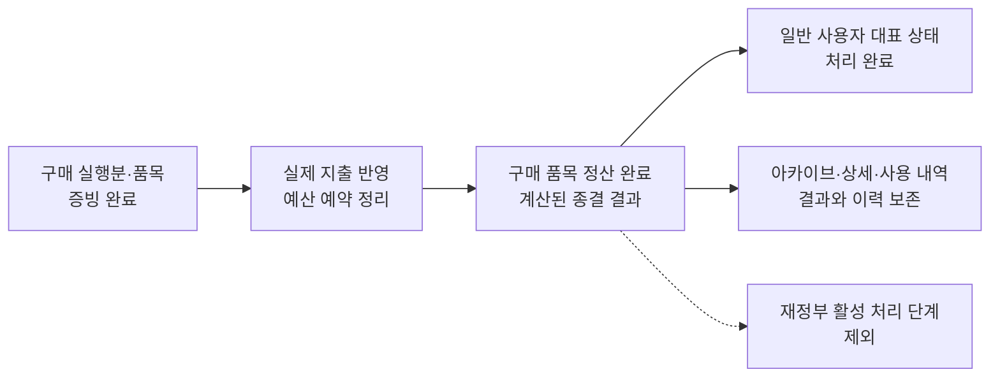
```mermaid
flowchart LR
    EVIDENCE["구매 실행분·품목<br/>증빙 완료"] --> BUDGET["실제 지출 반영<br/>예산 예약 정리"]
    BUDGET --> RESULT["구매 품목 정산 완료<br/>계산된 종결 결과"]
    RESULT --> USER["일반 사용자 대표 상태<br/>처리 완료"]
    RESULT --> ARCHIVE["아카이브·상세·사용 내역<br/>결과와 이력 보존"]
    RESULT -.-> FINANCE["재정부 활성 처리 단계<br/>제외"]
```

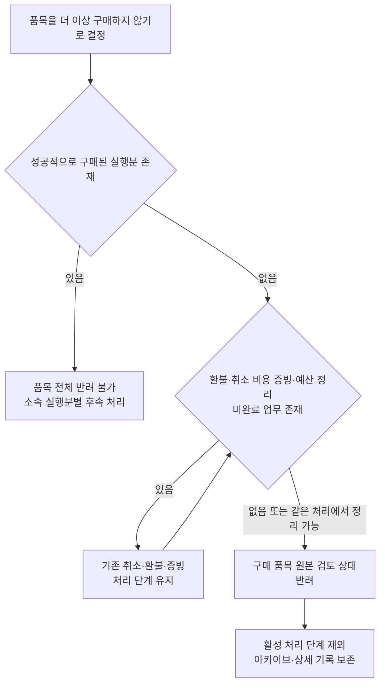
```mermaid
flowchart TD
    DECISION["품목을 더 이상 구매하지 않기로 결정"] --> SUCCESS{"성공적으로 구매된 실행분 존재"}
    SUCCESS -->|"있음"| KEEP["품목 전체 반려 불가<br/>소속 실행분별 후속 처리"]
    SUCCESS -->|"없음"| REMAIN{"환불·취소 비용 증빙·예산 정리<br/>미완료 업무 존재"}
    REMAIN -->|"있음"| TASK["기존 취소·환불·증빙<br/>처리 단계 유지"]
    TASK --> REMAIN
    REMAIN -->|"없음 또는 같은 처리에서 정리 가능"| REJECT["구매 품목 원본 검토 상태<br/>반려"]
    REJECT --> ARCHIVE["활성 처리 단계 제외<br/>아카이브·상세 기록 보존"]
```

#### 품목 카드와 구매 실행분 카드 전환

- 구매 승인 묶음 생성 전에는 일반 사용자와 재정부 모두 구매 품목을 카드의 표시 대상으로 사용한다.
- 구매 승인 묶음 생성 후 재정부 `처리 단계`에서는 품목별 초기 구매 실행분을 각각 `주문 대기` 카드로 표시한다.
- 일반 사용자 `품목 현황`에서는 철회되지 않은 구매 승인 묶음에 속한 구매 실행분이 하나뿐인 동안 구매 품목 카드 하나를 유지하고, 그 실행분 원본 상태를 집계한 대표 진행 상태를 표시한다.
- 부분 주문·부분 취소·재주문 등으로 같은 품목과 철회되지 않은 구매 승인 묶음에 속한 구매 실행분이 둘 이상이 되면 그 시점부터 실행분별로 별도 카드를 표시한다.
- 한 번 여러 실행분으로 분리 표시된 품목은 실행분들의 상태가 나중에 같아져도 품목 카드 하나로 다시 합치지 않는다.
- 주문 전 구매 승인 묶음이 철회되면 해당 묶음의 초기 구매 실행분은 삭제하지 않고 아카이브에 보존하되 활성 칸반과 현재 품목 진행 집계에서 제외한다.
- 철회 후 새 구매 승인 묶음으로 재진행하면 기존 실행분을 재사용하지 않고 새 묶음에 연결된 초기 구매 실행분을 새로 생성한다.

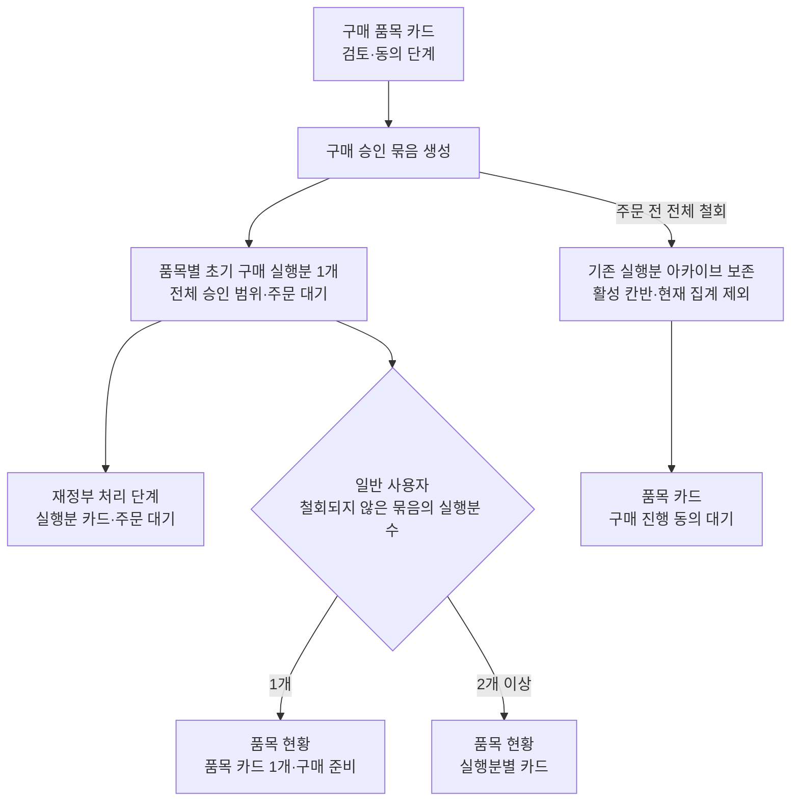
```mermaid
flowchart TD
    ITEM["구매 품목 카드<br/>검토·동의 단계"] --> APPROVAL["구매 승인 묶음 생성"]
    APPROVAL --> INITIAL["품목별 초기 구매 실행분 1개<br/>전체 승인 범위·주문 대기"]
    INITIAL --> FINANCE["재정부 처리 단계<br/>실행분 카드·주문 대기"]
    INITIAL --> COUNT{"일반 사용자<br/>철회되지 않은 묶음의 실행분 수"}
    COUNT -->|"1개"| USER_ITEM["품목 현황<br/>품목 카드 1개·구매 준비"]
    COUNT -->|"2개 이상"| USER_EXEC["품목 현황<br/>실행분별 카드"]
    APPROVAL -->|"주문 전 전체 철회"| WITHDRAWN["기존 실행분 아카이브 보존<br/>활성 칸반·현재 집계 제외"]
    WITHDRAWN --> WAIT["품목 카드<br/>구매 진행 동의 대기"]
```

### 2.5 책임과 기록

- 재정 단계 전환 버튼을 누른 사람이 해당 전환의 처리 책임자가 된다.
- 모든 상태 전환에는 처리자, 처리 시각, 이전 상태, 변경 상태와 처리 사유를 남긴다.
- 요청자의 `주문 취소 요청` 제출은 재정 상태 전환이 아니며, 외부 취소 성립 여부를 확인하고 구매 실행분의 원본 주문 상태를 전환하는 책임은 재정부에 있다.
- 구매 품목의 집계 결과와 칸반 위치에는 별도 수동 처리자를 두지 않고, 계산의 원인이 된 구매 실행분 원본 상태 전환 기록을 기준으로 추적한다.
- 자기 요청을 재정부 구성원이 직접 검토하는 것은 제한하지 않는다.
- 자기 요청 검토 여부와 처리 결과는 다른 검토와 동일하게 기록한다.

## 3. 핵심 도메인 단위

### 구매 요청

한 행사에서 필요한 하나 이상의 구매 품목을 묶어 재정부에 검토를 요청하는 제출 단위다.

- 반드시 하나의 행사에 속한다.
- 행사, 요청 부서, 요청자, 요청 제목, 구매 목적, 필요일, 우선순위와 하나 이상의 품목 목록을 가진다.
- 요청 참고사항과 요청 공통 첨부자료를 선택적으로 가질 수 있다.
- 요청 안의 품목들은 제출 이후 서로 다른 상태를 가질 수 있다.
- 보완 품목이 구매 승인 묶음에서 제외돼도 원래 구매 요청과 품목 관계는 삭제하지 않는다.
- 일부 또는 모든 품목이 `요청 취소`돼도 구매 요청과 품목의 제출 관계를 삭제하지 않고 전체 요청 아카이브에 보존한다.

### 구매 품목

구매 요청에 포함된 개별 물품·제작물·대여·용역으로, 검토·승인 범위·예산 예약과 소속 구매 실행분의 진행 결과를 관리하는 품목 단위다.

- 품목명, 유형, 수량, 단위, 예상 단가, 자동 계산된 요청 금액, 예산 항목과 가격 근거를 가진다.
- 품목 필요 사유, 희망 구매처, 상품·서비스 URL과 품목 참고사항을 선택적으로 가질 수 있고 구매 유형에 따른 조건부 필수 세부 정보와 첨부자료를 가진다.
- 검토 상태, 승인 범위와 예산 예약을 원본으로 가진다.
- 주문·수령 또는 이행·증빙 진행 결과는 소속 구매 실행분의 원본 상태에서 계산하며 품목에 같은 상태를 중복 저장하지 않는다.
- 승인, 보완 요청, 반려, 요청 취소와 예산 예약은 품목별로 적용한다.
- 주문, 배송, 수령 또는 이행과 증빙 처리는 구매 실행분에 적용하고 품목에서는 그 결과를 집계한다.
- 실제 구매가 여러 구매처·주문·결제·영수증으로 나뉘면 하나 이상의 구매 실행분을 가진다.
- 일부 구매 실행분의 주문이 취소돼도 다른 구매 실행분의 구매 사실과 상태는 유지한다.
- 주문 취소 후 성공적으로 구매된 실행분이 하나도 없고 더 이상 구매하지 않기로 결정한 경우에만 품목 전체를 반려한다.
- 승인 후 품목을 반려할 때는 환불·취소 비용 증빙·실제 지출·예산 예약 정리를 완료하거나 같은 처리에서 함께 완료하며 별도 `반려 완료` 상태를 두지 않는다.
- 원래 요청자는 해당 품목의 어떤 구매 실행분도 `주문 완료`가 되기 전까지 사유를 입력해 품목을 `요청 취소`로 종결할 수 있다.
- 요청 취소된 품목은 활성 검토·구매 준비·품목 현황에서 제외하고 전체 요청 아카이브에 취소 전 내용·이전 검토 상태·취소 사유·취소자·취소 시각을 보존한다.

### 구매 승인 묶음

하나의 구매 요청에서 같은 시점에 구매 진행이 허용된 하나 이상의 승인 품목을 함께 보관하는 기록 단위다.

- 반드시 하나의 원래 구매 요청에 속한다.
- 생성 시점에 포함된 승인 품목과 원래 구매 요청의 연결 관계를 유지한다.
- 생성 후 소속 품목을 추가하거나 제외하지 않는다.
- 재정부가 선진행 가능으로 선택하고 요청자가 제안 전체에 동의한 승인 품목으로 묶음을 생성한다.
- 보완 품목이 재제출 후 승인되면 기존 묶음에 합치지 않고 별도의 구매 승인 묶음을 생성한다.
- 묶음 생성 시 포함된 각 품목의 전체 승인 범위에 해당하는 초기 구매 실행분을 하나씩 자동 생성한다.
- 각 초기 구매 실행분은 자신을 생성한 구매 승인 묶음과 구매 품목에 함께 연결한다.
- 검토 단계에서 반려된 품목은 구매 승인 묶음에 포함하지 않고 원래 구매 요청에서 반려 결과를 조회한다.
- 구매 승인 묶음 생성 후 주문 취소를 거쳐 반려된 품목은 기존 묶음에서 제거하지 않고 반려 결과를 함께 표시한다.
- 묶음 자체의 통합 진행 상태는 두지 않고 소속 품목과 구매 실행분의 현재 상태를 표시한다.
- 주문 전 묶음 전체가 철회된 경우에만 진행 상태가 아닌 행정 표시인 `철회됨`을 남긴다.
- 구매 승인 아카이브는 구매 승인 묶음들이 쌓이는 조회 화면이다.
- 승인 묶음 생성 후 주문 완료 전에 품목이 요청 취소돼도 당시 묶음의 소속 관계는 감사 이력에서 삭제하지 않는다.
- 요청 취소된 품목과 주문되지 않은 초기 실행분은 구매 승인 아카이브의 일반 목록·묶음 상세·현재 집계에서 자동 제외한다. 제외 결과 묶음에 표시할 품목이 하나도 없으면 해당 묶음도 구매 승인 아카이브에서 표시하지 않는다.
- 승인 묶음의 원래 구성과 요청 취소에 따른 자동 제외 사실은 전체 요청 아카이브와 감사 기록에서 조회한다.

### 구매 실행분

승인된 하나의 구매 품목의 수량·이행 범위 중 주문, 수령 또는 이행, 취소·재주문과 증빙을 하나의 일관된 상태로 관리할 수 있는 최소 진행 단위다.

- 반드시 하나의 구매 품목에 속한다.
- 자신에게 구매 진행 권한을 부여한 하나의 구매 승인 묶음에 직접 연결한다.
- 원래 구매 품목의 승인 범위를 벗어날 수 없다.
- 구매 승인 묶음 생성 시 해당 품목의 전체 승인 범위에 대해 초기 구매 실행분 하나를 자동 생성한다.
- 초기 구매 실행분은 주문 상태 `주문 대기`, 수령·이행 상태 `해당 없음`, 증빙 상태 `해당 없음`으로 시작한다.
- 초기 구매 실행분 생성은 별도 수동 업무가 아니라 구매 승인 묶음 생성의 결과이며, 묶음 생성 처리자·생성 시각과 생성 원인을 함께 추적한다.
- 실제 수량 또는 이행 범위, 주문·수령 또는 이행 상태와 직접 금액을 가진다.
- 검토 이후 실제 구매 진행에서 주문 상태, 수령 또는 이행 상태와 증빙 상태의 원본 단위가 된다.
- 서로 다른 상태 축인 주문 상태, 수령 또는 이행 상태와 증빙 상태를 각각 하나씩 가지며 하나의 통합 상태로 합치지 않는다.
- 주문번호·구매처·상업적 주문자·상업적 주문 시각은 구매 실행분에 별도 입력하지 않고 증빙 정리 시 구매처·구매 종류·영수증·결제 정보로 기록한다.
- 외부 주문의 취소가 성립하면 환불 완료 여부와 관계없이 해당 구매 실행분의 주문 상태를 `주문 취소`로 변경한다.
- 결제 후 주문 취소의 환불 확인 업무는 주문 상태와 분리된 재정 후속 작업으로 관리한다.
- `주문 취소`는 해당 구매 실행분의 수령 또는 이행이 완료되기 전에 외부 취소가 성립한 경우에만 적용한다.
- 수령 완료 후 물품 반환은 기존 주문·수령 상태를 되돌리지 않는 별도 후속 절차로 관리한다.
- 용역 이행 완료 전 전체 또는 일부 미이행 범위를 취소하면 기존 주문 취소·부분 취소 규칙을 사용한다.
- 이행 완료 후 발생하는 환불·감액·배상은 주문 취소나 `용역 해지`로 부르지 않고 `이행 완료 후 용역 대금 조정`으로 구분하되 현재 범위에서는 특수 사례로 보류한다.
- 수령 완료 후 일부 물품 반환은 반환 수량·범위를 별도 기록하되 구매 실행분을 분할하거나 원래 직접 금액을 변경하지 않는다.
- 구매 실행분의 일부 수량·이행 범위만 취소되면 기존 실행분은 계속 진행되는 범위로 조정하고 취소 범위는 새 구매 실행분으로 분리한다.
- 부분 취소 전후의 수량·이행 범위 총합은 같아야 하며 원래 범위와 분할 관계를 보존한다.
- 취소된 범위를 재주문하면 취소 실행분을 되돌리지 않고 새 구매 실행분을 만들어 연결한다.
- 재주문 실행분은 원래 구매 품목과 구매 승인 묶음에 그대로 속하며 새 품목·묶음·예산 예약을 만들지 않는다.
- 결제 후 취소된 실행분의 환불 결과가 확인되기 전에도 재주문 실행분을 `주문 대기`로 만들 수 있지만 실제 주문과 `주문 완료` 전환은 허용하지 않는다.
- 결제 후 취소된 실행분에는 취소 대상 결제액, 개별 환불액·발생일, 누적 환불액과 근거 자료를 기록해 환불 결과를 확인한다.
- 전액 환불되고 취소 비용이 없는 실행분은 실제 지출 0원으로 환불 확인을 종료하며 별도 증빙 묶음에 연결하지 않는다.
- 일부 환불·환불 없음으로 비용이 남은 취소 실행분은 직접 금액을 0원으로 두고 기존 증빙 묶음에서 취소 수수료·환불 불가액을 증빙 조정 내역으로 정리한다.
- 주문 취소만으로 품목 예산 예약을 해제하지 않고 재주문 여부와 취소의 재정 결과가 확정될 때까지 예약액 전체를 유지한다.
- 재주문은 원래 품목의 구매 목적·유형·필수 조건, 취소 범위와 요청 금액으로 이루어진 승인 범위 안에서만 허용한다.
- 승인 범위를 벗어나면 기존 품목과 구매 승인 묶음을 수정하지 않고 새 구매 요청을 제출한다.
- 하나의 구매 품목은 하나 이상의 구매 실행분으로 나눌 수 있다.
- 하나의 구매 실행분은 하나의 증빙 묶음에만 연결할 수 있다.
- 영수증에서 해당 구매 실행분에 명확히 귀속되는 상품·용역 금액만 직접 금액으로 기록한다.
- 구매 실행분별 직접 금액의 합계를 구매 품목의 실제 직접 금액으로 사용한다.
- 증빙 묶음의 할인·배송비·수수료는 구매 실행분에 배분하지 않는다.
- 분할 생성자, 주문·정산 처리자와 처리 시각을 기록한다.

### 주문 취소 요청

원래 구매 요청의 요청자가 주문된 구매 실행분의 전부 또는 일부를 취소해 달라고 재정부에 전달하는 후속 요청 기록이다.

- 원래 구매 요청의 요청자만 자신이 요청한 구매 실행분에 제출할 수 있다.
- 구매 실행분이 `주문 완료`이고 아직 `수령 완료` 또는 `이행 완료`가 되지 않은 동안에만 제출할 수 있다.
- 대상 구매 실행분, 전량 또는 부분 취소 범위·수량, 취소 사유, 요청자와 요청 시각을 기록한다.
- 요청자가 판매자에게 직접 취소를 요청했거나 외부 취소 결과를 받았다면 그 사실과 근거 자료를 함께 제출할 수 있다.
- 제출만으로 외부 취소가 성립하거나 구매 실행분의 원본 주문 상태가 `주문 취소`로 바뀌지 않는다.
- 재정부가 외부 취소 성립 여부와 결제 여부를 확인한 뒤 원본 상태 전환과 환불·재주문·증빙·예산 후속 처리를 담당한다.
- 재정부는 요청자의 주문 취소 요청 없이도 운영상 필요한 주문 취소를 직접 시작할 수 있으며 동일한 외부 성립 확인과 기록 규칙을 적용한다.
- 주문 취소 요청과 처리 결과는 원래 구매 실행분에 연결해 보존하며 별도 구매 품목이나 구매 실행분을 만들지 않는다.

### 수령 확인 기록

재정부가 특정 구매 실행분의 실제 물품 수령 사실과 정상 인수 가능 여부를 확인해 남기는 기록이다.

- 실제 수령자, 실제 수령 수량·시각, 이상 여부·내용과 필요한 근거를 가진다.
- 재정부가 직접 받지 않은 경우 실제 수령자와 재정부가 확인에 사용한 근거를 함께 기록한다.
- 기록 입력자·확인자와 처리 시각은 재정부 구성원으로 제한한다.
- 정상 물품이면 수령 확인 기록과 구매 실행분 `수령 완료` 전환을 한 번의 처리로 수행한다.
- 파손·오배송 등 정상 인수가 확인되지 않으면 이상 내용과 근거만 기록하고 `수령 완료`로 전환하지 않는다.
- 파손·오배송 실행분은 새 원본 상태나 처리 단계를 만들지 않고 기존 `수령 확인 필요`를 유지하며 카드·상세에 `수령 문제 있음`을 보조 표시한다.
- 판매자가 기존 거래 안에서 정상 교환품을 보내면 새 구매 실행분을 만들지 않고 같은 실행분에 추가 확인 기록을 남긴다.
- 정상 교환품 수령 또는 문제 있는 물품을 그대로 인수하기로 한 근거가 확인되면 같은 실행분을 `수령 완료`로 전환한다.
- 외부 주문 취소가 성립하면 정상 수령으로 완료하지 않고 기존 주문 취소 절차를 적용한다.
- 일반 구성원은 VADA에서 수령 사실을 입력하거나 `수령 완료`로 전환하지 않는다.
- 재정부가 물품을 일반 구성원에게 넘기는 내부 전달은 별도 재정 상태나 확인 기록으로 관리하지 않는다.
- 기록 내용을 수정하면 수정 전후 값, 수정자·수정 시각과 사유를 보존한다.

### 물품 반환 기록

`수령 완료`된 물품의 일부 또는 전부를 판매자 등에게 돌려보낸 사실과 그 재정 결과를 원래 구매 실행분에 연결해 보존하는 재정부 전용 후속 기록이다.

- 원래 구매 실행분, 반환 수량·범위, 반환 사유, 처리자·처리 시각과 근거 자료를 가진다.
- 반환 수량·범위에 대해 판매자가 반환 대상으로 인정한 원래 결제 금액인 `반환 대상 결제액`을 가진다.
- 원래 실행분의 주문·수령·증빙 완료 이력을 삭제하거나 되돌리지 않는다.
- 일부 반환만으로 구매 실행분을 분할하거나 원래 직접 금액을 변경하지 않는다.
- 반환에 따른 개별 환불은 공통 환불 확인 업무에 누적하고, 실제 환불과 추가 반환 비용은 기존 증빙 조정 내역으로 반영한다.
- 기록 생성·변경, 환불 결과 확정, 증빙 정정과 예산 반영은 재정부만 수행한다.
- 기록을 삭제하거나 과거 값을 덮어쓰지 않고 정정 사유와 변경 이력을 보존한다.

### 보완 제출본

보완 요청에 대한 재제출 당시의 변경 내용을 보존하는 불변 기록이다.

- 보완 대상 품목별 보완 사유를 가진다.
- 요청자는 보완 대상으로 지정된 구매 품목의 품목명, 구매 유형, 수량, 단위, 예상 단가, 예산 항목, 가격 근거, 유형별 세부 입력값과 첨부자료 등 사용자 입력 필드를 모두 수정할 수 있다.
- 예상 합계는 수정된 수량과 예상 단가에서 자동으로 다시 계산하며, 구매 품목 식별자·검토 상태·처리 기록 같은 시스템 필드는 수정할 수 없다.
- 보완 대상이 아닌 다른 구매 품목은 수정할 수 없다.
- 보완 전·후 입력값과 첨부자료를 가진다.
- 필드별 추가·변경·제거와 첨부자료별 추가·교체·제외를 구분해 기록한다.
- 현재 제출본에서 제외하거나 교체한 첨부자료도 이전 보완 제출본에서 삭제하지 않는다.
- 보완 요청자·요청 시각, 재제출자·재제출 시각을 가진다.
- 추가 보완과 재제출이 반복돼도 이전 제출본을 덮어쓰지 않는다.

### 증빙 묶음

같은 구매처·구매 종류이거나 하나의 영수증·거래에 함께 포함된 구매 실행분을 다시 묶어 정리하는 정산 단위다.

- 하나의 행사에만 속한다.
- 하나 이상의 구매 실행분을 연결한다.
- 원래 구매 요청의 품목 구성과 동일할 필요가 없다.
- 같은 행사 안에서는 서로 다른 구매 요청·구매 품목의 실행분도 연결할 수 있다.
- 서로 다른 행사에 속한 구매 실행분은 같은 증빙 묶음에 연결할 수 없다.
- 재정부가 증빙 대상 구매 실행분을 직접 선택해 묶는다.
- `수령 완료`, `이행 완료` 또는 주문 취소 후 비용 잔존이 확인된 구매 실행분을 하나 이상 선택해야 생성할 수 있다.
- 주문 취소 후 환불 결과가 아직 미정이라 비용 잔존 여부를 알 수 없는 실행분은 생성 대상이 아니다.
- 실행분이 없는 빈 증빙 묶음은 생성하지 않는다.
- 주문·배송·수령·이행 상태 변경에 따라 증빙 묶음을 자동 생성하지 않는다.
- 생성된 증빙 묶음은 즉시 `증빙 정리 중`으로 관리한다.
- 시스템은 같은 구매처·구매 종류·결제·영수증 관계를 근거로 묶을 후보를 제안할 수 있지만 자동으로 묶지 않는다.
- `증빙 정리 중`에는 재정부가 같은 행사에 속하고 증빙 대상 상태이며 기존 묶음의 구매처·구매 종류·영수증·결제 관계와 함께 정리할 근거가 있고 다른 증빙 묶음에 연결되지 않은 구매 실행분을 추가로 연결할 수 있다.
- 구매 실행분을 추가로 연결하면 직접 금액 합계, 증빙 조정 내역의 적용 관계, 실제 지출액과 학교 감사 기준상 요구 항목 충족 여부를 다시 계산한다.
- `증빙 정리 중`에는 재정부가 사유를 입력해 잘못 연결된 구매 실행분의 연결을 해제할 수 있다.
- 연결 해제된 구매 실행분의 증빙 상태는 `증빙 필요`로 전환한다.
- 연결 해제 시 남은 실행분을 기준으로 직접 금액 합계, 증빙 조정 내역의 적용 관계, 실제 지출액과 학교 감사 기준상 요구 항목 충족 여부를 다시 계산한다.
- 이전 연결·금액·자료 이력은 삭제하지 않지만 연결 해제된 실행분의 값은 해당 증빙 묶음의 현재 금액·자료·충족 여부에 반영하지 않는다.
- 연결 해제된 실행분을 다른 증빙 묶음으로 자동 이동하지 않으며, 다른 묶음에서 정리하려면 별도의 연결로 기록한다.
- 마지막 실행분을 해제하면 별도 `작성 취소됨` 상태나 정식 아카이브 대상을 만들지 않고 묶음을 현재 업무와 금액 계산에서 제거한다.
- 마지막 연결 해제와 증빙 묶음 작성 취소는 하나의 처리로 수행하며 활성 상태의 빈 묶음이 존재할 수 없다.
- 증빙 묶음 식별자, 연결 이력, 작성 취소 처리자·시각·사유와 취소 당시 초안 내용은 감사 이력으로 보존한다.
- 작성 취소된 묶음은 다시 활성화하거나 재사용하지 않고, 다시 정리하려면 새 증빙 묶음을 생성한다.
- 학교 감사 기준상 부족한 자료를 우회하기 위한 목적으로 연결을 해제할 수 없다.
- `증빙 완료` 후에는 연결된 구매 실행분 구성을 변경하지 않는다.
- 완료 후 누락 실행분이 발견되면 새 증빙 묶음을 생성하고 필요한 원본 자료를 공동 참조한다.
- `증빙 완료` 후 자료·거래 정보·직접 금액·증빙 조정 내역·실제 지출을 바로잡아야 하면 완료본을 직접 수정하지 않고 같은 증빙 묶음에 새 증빙 정정본을 생성한다.
- 증빙 정정본은 기존 연결 실행분 구성을 그대로 사용하며 새 실행분을 추가하거나 기존 실행분을 해제하지 않는다.
- 이전 완료본은 불변 기록으로 보존하고 새 정정본을 `증빙 정리 중`에서 다시 확인한다.
- 정정본이 완료되기 전에는 마지막 완료본의 실제 지출이 현재 유효하며, 정정본 완료 시 이전 유효본과 새 금액의 차액만 실제 지출에 반영한다.
- 구매처, 구매 종류, 영수증과 결제 정보는 증빙 묶음을 정리할 때 입력한다.
- 수령·이행 완료된 실행분뿐 아니라 일부 환불·환불 없음으로 취소 비용이 남은 주문 취소 실행분도 연결할 수 있다.
- 각 구매 실행분과 원래 구매 품목·구매 요청의 연결 관계는 유지한다.
- 연결된 구매 실행분에 대한 영수증, 거래 내역, 사진, 구매 사유 등 복합 증빙을 관리한다.
- 할인·배송비·수수료는 구매 실행분에 배분하지 않고 개별 증빙 조정 내역으로 기록한다.
- 구매 실행분 직접 금액 합계에 증빙 조정액 합계를 더한 금액을 증빙 묶음 실제 지출액으로 사용한다.
- 시스템은 증빙 조정액의 품목별 배분안을 제시하지 않고 영수증·거래 내역 금액과 실제 지출액의 일치만 확인한다.
- 증빙 완료 결과는 재정부가 선택해 연결한 구매 실행분과 그 원래 품목에만 반영한다.

### 증빙 아카이브

한 행사에서 하나 이상의 완료본이 생성된 증빙 묶음과 그 불변 이력을 조회하는 재정부 기록 관점이다.

- 증빙 아카이브는 새 처리 단위, 원본 상태, 처리 단계나 칸반 열이 아니다.
- 증빙 묶음의 첫 완료본이 생성되는 시점부터 해당 행사 증빙 아카이브에 표시한다.
- 완료본이 한 번도 생성되지 않은 `증빙 정리 중` 묶음은 활성 증빙 보드에서만 관리하고 증빙 아카이브에는 표시하지 않는다.
- 마지막 실행분 연결 해제로 작성 취소된 증빙 묶음은 정식 증빙 아카이브 대상에 포함하지 않고 기존 작성 취소 감사 이력으로만 보존한다.
- 증빙 아카이브는 증빙 묶음 식별자, 현재 유효본, 이전 완료본과 정정본의 순서·상태, 생성·완료·정정 처리자와 시각을 보여준다.
- 구매처·구매 종류·영수증·결제 정보, 연결 구매 실행분과 원래 품목·요청 관계, 직접 금액 합계, 증빙 조정 내역, 실제 지출과 이전 유효본 대비 차액을 보여준다.
- 학교 감사 기준상 적용 요구 항목과 충족 기록, 증빙 자료의 연결 범위·대상, 물품 반환·환불과 증빙 정정 이력을 조회할 수 있다.
- 증빙 정정본 작성 중에는 마지막 완료본을 현재 유효본으로 계속 표시하고 `정정 진행 중`을 행정 보조 정보로 함께 표시한다.
- 정정 중인 증빙 묶음은 증빙 아카이브에 마지막 완료본을 유지하는 동시에 재정부 활성 증빙 보드의 `증빙 정리 중`에 카드 하나로 표시할 수 있다. 이는 같은 활성 업무 카드의 중복 배치가 아니다.
- 정정본 완료 시 새 정정본을 현재 유효본으로 표시하고 이전 완료본과 정정본은 버전 이력에서 계속 조회한다.
- 증빙 아카이브는 기존 증빙 묶음과 버전·관계·자료를 복제하지 않고 같은 원본 기록을 읽기 전용으로 보여준다.
- 전체 증빙 자료와 금액·정정 이력은 재정부의 증빙 처리 권한 보유자만 열람한다.
- 일반 부원·부서장은 증빙 아카이브에 직접 접근하지 않고 기존 `품목 현황`, `전체 요청`과 `사용 내역`에서 대표 진행 상태와 확정 실제 지출 결과를 확인한다.

### 증빙 묶음 연결

이미 존재하는 구매 실행분을 어느 증빙 묶음에서 정산할지 지정하는 관계다.

- 연결은 구매 실행분을 새로 생성하거나 분할하는 행위가 아니다.
- 연결해도 구매 실행분의 원래 구매 요청·구매 품목·구매 승인 묶음·승인 범위와 주문·수령 또는 이행 상태는 바뀌지 않는다.
- `연결 해제`는 구매 실행분과 증빙 묶음의 정산 관계를 해제하는 행위이며 구매 실행분 자체를 삭제하지 않는다.
- 증빙 단계에서 `실행분 추가·제외`라는 표현 대신 `증빙 묶음에 연결·연결 해제`를 사용한다.
- `증빙 정리 중`에는 조건을 충족하는 기존 구매 실행분을 추가로 연결할 수 있지만 `증빙 완료` 후에는 연결 구성을 변경하지 않는다.
- `증빙 정리 중`에는 재정부가 사유를 입력해 잘못된 연결을 해제할 수 있으며, 마지막 실행분이면 묶음을 현재 업무에서 제거하고 작성 취소 감사 이력을 남기는 처리를 함께 수행한다.
- 연결 해제된 실행분은 `증빙 필요`로 돌아가며 기존 연결·금액·자료 이력은 보존하되 원래 묶음의 현재 계산과 학교 감사 기준상 요구 항목 충족 여부에서는 제외한다.
- 다른 증빙 묶음으로의 연결은 자동 이동이 아니라 별도 연결 행위로 기록한다.
- 학교 감사 기준상 부족한 자료를 우회하기 위한 연결 해제와 `증빙 완료` 후 연결 해제는 허용하지 않는다.

### 증빙 조정 내역

배송비·일반 수수료·공통 할인·취소 수수료·환불 불가액·물품 반환 환불·반환 비용처럼 구매 실행분의 직접 금액에 포함하거나 품목별로 배분하지 않는 개별 금액 기록이다.

- 유형, 금액, 적용 대상, 관련 주문·결제 정보와 근거 증빙 자료를 가진다.
- 주문 취소의 취소 수수료와 환불 불가액도 증빙 조정 내역 유형으로 기록한다.
- 물품 반환의 실제 환불은 음수, 별도로 결제한 반품 배송비·명시적 공제 수수료는 양수 증빙 조정 내역으로 기록한다.
- 총 환불액과 공제 수수료의 구분 근거가 없고 순환불액만 확인되면 음수 순환불액만 기록하고 수수료를 추정하지 않는다.
- 배송비·일반 수수료·취소 수수료·환불 불가액은 양수, 할인은 음수로 기록한다.
- 적용 대상은 하나 이상의 구매 실행분 또는 증빙 묶음 전체로 지정한다.
- 적용 대상과의 관계만 기록하며 금액을 대상별로 나누지 않는다.
- 배송비가 여러 번 발생하면 합산하지 않고 각각 별도 내역으로 기록한다.
- 입력자·입력 시각과 변경 이력을 보존한다.

### 증빙 자료

증빙 묶음, 연결 구매 실행분 또는 원래 구매 품목의 구매 사실·사용 사실·결제 사실·필요성을 설명하는 자료다.

- 증빙의 필수 여부와 대체·면제 가능성은 VADA가 자체적으로 정하지 않고 모든 행사에 공통으로 적용되는 `학교 감사 기준`을 따른다.
- VADA는 학교 감사 기준에서 요구하는 정보·자료·확인 조건이 모두 충족됐는지를 관리한다.
- 학교 감사 기준에 근거하지 않은 VADA 자체 대체·면제 규칙이나 재정부 담당자의 임의 면제는 두지 않는다.
- 학교 감사 기준을 별도 업무 단위로 등록하거나 행사·증빙 묶음에 지정하지 않는다.
- 증빙 묶음은 학교 감사 기준 중 실제 거래 상황에 적용되는 요구 항목과 항목별 충족 여부를 각각 관리한다.
- 증빙 자료의 연결 범위는 `증빙 묶음 공통 자료`, `구매 실행분 자료`, `구매 품목 자료`로 구분한다.
- `증빙 묶음 공통 자료`는 증빙 묶음 전체 또는 묶음 안의 여러 구매 실행분에 공통인 거래·결제 사실을 입증한다.
- `구매 실행분 자료`는 특정 구매 실행분의 구매·수령·이행·취소·환불 사실을 입증한다.
- `구매 품목 자료`는 한 구매 품목의 여러 실행분에 공통인 구매 목적·필요성·사용 사실을 입증한다.
- 자료 종류만으로 연결 범위를 결정하지 않고 자료가 입증하는 사실과 대상을 기준으로 정한다.
- 하나의 원본 자료가 여러 대상이나 연결 범위의 사실을 입증하면 원본을 중복 등록하지 않고 관련 대상에 함께 연결한다.
- 하나의 영수증·결제가 여러 행사의 품목을 포함하면 원본 자료와 결제 정보는 한 번만 등록하고 행사별 증빙 묶음에서 공동으로 참조할 수 있다.
- 품목, 증빙 묶음 실제 지출액, 증빙 상태와 정산 완료 여부는 행사별로 분리한다.
- 행사별로 분리한 증빙 묶음 실제 지출액의 합계가 원본 영수증·결제 총액과 일치하는지 확인한다.
- 주문 취소 환불이 있으면 행사별 실제 지출액 합계와 누적 환불액 합계가 원본 결제 총액과 일치하는지 확인한다.

### 예산 예약

승인된 구매 품목의 요청 금액을 실제 구매 전까지 다른 구매에 사용할 수 없도록 확보한 금액이다.

### 실제 지출

증빙 완료 시 확인한 구매 실행분 직접 금액과 증빙 조정액의 합계를 예산과 사용 내역에 반영한 기록이다.

- 물품 반환 전 최초 증빙의 직접 금액은 원래 거래 사실로 유지한다.
- 물품 반환 후에는 실제 환불액을 음수, 별도로 추가 결제한 반환 비용을 양수 증빙 조정 내역으로 반영해 실제 지출을 다시 계산한다.
- 이미 완료된 증빙의 물품 반환은 증빙 정정본 완료 시 이전 유효본과의 실제 지출 차액만 예산과 사용 내역에 반영한다.

## 4. 역할과 권한

| 역할 | 열람 | 구매 요청·후속 요청 | 재정 처리 |
|---|---|---|---|
| 일반 부원 | 전체 재정 현황, 사용 내역, 행사 재정, 구매 요청 조회. 증빙 아카이브 원본 자료 제외 | 작성 불가 | 처리 불가 |
| 부서장 | 일반 부원과 동일 | 구매 요청 작성, 본인 요청 보완·재제출, 본인 품목 요청 취소, 본인 요청의 주문 취소 요청 | 처리 불가 |
| 재정부 | 전체 재정 현황, 사용 내역, 행사 재정, 구매 요청 조회, 증빙 아카이브 전체 이력 | 구매 요청 작성, 본인 요청 보완·재제출, 본인 품목 요청 취소, 본인 요청의 주문 취소 요청 | 예산 편성·조정, 품목 검토·승인·보완·반려, 주문·주문 취소 확정, 수령·이행 확인, 환불·증빙 처리 |

확정 규칙:

- 승인·보완 요청·반려는 재정부만 처리한다.
- 반려 여부는 재정부의 검토 권한 보유자만 판단한다.
- 시스템은 반려 사유의 고정 목록, 자동 반려 조건이나 반려 추천을 만들지 않는다.
- 요청자는 자신이 제출한 구매 요청의 과거 보완·검토 이력만 열람할 수 있다.
- 재정부의 검토 권한 보유자는 모든 구매 요청의 과거 보완·검토 이력을 열람할 수 있다.
- 과거 보완·검토 이력에는 회차별 수정 전·후 내용과 첨부자료, 검토 결과, 처리자와 처리 시각이 포함된다.
- 요청자는 자신이 제출한 구매 요청의 품목을 해당 품목의 어떤 실행분도 `주문 완료`가 되기 전까지 사유를 입력해 직접 `요청 취소`할 수 있다.
- 요청 취소는 재정부 승인 없이 즉시 적용하되 시스템은 처리 시점에 주문 완료 실행분 존재 여부를 다시 확인하고 하나라도 있으면 요청 취소를 차단한다.
- 요청자는 다른 사람의 품목을 취소할 수 없고, 주문 완료 이후에는 요청 취소 대신 기존 `주문 취소 요청`을 사용한다.
- 주문 완료와 수령·이행 확인은 재정부만 처리한다.
- 요청자는 자신이 제출한 구매 요청에 속한 주문 완료 실행분에 `주문 취소 요청`을 제출할 수 있지만 원본 주문 상태를 직접 `주문 취소`로 전환할 수 없다.
- 외부 주문 취소의 실행·성립 확인, 부분 취소 분할, 결제 여부 확인과 원본 주문 상태 전환은 재정부만 처리한다.
- 물품 수령 사실 입력, 이상 확인과 `수령 완료` 상태 전환은 재정부만 처리하며 일반 구성원에게 수령 관련 입력 권한을 주지 않는다.
- 물품 반환 기록, 반환 대상 결제액·환불 결과 확인, 반환 증빙 정정과 예산 반영은 재정부만 처리한다.
- 증빙 등록 상태 변경, 직접 금액·증빙 조정액·실제 지출액 확정과 증빙 완료는 재정부만 처리한다.
- 증빙 아카이브의 전체 증빙 자료·금액·완료본·정정본 이력은 재정부만 열람한다.
- 자기 요청 검토를 제한하지 않는다.
- 권한이 없는 사용자에게 처리 버튼을 노출하지 않는다.

## 5. 구매 요청 작성과 제출

### 5.1 공통 제출 정보

금액에 따라 필수 정보를 다르게 제한하지 않는다. 모든 요청은 같은 기본 구조를 사용한다.

입력 구분은 다음과 같다.

- `필수·자동`: 데이터는 반드시 존재하지만 시스템이 현재 맥락이나 로그인 정보에서 설정한다.
- `필수·직접`: 요청자가 제출 전에 직접 입력하거나 선택해야 한다.
- `조건부 필수`: 선택한 값이나 구매 유형에 해당할 때 반드시 입력한다.
- `선택`: 입력하지 않아도 제출할 수 있다.
- `자동 계산`: 다른 입력값에서 계산하며 사용자가 직접 수정하지 않는다.

#### 요청 전체 정보

| 정보 | 필수 여부 | 입력 방식과 규칙 |
|---|---|---|
| 행사 | 필수·자동 | 구매 요청을 시작한 행사 재정 화면의 행사로 연결한다. 다른 행사로 변경하지 않는다. |
| 요청 부서 | 필수 | 로그인 사용자의 기본 소속 부서로 자동 설정한다. 요청 권한이 있는 소속이 둘 이상이면 그중 하나를 요청자가 직접 선택한다. |
| 요청자 | 필수·자동 | 로그인 사용자로 설정하며 다른 사람으로 변경하지 않는다. |
| 요청 제목 | 필수·직접 | 요청 아카이브와 검토 목록에서 요청을 식별하는 제목을 입력한다. |
| 구매 목적 | 필수·직접 | 요청 전체의 필요성과 사용 목적을 입력한다. |
| 필요한 날짜 | 필수·직접 | 구매·납품·이행이 필요한 날짜를 입력한다. |
| 우선순위 | 선택 | 기본값은 `일반`이며 요청자가 `긴급`으로 변경할 수 있다. 승인 조건이 아니라 검토 순서의 보조 정보다. |
| 긴급 사유 | 조건부 필수 | 우선순위를 `긴급`으로 선택했을 때 입력한다. |
| 구매 품목 | 필수·직접 | 하나 이상의 구매 품목을 추가한다. |
| 요청 참고사항 | 선택 | 개별 품목에 귀속되지 않는 공통 설명을 입력한다. |
| 요청 공통 첨부자료 | 선택 | 여러 품목에 공통으로 적용되는 기획서 등의 자료를 첨부한다. |

우선순위는 `일반`과 `긴급` 두 값만 사용한다. `긴급`은 승인을 보장하거나 승인 조건을 완화하지 않는다.

#### 구매 품목 공통 정보

| 정보 | 필수 여부 | 입력 방식과 규칙 |
|---|---|---|
| 품목명 | 필수·직접 | 품목을 식별할 이름을 입력한다. |
| 구매 유형 | 필수·직접 | `일반 구매`, `제작·인쇄`, `대여`, `용역` 중 하나를 선택한다. |
| 수량 | 필수 | 0보다 큰 값을 직접 입력한다. 용역은 시스템이 `1`을 기본 설정한다. |
| 단위 | 필수 | 수량의 단위를 직접 입력하거나 선택한다. 용역은 시스템이 `건`을 기본 설정한다. |
| 예상 단가 | 필수·직접 | 0보다 큰 예상 단가를 입력한다. 용역은 한 건의 예상 총액을 예상 단가로 입력한다. |
| 예상 합계·요청 금액 | 자동 계산 | `수량 × 예상 단가`로 계산하고 사용자가 직접 수정하지 않는다. |
| 예산 항목 | 필수·직접 | 해당 행사에 존재하는 예산 항목 중 하나를 선택한다. |
| 가격 근거 | 필수·직접 | 가격 설명, 상품·서비스 URL, 견적서·가격표 첨부 중 하나 이상을 제공한다. 구매 유형상 견적서가 필수라면 설명이나 URL만으로 대체하지 않는다. |
| 품목 필요 사유 | 선택 | 요청 전체의 구매 목적 외에 품목별 설명이 필요할 때 입력한다. |
| 희망 구매처 | 선택 | 검토 참고용 구매처를 입력하며 구매처 확정 정보로 취급하지 않는다. |
| 상품·서비스 URL | 선택 | 상품·서비스의 규격이나 가격을 확인할 URL을 입력하며 가격 근거 중 하나로 사용할 수 있다. |
| 품목 첨부자료 | 조건부 필수 | 구매 유형별 요구 조건에 해당할 때 첨부한다. |
| 품목 참고사항 | 선택 | 정형 필드로 표현하기 어려운 품목별 내용을 입력한다. |

#### 구매 유형별 정보

| 구매 유형 | 필수·직접 | 조건부 필수 | 선택 또는 기본값 |
|---|---|---|---|
| 일반 구매 | 규격·모델·옵션, 수량·단위, 가격 근거 | 색상·사이즈 등 선택 조건이 있는 경우 해당 조건 | 희망 구매처, 대체 상품 허용 여부. 대체 상품 허용 여부 기본값은 `허용 안 함` |
| 제작·인쇄 | 제작물 종류, 규격·크기, 재질·제작 조건, 제작 수량, 납품 필요일, 가격 근거 | 해당하는 인쇄·후가공 조건. 디자인 파일 또는 디자인 미확정 사유 중 하나 | 디자인 파일이 준비됐다면 첨부 |
| 대여 | 대여 대상, 수량·단위, 대여 시작일시, 대여 종료일시, 수령·설치 장소, 반납 장소·방법, 설치·철거 포함 여부, 가격 근거 | 보증금이 있으면 보증금 여부·금액 | 확인된 파손·연장 조건 자료 |
| 용역 | 용역 내용, 이행 기간 또는 일시, 이행 범위, 결과물 또는 완료 기준, 가격 근거 | 이행 장소가 있는 경우 장소. 계약 또는 학교 감사 기준에서 요구하면 계약서·제안서 | 제공자가 정해졌다면 업체·개인. 수량 `1`, 단위 `건` 기본 설정 |

유형별 필수·조건부 필수 정보는 요청 금액과 관계없이 적용한다. 요청 단계의 유형별 첨부자료와 증빙 단계의 학교 감사 필수자료는 서로 다른 판단 기준을 사용하며, 증빙 필수자료는 9장의 학교 감사 기준을 따른다.

#### 시스템 생성·관리 정보

| 정보 | 처리 방식 |
|---|---|
| 구매 요청 식별자·구매 품목 식별자 | 시스템 자동 생성 |
| 요청자 | 로그인 사용자에서 자동 설정 |
| 최초 작성·제출 시각 | 시스템 자동 기록 |
| 예상 합계·요청 금액 | 수량과 예상 단가에서 자동 계산 |
| 검토 상태 | 시스템 관리 |
| 검토자·검토 시각 | 처리 시 자동 기록 |
| 보완 회차 | 보완 요청마다 자동 누적 |
| 수정 전후 이력 | 제출본과 보완 제출본에 자동 보존 |
| 예산 예약액 | 승인 시 품목 요청 금액으로 자동 설정 |
| 칸반 위치 | 원본 상태와 관계에서 자동 계산 |

### 5.2 시스템이 자동으로 확인할 사항

- 5.1에서 정한 필수·직접, 필수·자동, 조건부 필수 정보의 누락
- 로그인 사용자와 요청자 일치, 요청 부서가 사용자의 요청 가능 소속인지 여부
- 하나 이상의 구매 품목 존재 여부
- 우선순위가 `긴급`일 때 긴급 사유 존재 여부
- 구매 유형별 필수·조건부 필수 세부 정보 존재 여부
- 수량·금액이 0 이하인지 여부
- 예상 합계 계산
- 필요한 날짜가 유효한지 여부
- 가격 설명·URL·견적서·가격표 중 하나 이상의 가격 근거와 유형별 필수 첨부자료 존재 여부
- 선택한 예산 항목이 해당 행사에 존재하는지 여부
- 승인 시점의 예산 사용 가능액

사용 가능 예산을 초과한 요청도 제출은 가능하지만 승인할 수 없다.

### 5.3 재정부가 판단할 사항

- 구매 목적과 필요성
- 수량과 사양의 적절성
- 가격의 합리성
- 가격 근거와 첨부자료의 충분성
- 예산 항목의 적절성
- 필요한 날짜와 구매 가능성
- 추가 설명이나 보완이 필요한지 여부

재정부는 5.2의 시스템 자동 확인 사항과 이 절의 직접 판단 사항을 모두 충족한 품목에만 `승인`을 선택한다. 하나라도 충족하지 않으면 승인할 수 없다. 수정·추가 제출로 충족할 수 있으면 `보완 요청`, 해당 품목을 더 이상 구매하지 않기로 확정하면 `반려`를 선택한다.

승인 조건을 충족하지 못한 사실만으로 시스템이 `반려`를 자동 선택하거나 추천하지 않는다. `보완 요청`과 `반려` 중 어떤 결과를 선택할지는 재정부의 검토 권한 보유자가 품목별로 판단한다. 반려 사유는 고정 목록에서 선택하지 않고 해당 판단의 근거를 기록한다.

## 6. 품목별 검토

### 6.1 검토 상태

| 상태 | 정의 | 다음 처리 |
|---|---|---|
| 검토 대기 | 제출 또는 보완 재제출 후 재정부의 확인을 기다림. 재정부가 검토해 바로 결정한다(별도 `검토 중` 단계 없음) | 승인, 보완 요청, 반려 |
| 보완 요청 | 품목 정보가 부족해 요청자 수정이 필요함 | 보완 후 재제출 |
| 승인 | 요청 내용과 요청 금액 그대로 구매를 허용함 | 품목 예산 예약, 주문 준비 |
| 반려 | 해당 품목을 더 이상 구매하지 않기로 확정함 | 활성 처리 단계 제외, 기록 보존 |
| 요청 취소 | 주문 완료 전 원래 요청자가 사유를 입력해 해당 품목 요청을 철회함 | 활성 처리 단계·현재 집계·승인 아카이브 표시 제외, 전체 요청 아카이브 보존 |

### 6.2 처리 결과의 의미

- `승인`: 5.2의 시스템 자동 확인 사항과 5.3의 재정부 직접 판단 사항을 모두 충족한 품목의 구매 진행을 허용한다. 별도의 승인액을 입력하지 않으며 품목 요청 금액을 예산 예약한다.
- `보완 요청`: 품목의 부족한 정보를 수정하도록 요청한다. 해당 품목만 보완 응답 대기 상태가 된다.
- `반려`: 재정부의 검토 권한 보유자가 해당 품목을 더 이상 구매하지 않기로 판단해 구매를 종료하는 품목 단위의 원본 종결 상태다. 시스템은 반려 사유 목록·자동 판정·추천을 제공하지 않는다. 검토 단계에서는 예산 예약 없이 바로 전환할 수 있다. 승인 후에는 성공적으로 구매된 실행분이 없고 환불·취소 비용 증빙·실제 지출·예산 예약 정리를 완료하거나 같은 처리에서 함께 완료할 수 있을 때만 전환한다. 별도 `반려 완료` 상태나 후속 완료 처리는 두지 않는다.
- `요청 취소`: 원래 요청자가 잘못 제출했거나 더 이상 필요하지 않은 품목을 주문 완료 전에 직접 철회하는 종결 상태다. 재정부의 반려 판단과 구분하며 취소 사유를 필수로 기록한다.

### 6.3 혼합 결과

한 구매 요청 안에서 다음과 같은 혼합 상태를 허용한다.

- 품목 A 승인
- 품목 B 보완 요청
- 품목 C 반려

승인된 품목 A의 선진행 여부는 재정부가 판단해 보완 요청과 함께 요청자에게 전달한다.

선진행 동의는 **같은 요청에 보완·검토 대기 품목이 함께 남아 있을 때** 승인 품목을 먼저 진행할지 정하는 장치다. 따라서 요청의 모든 품목이 확정(승인 또는 반려)되어 보완·검토 대기 품목이 없으면 별도의 `선진행 동의 대기` 단계 없이 승인 품목으로 바로 구매 승인 묶음을 생성하고 주문 대기로 넘어간다. 보완 품목이 함께 남아 있을 때만 승인 품목을 `선진행 동의 대기`에 두고 요청자(운영상 재정부 대행 가능)의 `구매 진행 동의`로 진행한다.

- 재정부는 승인 품목마다 `선진행 가능` 또는 `보완 완료 후 진행`을 지정한다.
- `보완 완료 후 진행`으로 지정한 품목에는 보완 품목과의 관계 또는 보류 사유를 기록한다.
- 재정부가 선진행 가능으로 선택한 품목 목록을 하나의 선진행 제안으로 요청자에게 전달한다.
- 요청자는 제안된 품목 목록 전체에 동의하거나 거부하며 목록을 직접 수정하지 않는다.
- 요청자가 선진행에 동의하면 제안에 포함된 승인 품목으로 구매 승인 묶음을 생성하고 주문을 시작할 수 있다.
- 요청자가 제안을 거부하면 재정부가 품목 목록을 수정해 새 선진행 제안으로 다시 전달할 수 있다.
- 요청자가 선진행에 동의하지 않거나 응답하지 않으면 승인 품목의 예산 예약은 유지하되 주문은 보류한다.
- 선진행 동의를 기다리는 동안 보완 품목은 원래 구매 요청과 연결된 상태로 보완·재제출한다.
- 보완 품목이 최종 승인되면 대기 중인 기존 승인 품목과 함께 구매 승인 묶음을 생성한다.
- 보완 품목이 반려되면 대기 중인 기존 승인 품목만으로 구매 승인 묶음을 생성한다.
- 요청자의 미응답을 자동 동의나 자동 반려로 처리하지 않는다.
- 선진행 동의로 먼저 구매 승인 묶음을 생성한 뒤 보완 품목이 승인되면 해당 품목은 별도의 새 구매 승인 묶음에 등록한다.

구매 요청 수준의 `부분 승인`, `구매 중`, `정산 중` 등 통합 진행 상태는 만들지 않는다. 구매 요청 아카이브에서는 소속 품목의 개별 상태를 보여준다.

## 7. 보완과 재검토

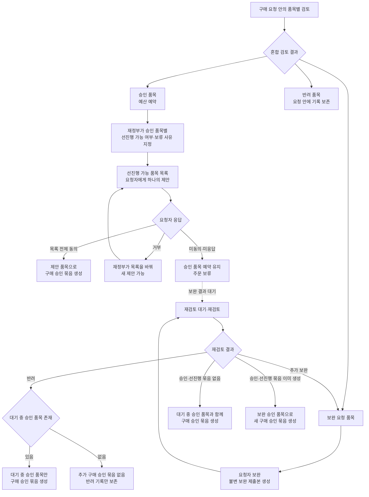
```mermaid
flowchart TD
    REVIEW["구매 요청 안의 품목별 검토"] --> MIXED{"혼합 검토 결과"}
    MIXED --> APPROVED["승인 품목<br/>예산 예약"]
    MIXED --> SUPPLEMENT["보완 요청 품목"]
    MIXED --> REJECTED["반려 품목<br/>요청 안에 기록 보존"]

    APPROVED --> PLAN["재정부가 승인 품목별<br/>선진행 가능 여부·보류 사유 지정"]
    PLAN --> PROPOSAL["선진행 가능 품목 목록<br/>요청자에게 하나의 제안"]
    PROPOSAL --> RESPONSE{"요청자 응답"}
    RESPONSE -->|"목록 전체 동의"| EARLY_BUNDLE["제안 품목으로<br/>구매 승인 묶음 생성"]
    RESPONSE -->|"거부"| REPROPOSE["재정부가 목록을 바꿔<br/>새 제안 가능"]
    REPROPOSE --> PROPOSAL
    RESPONSE -->|"미동의·미응답"| HOLD["승인 품목 예약 유지<br/>주문 보류"]

    SUPPLEMENT --> RESUBMIT["요청자 보완<br/>불변 보완 제출본 생성"]
    RESUBMIT --> REREVIEW["재검토 대기·재검토"]
    REREVIEW --> RESULT{"재검토 결과"}
    RESULT -->|"추가 보완"| SUPPLEMENT
    RESULT -->|"반려"| WAITING_APPROVED{"대기 중 승인 품목 존재"}
    WAITING_APPROVED -->|"있음"| AFTER_REJECT["대기 중 승인 품목만<br/>구매 승인 묶음 생성"]
    WAITING_APPROVED -->|"없음"| END["추가 구매 승인 묶음 없음<br/>반려 기록만 보존"]
    RESULT -->|"승인·선진행 묶음 없음"| WAITING_BUNDLE["대기 중 승인 품목과 함께<br/>구매 승인 묶음 생성"]
    RESULT -->|"승인·선진행 묶음 이미 생성"| LATER_BUNDLE["보완 승인 품목으로<br/>새 구매 승인 묶음 생성"]

    HOLD -.->|"보완 결과 대기"| REREVIEW
```

- 보완 기한이 지나도 자동 반려하지 않는다.
- 보완 전·후 내용과 첨부자료를 모두 보존한다.
- 요청자는 보완 대상 품목의 모든 품목 입력값과 첨부자료를 수정할 수 있으며, 보완 대상이 아닌 다른 품목은 수정할 수 없다.
- 보완 단계는 아직 해당 품목의 승인 범위가 확정되기 전이므로 변경된 필드의 수나 내용의 크기를 기준으로 새 구매 요청·새 구매 품목을 만들지 않는다.
- 보완 재제출은 같은 구매 요청과 구매 품목 식별자를 유지한 채 새 보완 제출본을 생성한다.
- 재제출 직후 해당 품목의 원본 검토 상태는 `검토 대기`, 재정부 처리 단계는 `재검토 대기`로 계산한다.
- 재검토에서도 품목별로 승인·추가 보완 요청·반려를 결정한다.
- 보완 재제출은 원래 요청과 품목을 새 요청으로 복제하지 않는다.
- 보완 품목의 재승인으로 새로 생성되는 것은 구매 요청이나 구매 품목이 아니라 구매 승인 묶음이다.
- 승인 품목은 재정부 승인 시 예산을 예약하되 구매 승인 묶음이 생성되기 전에는 주문할 수 없다.

### 6.4 요청자의 품목별 요청 취소

- 구매 요청 전체를 하나의 상태로 취소하지 않고 요청 안의 구매 품목을 하나 이상 선택해 개별적으로 취소한다.
- 원래 요청자만 자신의 품목을 취소할 수 있으며 품목별 취소 사유는 필수다. 취소자·취소 시각은 시스템이 기록한다.
- 검토 대기·보완 요청·승인 상태에서도 해당 품목의 어떤 구매 실행분도 `주문 완료`가 되지 않았다면 요청 취소할 수 있다.
- 승인 묶음 생성으로 초기 실행분이 존재하더라도 그 실행분이 모두 `주문 대기`이면 요청 취소할 수 있다.
- 요청 취소 처리 시 시스템은 주문 완료 실행분 존재 여부를 다시 확인한다. 하나라도 존재하면 처리를 거부하고 해당 실행분에 기존 `주문 취소 요청`을 사용하도록 안내한다.
- 요청 취소가 확정되면 진행 중인 검토·보완·선진행·구매 준비 업무를 즉시 종료하고 해당 품목과 주문되지 않은 실행분을 모든 활성 칸반·현재 집계에서 제외한다.
- 승인으로 예산이 예약돼 있었다면 실제 지출이 없으므로 품목 예약액 전액을 즉시 해제한다.
- 다른 품목의 검토 상태·승인·예산 예약·구매 승인 묶음·구매 실행분에는 영향을 주지 않는다.
- 구매 요청의 모든 품목이 요청 취소돼도 구매 요청 자체를 삭제하지 않고 전체 요청 아카이브에 품목별 취소 결과를 표시한다.
- 요청 취소된 품목은 전체 요청 아카이브에 원래 제출 내용, 수정·검토 이력, 취소 직전 상태, 취소 사유·취소자·취소 시각을 보존한다.
- 요청 취소된 품목이 구매 승인 아카이브에 표시되고 있었다면 해당 품목과 주문되지 않은 실행분을 자동 제외하고, 표시 대상 품목이 없는 승인 묶음은 목록에서 제외한다. 묶음의 과거 소속 관계와 자동 제외 사실은 감사 기록에서 보존한다.
- `요청 취소`는 외부 주문 취소가 아니므로 환불·취소 비용·재주문·증빙 후속 업무를 만들지 않는다.

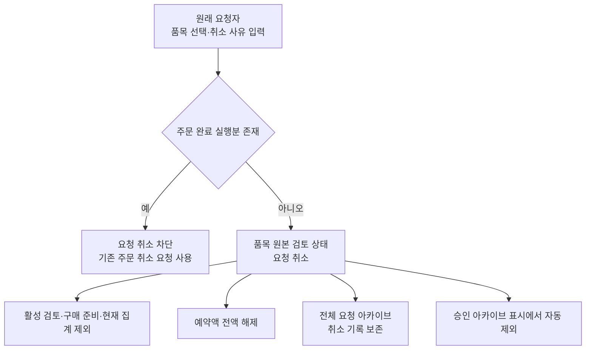
```mermaid
flowchart TD
    R["원래 요청자<br/>품목 선택·취소 사유 입력"] --> C{"주문 완료 실행분 존재"}
    C -->|"예"| B["요청 취소 차단<br/>기존 주문 취소 요청 사용"]
    C -->|"아니오"| X["품목 원본 검토 상태<br/>요청 취소"]
    X --> A["활성 검토·구매 준비·현재 집계 제외"]
    X --> U["예약액 전액 해제"]
    X --> H["전체 요청 아카이브<br/>취소 기록 보존"]
    X --> P["승인 아카이브 표시에서 자동 제외"]
```

### 7.1 보완과 새 구매 요청의 경계

- 보완 대상 품목의 품목명·구매 유형·수량·금액·예산 항목·가격 근거·유형별 세부 정보·첨부자료가 크게 달라져도 보완 단계에서는 기존 요청과 품목을 유지한다.
- 변경 정도를 판정해 보완 품목을 자동으로 새 구매 요청으로 이동·복제하거나 새 요청 작성을 강제하지 않는다.
- 기존 요청에 없던 독립된 구매를 추가하려는 경우에는 보완 품목에 합치지 않고 같은 행사에서 일반적인 새 구매 요청을 작성한다.
- 승인 범위를 벗어난 재주문은 8.7의 기존 규칙에 따라 새 구매 요청을 작성하고 원래 취소 실행분과 대체 관계를 기록한다.
- 새 구매 요청을 만들더라도 기존 구매 요청·품목·보완 제출본·검토 결과·예산 예약·구매 실행분을 이동하거나 복사하지 않는다.
- 대체 관계가 있는 새 구매 요청은 원래 요청·품목 또는 취소 실행분과 연결하고 새 요청 사유를 기록한다.
- 새 요청 제출 후 새 품목은 해당 `행사 > 재정`의 재정부 `요청 검토 > 검토 대기`에 표시하고, 일반 사용자 `품목 현황`에서는 `검토 중`으로 표시한다.
- 새 구매 요청은 `전체 요청` 아카이브에 별도 제출 기록으로 보존한다.
- 새 요청의 품목 카드에는 대체 관계가 있을 때 `기존 품목 대체 요청`, 원래 요청·품목 식별자와 새 요청 사유를 표시한다.

### 7.2 선진행 동의 철회

- 요청자는 구매 승인 묶음에 속한 어떤 품목도 주문되지 않았을 때만 선진행 동의 철회를 요청할 수 있다.
- 요청자는 철회 사유를 입력하고 재정부는 소속 품목의 주문 여부를 확인한다.
- 주문된 품목이 없으면 재정부가 구매 승인 묶음 전체를 `철회됨`으로 처리한다.
- 철회된 묶음은 삭제하지 않고 구매 승인 아카이브에 보존한다.
- 철회된 묶음의 소속 품목은 `구매 진행 동의 대기`로 돌아가며 예산 예약은 유지한다.
- 철회된 묶음의 초기 구매 실행분은 삭제하거나 다른 묶음으로 옮기지 않고 해당 묶음의 아카이브에 보존한다.
- 철회된 묶음의 구매 실행분은 활성 칸반과 해당 품목의 현재 주문·수령 또는 이행·증빙 집계에서 제외한다.
- 다시 진행하려면 재정부의 새 선진행 제안, 요청자의 새 동의와 새 구매 승인 묶음이 필요하다.
- 새 구매 승인 묶음이 생성되면 품목별 초기 구매 실행분도 새로 생성하며 철회된 묶음의 실행분을 재사용하지 않는다.
- 철회 또는 재진행 과정에서도 기존 구매 승인 묶음의 소속 품목을 추가·제외하지 않는다.
- 하나 이상의 품목이 주문된 뒤에는 묶음 전체를 철회할 수 없고 품목별 주문 취소 절차를 사용한다.
- 선진행 동의 철회는 승인 품목을 다시 동의 대기로 돌리는 묶음 단위 절차이고, 품목별 `요청 취소`는 주문 완료 전 요청자가 해당 품목을 종결하는 절차이므로 서로 대체하지 않는다.

## 8. 품목별 주문·배송·이행

### 8.1 주문 상태

현재 범위에서는 별도 `주문 묶음`이나 `주문 기록`을 생성하지 않는다. 주문 단계에서 재정부가 직접 입력·선택하는 값은 구매 실행분별 주문 상태뿐이며 상업적 주문번호·구매처·주문자·주문 시각은 입력하지 않는다. `주문 완료` 처리에 따른 `배송 대기`·`이행 대기` 시작은 시스템이 구매 유형에 따라 연동하고, 주문 완료 버튼을 누른 시스템 처리자와 상태 전환 시각은 감사 기록으로 남긴다.

`해당 없음`은 승인 전 주문 상태가 존재하지 않는다는 표시이고, `구매 진행 동의 대기`는 승인·예산 예약·선진행 제안과 구매 승인 묶음 미생성 관계에서 계산하는 품목 표시다. 두 명칭은 구매 실행분의 원본 주문 상태가 아니다. 구매 승인 묶음이 생성되면 각 품목의 전체 승인 범위에 대한 초기 구매 실행분이 자동 생성되고 원본 주문 상태 `주문 대기`부터 시작한다.

| 상태 | 정의 | 다음 처리 |
|---|---|---|
| 주문 대기 | 구매 승인 묶음 생성으로 만들어진 초기 실행분 또는 취소 후 새로 만든 재주문 실행분이 실제 주문되기 전 | 주문 가능 조건을 충족하면 주문 |
| 주문 완료 | 주문·발주 완료 | 배송 또는 용역 이행 확인 |
| 구매 불가 | 품절 등으로 승인된 구매 범위를 진행할 수 없음 | `구매 불가 처리 필요`: 품절 사유 반려·예약 해제, 성공 실행분이 있으면 영향분만 후속 처리 |
| 주문 취소 | 완료한 특정 구매 실행분의 주문을 취소함 | 해당 실행분 범위의 재주문 또는 품목 반려 검토 |

```text
구매 승인 묶음 생성
→ 포함된 품목마다 전체 승인 범위의 초기 구매 실행분 1개 자동 생성
→ 각 초기 실행분 주문 대기
→ 전량 주문이면 같은 실행분을 주문 완료로 전환
→ 일부 범위만 주문하면 주문 완료 범위와 남은 주문 대기 범위로 실행분 분할
```

- 주문 완료 처리는 구매 실행분의 원본 주문 상태를 `주문 완료`로 변경한다.
- 같은 처리의 결과로 물품·제작물 실행분의 수령 상태는 `배송 대기`, 대여·용역 실행분의 이행 상태는 `이행 대기`로 시작한다.
- 주문 완료 원본 상태와 함께 시작된 배송·이행 상태는 같은 처리 원인, 처리자와 처리 시각으로 연결해 추적한다.
- 배송·이행 상태를 시작하기 위해 재정부가 별도의 중복 전환을 수행하지 않는다.
- 이 자동 전환을 위해 주문번호·구매처·상업적 주문자·상업적 주문 시각 등 추가 주문 정보를 입력하지 않는다.

### 8.2 물품의 배송·수령 상태

| 상태 | 정의 | 다음 처리 |
|---|---|---|
| 해당 없음 | 주문 전 | 주문 완료 |
| 배송 대기 | 주문 완료 후 발송 전 | 배송 시작 |
| 배송 중 | 판매자가 발송해 운송 중 | 배송 완료 확인 |
| 수령 확인 필요 | 배송 완료 정보는 있으나 실제 수령 확인 전 | 수령 확인 |
| 수령 완료 | 실제 물품 수령 확인 | 증빙 묶음 연결 |

- 재정부는 구매 실행분별 실제 수령자·수량·시각, 이상 여부·내용과 근거를 수령 확인 기록으로 입력한다.
- 재정부가 직접 받지 않았다면 실제 수령자와 확인 근거를 함께 기록한다.
- 정상 물품이면 한 번의 처리로 수령 확인 기록과 `수령 완료` 전환을 함께 수행한다.
- 수령 사실이나 근거를 확인할 수 없으면 시간이 지나도 자동으로 `수령 완료` 처리하지 않고 `수령 확인 필요`를 유지한다.
- 파손·오배송 또는 주문 취소 후 도착이 확인되면 자동으로 `수령 완료` 처리하지 않고 상세 후속 규칙에 따라 재정부가 판단한다.
- 일반 구성원은 VADA에서 수령 사실을 입력하거나 상태를 전환하지 않는다.
- 재정부가 물품을 일반 구성원에게 넘기는 내부 전달은 구매 실행분의 별도 상태로 관리하지 않는다.
- 파손·오배송은 새 수령 상태나 재정부 처리 단계를 만들지 않고 기존 `수령 확인 필요`를 유지하며 `수령 문제 있음`을 보조 표시한다.
- 판매자가 같은 거래 안에서 정상 교환품을 보내면 새 실행분을 만들지 않고 기존 실행분에 추가 수령 확인 기록을 남긴다.
- 정상 교환품 수령 또는 문제 있는 물품을 그대로 인수하기로 한 근거가 확인되면 `수령 완료`로 전환한다.
- 외부 주문 취소가 성립하면 `수령 완료`로 전환하지 않고 기존 주문 취소 절차를 적용한다.
- 일부 수량만 파손·오배송된 경우의 실행분 분할은 현재 보류하므로 실행분 전체를 `수령 확인 필요`에 유지한다.

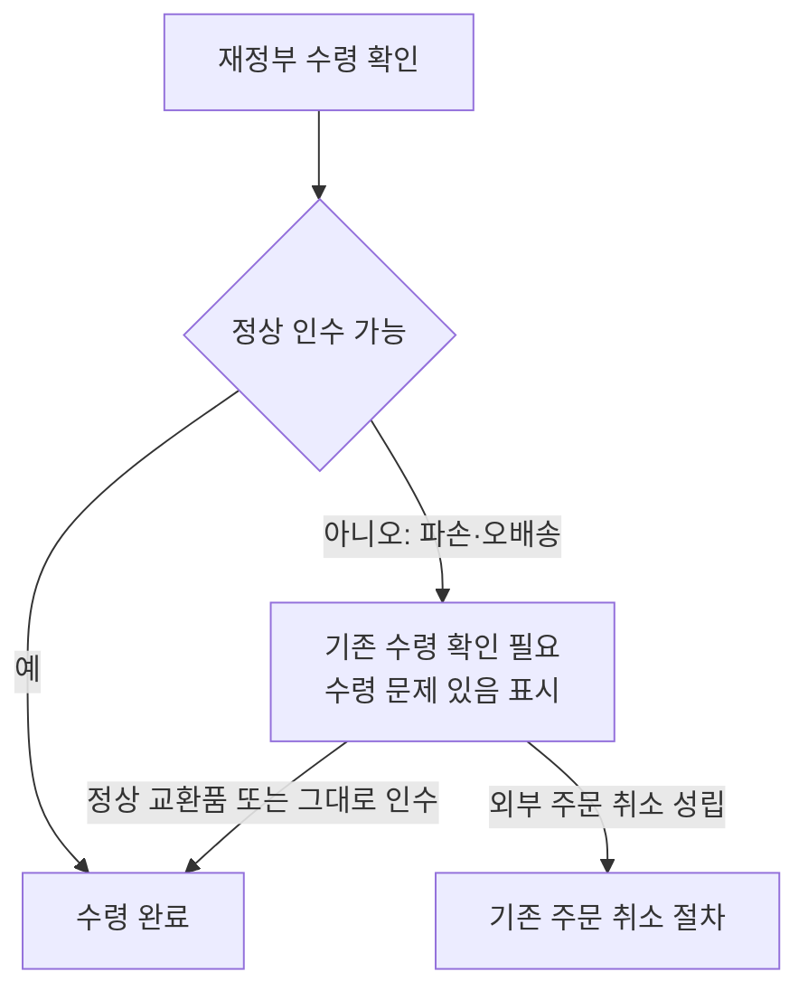
```mermaid
flowchart TD
    CHECK["재정부 수령 확인"] --> NORMAL{"정상 인수 가능"}
    NORMAL -->|"예"| COMPLETE["수령 완료"]
    NORMAL -->|"아니오: 파손·오배송"| WAIT["기존 수령 확인 필요<br/>수령 문제 있음 표시"]
    WAIT -->|"정상 교환품 또는 그대로 인수"| COMPLETE
    WAIT -->|"외부 주문 취소 성립"| CANCEL["기존 주문 취소 절차"]
```

### 8.3 대여·용역의 이행 상태

대여는 물품을 빌려 사용한 뒤 되돌려주는 반납이 이행의 핵심 종료 행위이므로, 이행 중과 이행 완료 사이에 `반납 확인 필요`를 둔다. 반납이 없는 용역(인쇄 대행·공연 등)은 이 단계를 건너뛰고 이행 중에서 바로 이행 완료로 처리한다.

| 상태 | 정의 | 다음 처리 |
|---|---|---|
| 해당 없음 | 주문 전 | 주문 완료 |
| 이행 대기 | 주문·계약 후 수행 전(대여물 인수 전) | 이행 시작 |
| 이행 중 | 대여물을 빌려 사용 중이거나 용역 수행 중 | (대여) 반납 확인 요청 · (용역) 이행 완료 |
| 반납 확인 필요 | 사용 종료 후 대여물의 반납·회수와 상태 확인 대기 | 반납 확인·이행 완료 |
| 이행 완료 | (대여) 반납·회수까지 끝난 상태 · (용역) 용역 결과 확인 | 증빙 묶음 연결 |

- 보증금은 별도 이행 상태를 만들지 않고 지출(예치)과 반납 시 환입을 기존 증빙·실제 지출·환불(환입) 흐름으로 처리하며 카드·상세에 함께 표시한다.
- 반납 지연 연체료와 파손·분실 배상은 `이행 완료 후 용역 대금 조정`과 같은 특수 사례로 현재 범위에서 보류한다(15장).

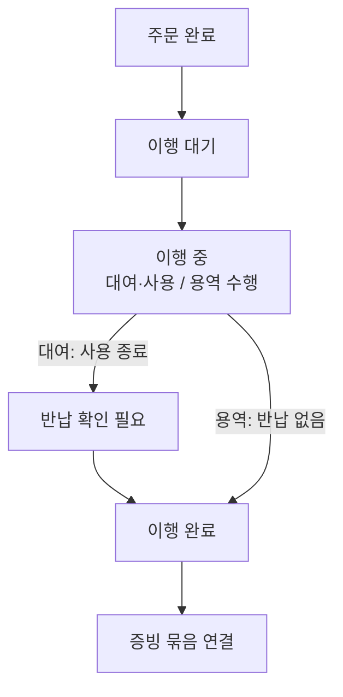
```mermaid
flowchart TD
    ORDER["주문 완료"] --> WAIT["이행 대기"]
    WAIT --> DOING["이행 중<br/>대여·사용 / 용역 수행"]
    DOING -->|"대여: 사용 종료"| RETURN["반납 확인 필요"]
    RETURN --> DONE["이행 완료"]
    DOING -->|"용역: 반납 없음"| DONE
    DONE --> EVIDENCE["증빙 묶음 연결"]
```

### 8.4 품절 처리

```text
품절 확인
→ 영향받은 구매 범위 구매 불가
→ 해당 품목에 성공적으로 구매된 실행분이 있는지 확인
→ 성공적으로 구매된 실행분이 없고 더 이상 구매하지 않으면 반려 사유를 품절로 기록
→ 해당 품목 반려
→ 성공적으로 구매된 실행분이 있으면 품목 전체를 반려하지 않고 영향받은 실행분만 후속 처리
→ 처리자·처리 시각 기록
```

다른 품목의 주문과 예산 예약은 변경하지 않는다.

### 8.5 주문 취소와 품목 반려의 경계

- `주문 취소`는 완료한 주문을 취소한 특정 구매 실행분의 주문 상태다.
- `주문 취소`는 외부 취소가 성립했다는 원본 사실이며 재정부 활성 처리 단계의 이름으로 사용하지 않는다.
- 재정부 활성 처리 단계는 주문 취소 후 결제 여부·환불 확인·재주문 판단·취소 비용 증빙에서 현재 남아 있는 다음 업무를 계산해 표시한다.
- 결제 여부와 관계없이 외부 주문의 취소가 성립한 시점에 해당 구매 실행분을 `주문 취소`로 전환한다.
- 결제 전에 취소됐다면 환불 확인 업무를 만들지 않는다.
- 결제 후 취소됐다면 주문 상태를 되돌리지 않고 별도의 재정 후속 작업으로 환불 여부를 확인한다.
- 환불 대기를 `주문 완료`로 표시하거나 `환불 완료`를 새로운 원본 주문 상태로 만들지 않는다.
- 취소 처리 시 후속 작업 필요 여부를 판단하기 위한 결제 여부만 확인하고 주문번호·구매처·결제수단 등 상업적 상세 정보는 입력하지 않는다.
- `주문 취소`는 해당 구매 실행분의 `수령 완료` 또는 `이행 완료` 전에 외부 취소가 성립한 경우에만 적용한다.
- 배송 중 취소 후 실제 수령 없이 반송된 경우는 주문 취소로 처리할 수 있다.

#### 요청자의 주문 취소 요청

- 원래 구매 요청의 요청자는 자신의 구매 실행분이 `주문 완료`이고 `수령 완료` 또는 `이행 완료` 전일 때 전량 또는 일부 `주문 취소 요청`을 제출할 수 있다.
- 주문 취소 요청에는 대상 실행분, 취소 범위·수량, 취소 사유를 필수로 기록하고 요청자·요청 시각은 시스템이 기록한다.
- 요청자가 외부 주문처에 직접 취소를 요청했거나 취소 결과를 받은 경우 외부 요청 시각·응답과 근거 자료를 함께 제출할 수 있다.
- 주문 취소 요청은 구매 실행분의 원본 상태가 아니며 제출만으로 주문·배송·수령 또는 이행 상태, 예산 예약을 변경하지 않는다.
- 요청이 제출되면 해당 실행분의 재정부 최우선 처리 단계를 실행분의 구매 유형에 따라 `물품 배송·수령`·`대여 이행`·`용역 이행` 영역의 `주문 취소 요청 확인`으로 계산하고 기존 배송·이행 정보는 카드·상세에 함께 표시한다.
- 재정부는 외부 주문처에 취소를 실행하거나 요청자가 제출한 외부 취소 결과를 확인하고, 처리 중 외부 응답을 기다리는 경우 같은 처리 단계에서 대기 사유와 마지막 확인 시각을 표시한다.
- 외부 취소가 성립하면 재정부가 처리자·처리 시각·성립 근거와 결제 여부를 기록하고 해당 실행분을 `주문 취소`로 전환한 뒤 기존 환불·재주문·증빙·예산 규칙을 적용한다.
- 외부 취소가 성립하지 않으면 재정부가 불성립 사유·근거·처리자·처리 시각을 기록하고 주문 취소 요청을 종료한 뒤 기존 원본 상태에서 정상 배송·수령 또는 이행 처리 단계를 다시 계산한다.
- 요청자는 자신의 주문 취소 요청 진행 여부와 성립·불성립 결과를 조회할 수 있지만 환불 결과, 취소 비용, 재주문과 예산 처리를 확정할 수 없다.
- 재정부가 요청자 요청 없이 주문 취소를 시작한 경우에도 외부 취소 성립 전에는 원본 상태를 바꾸지 않고, 성립 확인 후 같은 기록과 후속 처리 규칙을 적용한다.

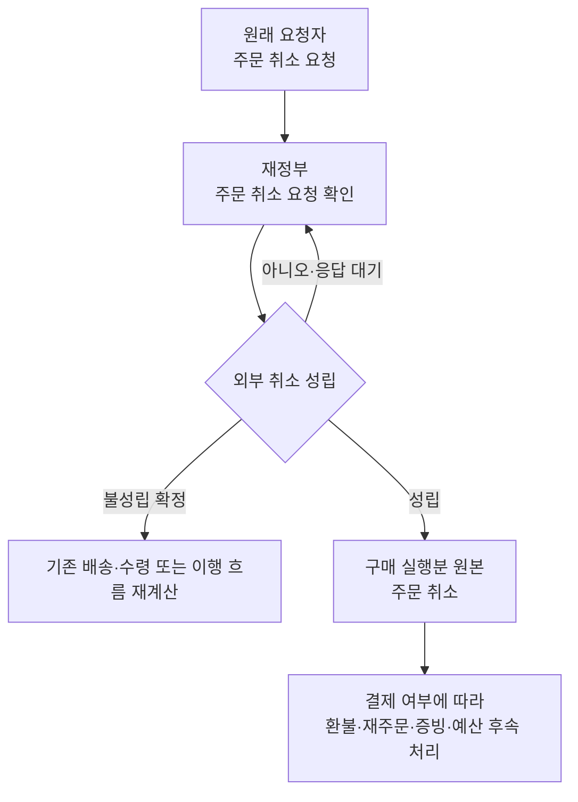
```mermaid
flowchart TD
    REQUESTER["원래 요청자<br/>주문 취소 요청"] --> CHECK["재정부<br/>주문 취소 요청 확인"]
    CHECK --> EXTERNAL{"외부 취소 성립"}
    EXTERNAL -->|"아니오·응답 대기"| CHECK
    EXTERNAL -->|"불성립 확정"| RESUME["기존 배송·수령 또는 이행 흐름 재계산"]
    EXTERNAL -->|"성립"| CANCEL["구매 실행분 원본<br/>주문 취소"]
    CANCEL --> FOLLOWUP["결제 여부에 따라<br/>환불·재주문·증빙·예산 후속 처리"]
```

- 주문 취소가 성립한 뒤 물품이 실제 도착해도 원본 주문 상태 `주문 취소`를 유지하고 `주문 완료`나 `수령 완료`로 되돌리지 않는다.
- 재정부는 수령 확인 기록에 실제 도착 사실·시각·수령자·근거와 `주문 취소 후 도착`을 기록한다.
- 주문 취소 후 도착한 실행분은 새 상태를 만들지 않고 기존 수령 상태 `수령 확인 필요`와 보조 표시 `수령 문제 있음 · 주문 취소 후 도착`을 사용한다.
- 물품의 반송 또는 판매자 처분 지시가 미해결인 동안 재정부 처리 단계 `수령 확인 필요`를 환불 확인·재주문 판단보다 우선한다.
- 환불 내역은 발생 시점에 기록할 수 있지만 반송·처분 미해결 중에는 재정부 대표 카드를 `환불 대기`나 `환불 확인`으로 이동하지 않는다.
- 반송·처분이 해결되면 처리자·시각·근거를 기록하고 기존 `환불 대기`·`환불 확인`·`증빙 필요`·`재주문 판단` 등 주문 취소 후속 절차를 재개한다.
- 일반 사용자에게는 대표 상태 `주문 취소`를 유지하고 `주문 취소 후 도착`을 보조 표시한다.
- 반송 배송비 등 실제 비용은 수령 상태에 넣지 않고 금액과 근거가 확정된 뒤 기존 증빙 조정 내역으로 처리한다.
- 수령 완료 후 물품을 돌려보내는 것은 `물품 반환`으로 구분한다.
- 용역 이행 완료 전 전체 미이행 범위를 취소하면 기존 `주문 취소`, 일부 미이행 범위만 취소하면 기존 부분 주문 취소 규칙을 적용한다.
- 이행 완료 후 품질 문제·합의 등으로 대금을 환불·감액·배상하는 것은 계약 관계의 종료보다 금액 변경이 핵심이므로 `용역 해지`가 아니라 `이행 완료 후 용역 대금 조정`으로 구분한다.
- 이행 완료 후 용역 대금 조정은 현재 범위에서 특수 사례로 보류하며, 전용 상태·기록 단위·처리 단계·칸반 열과 환불·증빙·실제 지출·예산 자동 처리 규칙을 만들지 않는다.
- 물품 반환이 발생해도 완료된 주문·수령 상태를 주문 취소로 되돌리지 않는다.
- 물품 반환은 원래 `수령 완료` 구매 실행분에 연결되는 재정부 전용 `물품 반환 기록`으로 관리한다.
- 물품 반환 기록은 주문·수령 원본 상태나 재정부 처리 단계가 아니며, 반환만을 위한 원본 상태·칸반 열을 만들지 않는다.
- 물품 반환이 발생해도 해당 실행분의 `주문 완료`와 `수령 완료`는 달성 사실로 유지한다.

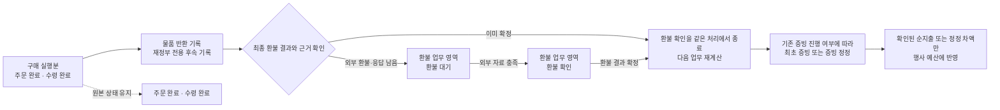
```mermaid
flowchart LR
    COMPLETE["구매 실행분<br/>주문 완료 · 수령 완료"] --> RETURN["물품 반환 기록<br/>재정부 전용 후속 기록"]
    COMPLETE -.->|"원본 상태 유지"| KEPT["주문 완료 · 수령 완료"]
    RETURN --> RESULT{"최종 환불 결과와 근거 확인"}
    RESULT -->|"외부 환불·응답 남음"| WAIT["환불 업무 영역<br/>환불 대기"]
    WAIT -->|"외부 자료 충족"| REFUND["환불 업무 영역<br/>환불 확인"]
    RESULT -->|"이미 확정"| RECALC["환불 확인을 같은 처리에서 종료<br/>다음 업무 재계산"]
    REFUND -->|"환불 결과 확정"| RECALC
    RECALC --> EVIDENCE["기존 증빙 진행 여부에 따라<br/>최초 증빙 또는 증빙 정정"]
    EVIDENCE --> BUDGET["확인된 순지출 또는 정정 차액만<br/>행사 예산에 반영"]
```

- 한 구매 실행분의 주문 취소는 같은 품목의 다른 구매 실행분 상태를 변경하지 않는다.
- 주문 취소만으로 구매 품목 전체를 반려하지 않는다.
- 성공적으로 구매된 실행분이 하나라도 있으면 다른 실행분이 취소돼도 품목 전체를 반려하지 않는다.
- 성공적으로 구매된 실행분이 하나도 없고 재정부가 해당 품목을 더 이상 구매하지 않기로 결정한 경우에만 품목 전체를 `반려`한다.
- `최종 반려`라는 별도 상태는 만들지 않고 기존 품목의 `반려`를 종결 결과로 사용한다.
- 승인 후에는 환불 확인·취소 비용 증빙·실제 지출 전환과 예산 예약 정리 중 남은 업무가 있으면 아직 품목을 `반려`로 전환하지 않고 해당 미완료 처리 단계에 둔다.
- 남은 재정 업무가 없거나 같은 처리에서 실제 지출 전환과 예약 해제를 함께 완료할 수 있을 때 품목을 `반려`로 전환하고 활성 처리 단계에서 제외한다.
- `반려 완료`라는 별도 상태·처리 단계나 반려 후 추가 완료 버튼은 만들지 않는다.
- 주문 취소 또는 품목 반려 후에도 원래 구매 승인 묶음에서 해당 품목을 제거하지 않는다.

### 8.6 부분 주문 취소

- 구매 실행분의 일부 수량 또는 이행 범위만 취소되면 기존 실행분은 계속 진행되는 범위로 조정한다.
- 취소 범위는 기존 실행분에서 분리한 새 구매 실행분으로 생성하고 주문 상태를 `주문 취소`로 기록한다.
- 새 취소 실행분은 분리된 원래 실행분과의 연결 관계를 유지한다.
- 부분 취소 전 원래 범위와 조정 후 계속 진행 범위·취소 범위를 모두 보존한다.
- 조정 후 계속 진행 범위와 취소 범위의 합은 부분 취소 전 원래 범위와 일치해야 한다.
- 전량 취소라면 새 실행분을 만들지 않고 기존 실행분 전체를 `주문 취소`로 전환한다.
- 같은 실행분에서 부분 취소가 반복되면 취소가 성립할 때마다 새 취소 실행분을 만들고 이전 분할 이력을 덮어쓰지 않는다.
- 결제 후 부분 취소의 환불 확인 업무는 새로 분리한 취소 실행분에 연결한다.
- 분할은 재정부만 처리하고 처리자·처리 시각·사유와 분할 전후 범위를 기록한다.
- 요청자는 부분 주문 취소를 요청할 수 있지만 취소 범위의 실행분 분할은 외부 부분 취소가 성립한 뒤 재정부가 수행한다.
- 요청자의 미응답을 이유로 남은 범위를 자동 취소하거나 품목 전체를 자동 반려하지 않는다.

### 8.7 재주문

- 취소된 수량·이행 범위를 다시 주문하면 기존 취소 실행분을 `주문 대기`로 되돌리지 않는다.
- 취소 실행분의 환불·취소 비용 증빙·실제 지출·예산 문제가 모두 정리됐지만 연결된 재주문 실행분이나 `재주문하지 않음` 결정 기록이 없으면 재정부 처리 단계를 `재주문 판단`으로 계산한다.
- `재주문 판단`은 구매 실행분의 새 원본 주문 상태가 아니라 재정부의 다음 미완료 업무다.
- 재주문하기로 결정하면 재주문 실행분을 생성하고, 재주문하지 않기로 결정하면 결정자·결정 시각과 사유를 기록한다.
- 재주문하지 않기로 결정했을 때 성공적으로 구매된 실행분이 없으면 남은 재정 정리 조건을 확인해 품목을 `반려`하고, 성공 구매 실행분이 있으면 품목 전체를 반려하지 않고 해당 실행분들의 진행을 계속한다.
- 재주문 범위에 대한 새 구매 실행분을 생성하고 재주문의 원인이 된 취소 실행분과 연결한다.
- 새 실행분은 일반 실행분과 동일하게 `주문 대기`에서 시작해 실제 주문 시 `주문 완료`로 전환한다.
- 취소와 재주문이 반복되면 각 주문 시도마다 새 구매 실행분을 만들고 이전 취소 실행분과의 연결 관계를 이어서 보존한다.
- 취소 실행분은 구매 품목의 성공 구매 수량·이행 범위 집계에서 제외하고 재주문 실행분의 범위만 새 구매 결과로 집계한다.
- 취소 실행분에 남은 환불 확인·취소 비용 기록과 재주문 실행분의 주문·결제·증빙 기록을 서로 섞지 않는다.
- 재주문으로 구매 품목이나 구매 승인 묶음을 새로 만들지 않으며 기존 구매 승인 묶음의 구성도 바꾸지 않는다.
- 재주문 실행분 때문에 품목 예산을 추가로 예약하지 않고 기존 품목의 예산 예약을 유지한다.
- 결제 전 취소는 환불 확인 없이 재주문 실행분을 실제 주문할 수 있다.
- 결제 후 취소는 환불 결과 확인 전에도 재주문 실행분을 `주문 대기`로 생성할 수 있다.
- 결제 후 취소의 환불 결과가 확인되기 전에는 재주문 실행분을 실제 주문하거나 `주문 완료`로 전환할 수 없다.
- 환불 결과 확정 후 취소 수수료·환불 불가액이 남으면 원인이 된 취소 실행분의 `증빙 완료`, 취소 순지출액 실제 지출 반영과 행사 사용 가능 예산 확인 전까지 연결된 재주문 실행분을 실제 주문하거나 `주문 완료`로 전환할 수 없다.
- 환불 결과가 확인돼도 환불 불가액·취소 수수료와 사용 가능 예산 조건이 충족되지 않으면 재주문을 자동으로 허용하지 않는다.
- 미리 생성된 재주문 실행분은 원본 주문 상태 `주문 대기`를 유지하되 위 차단 조건이 하나라도 남아 있으면 재정부 처리 단계 `재주문 보류`에 둔다.
- `재주문 보류` 카드와 상세에는 현재 남은 차단 사유를 모두 표시하며, 원인이 된 취소 실행분은 자신의 `환불 대기`·`환불 확인`·`증빙 필요` 등 처리 단계에 별도 카드로 유지한다.
- 모든 차단 조건이 해소되면 재주문 실행분을 별도 보류 해제 처리 없이 재정부 처리 단계 `주문 대기`로 자동 재계산한다.
- 재주문은 다음 승인 범위 조건을 모두 충족해야 한다.
  - 원래 구매 요청의 구매 목적과 구매 품목의 구매 유형이 같아야 한다.
  - 원래 품목의 필수 규격·이행 조건을 모두 충족해야 한다.
  - 재주문 수량·이행 범위가 원인이 된 취소 실행분의 범위를 초과하지 않아야 한다.
  - 성공 구매분과 재주문 예정분의 예상 직접 금액 합계가 원래 품목 요청 금액을 초과하지 않아야 한다.
- 재정부는 재주문 전에 예상 직접 금액과 갱신된 가격 근거를 기록해 승인 범위 충족 여부를 확인한다.
- 재주문 예상 직접 금액은 실제 결제액이나 증빙 직접 금액이 아니며 구매처·주문번호·결제수단을 함께 입력하지 않는다.
- 취소 수수료·환불 불가액은 품목 직접 금액이 아니므로 재주문 예상 직접 금액 합계에서는 제외하되 행사 사용 가능 예산에는 반영한다.
- 구매처·브랜드 변경이 원래 필수 조건을 바꾸지 않으면 승인 범위 안의 재주문으로 처리할 수 있다.
- 승인 범위 안의 동일 목적 재주문은 요청자의 추가 응답을 기다리지 않고 재정부가 진행할 수 있다.
- 승인 범위를 벗어나면 기존 품목을 수정하거나 승인 상태를 재검토로 되돌리지 않고 요청 권한자가 새 구매 요청을 제출한다.
- 새 구매 요청과 원래 취소 실행분의 대체 관계를 기록한다.
- 재정부가 재주문 실행분을 생성하며 생성자·생성 시각·사유와 원래 취소 실행분의 연결 관계를 기록한다.

### 8.8 환불 확인 업무

- `환불 확인 업무`는 결제 후 주문 취소 또는 수령 완료 후 물품 반환에 따른 자금 반환을 추적하고 최종 결과를 확정하는 공통 재정 후속 작업이다.
- 환불 결과가 미확정이고 판매자의 환불·응답 또는 추가 입금처럼 외부 결과가 남아 재정부가 최종 확정할 수 없으면 처리 단계를 `환불 대기`로 계산한다.
- 필요한 외부 응답·입금 내역과 근거가 갖춰져 재정부의 금액 대조와 최종 결과 확정만 남으면 처리 단계를 `환불 확인`으로 계산한다.
- `환불 대기`와 `환불 확인`은 별도 원본 상태가 아니라 환불 자료와 추가 환불 예정 여부에서 자동 계산하는 환불 업무 영역의 두 칸반 열이며, 재정부가 카드를 수동으로 옮기지 않는다.
- 환불 지연은 `환불 대기` 카드의 경과 기간과 보조 정보로 표시하고 `환불 지연` 열은 만들지 않는다.
- 최종 환불 결과가 확정되면 활성 환불 업무가 끝나므로 `환불 완료` 열을 만들지 않고 다음 업무 영역을 계산하거나 활성 업무 영역에서 제외한다.
- 물품 반환의 환불 추적에도 같은 `환불 대기`와 `환불 확인`을 재사용하고 `반환 환불 대기`·`반환 환불 완료` 같은 반환 전용 상태·처리 단계·칸반 열을 만들지 않는다.
- 물품 반환 기록 생성 시 최종 환불 결과와 근거가 이미 확인되면 같은 처리에서 환불 확인 업무를 시작하고 끝내 두 환불 열에는 표시하지 않는다.
- 이미 정산 완료된 실행분도 물품 반환의 환불 결과가 미확정이면 환불 확인 업무를 새로 계산하지만 기존 주문·수령·정산 완료 사실과 이력은 유지한다.
- 환불 내역이 없거나 일부 환불만 도착했다는 사실만으로 칸반 열을 정하지 않고 외부 환불·응답이 남았는지를 기준으로 `환불 대기`와 `환불 확인`을 구분한다.
- 환불 확인 업무가 미완료인 동안에는 주문 취소 후 도착한 물품의 반송·처분이 미해결인 경우를 제외하고 해당 취소 실행분의 재주문 판단·취소 비용 증빙·품목 반려 판단보다 `환불 대기` 또는 `환불 확인`을 우선한다.
- 환불 확인 업무에는 원인에 따라 주문 취소의 `취소 대상 결제액` 또는 물품 반환의 `반환 대상 결제액`, 하나 이상의 개별 환불액·환불 발생일, 누적 환불액과 근거 자료를 기록한다.
- 개별 환불은 발생할 때마다 추가하고 이전 환불 기록을 덮어쓰거나 합계만 남기지 않는다.
- 누적 환불액은 개별 환불액의 합계로 계산하며 해당 환불의 취소 대상 결제액 또는 반환 대상 결제액을 초과할 수 없다.
- 환불 결과는 다음과 같이 계산한다.

| 환불 결과 | 조건 |
|---|---|
| 전액 환불 | 누적 환불액이 해당 취소 대상 결제액 또는 반환 대상 결제액과 같음 |
| 일부 환불 | 누적 환불액이 0보다 크고 해당 비교 기준 금액보다 작으며 추가 환불이 없다고 확인됨 |
| 환불 없음 | 누적 환불액이 0이고 추가 환불이 없다고 확인됨 |

- 물품 반환에도 `전액 환불`, `일부 환불`, `환불 없음`이라는 같은 결과 명칭을 재사용한다.
- 세 결과는 원본 상태나 환불 보드의 칸반 열이 아니라 환불 확인 업무가 끝날 때 금액과 추가 환불 가능성에서 계산해 보존하는 최종 결과다.
- 물품 반환의 전액·일부를 판단할 때는 `반환 대상 결제액`과 누적 환불액을 비교하며, 구체적인 산정·증빙·실제 지출·예산 규칙은 8.11을 따른다.
- 환불이 더 예정돼 있으면 누적 환불액이 존재해도 `일부 환불`로 확정하지 않고 `환불 대기`를 유지한다.
- 요청자의 미응답이나 환불 지연만으로 `환불 없음`을 확정하지 않는다.
- 일부 환불 또는 환불 없음의 차액을 취소 수수료·환불 불가액으로 자동 확정하지 않고 별도 근거를 확인한다.
- 환불 확인 업무 자료는 이후 증빙 정리에서 다시 입력하지 않고 공동 참조한다.
- 환불 확인 업무에서는 구매처·주문번호·결제수단 등 전체 상업적 결제 정보를 추가로 입력하지 않는다.
- 재정부만 환불 결과를 확정하며 개별 환불 등록자, 최종 확인 처리자와 각 처리 시각을 기록한다.
- 취소 대상 결제액·개별 환불액·환불 결과를 정정하면 이전 값을 삭제하지 않고 정정 사유와 이력을 보존한다.
- 이 절의 취소 대상 결제액·취소 순지출액·재주문·품목 반려 규칙은 주문 취소에만 적용한다. 물품 반환은 공통 환불 업무와 결과 명칭만 재사용하고 금액·증빙·예산은 8.11의 반환 규칙을 적용한다.

### 8.9 취소 비용 증빙

- 환불 결과가 `전액 환불`이고 취소 수수료·환불 불가액이 없으면 환불 확인 업무 자료만 보존하고 실제 지출 0원으로 취소 정산을 끝낸다.
- 실제 지출 0원인 취소 실행분은 별도 증빙 묶음에 연결하지 않고 품목의 증빙 완료 집계 대상에서도 제외한다.
- 환불 결과가 확정되고 취소 수수료·환불 불가액이 남은 실행분은 원본 증빙 상태와 재정부 처리 단계를 기존 `증빙 필요`로 전환한다.
- 취소 비용을 이유로 `취소 비용 증빙 필요`·`취소 정산 필요` 같은 별도 상태나 칸반 열을 만들지 않고, 주문 취소·환불 결과·취소 순지출액은 카드·상세의 보조 정보로 표시한다.
- 비용이 남은 취소 실행분과 연결된 재주문 실행분은 미리 생성할 수 있지만, 취소 실행분의 `증빙 완료`, 취소 순지출액 실제 지출 반영과 행사 사용 가능 예산 확인 전에는 실제 주문할 수 없다.
- 환불 결과가 `일부 환불` 또는 `환불 없음`이고 차액이 남으면 차액의 원인을 입증하는 자료가 있어야 한다.
- 취소된 실행분은 상품·용역을 취득하지 않았으므로 직접 금액을 0원으로 기록한다.
- 근거가 확인된 취소 수수료와 환불 불가액은 각각 별도의 양수 증빙 조정 내역으로 기록하고 해당 취소 실행분 또는 관련 증빙 묶음 전체에 연결한다.
- 차액을 취소 수수료나 환불 불가액으로 자동 분류하지 않으며 근거가 없으면 증빙 묶음을 완료할 수 없다.
- 취소 비용만을 위한 별도 종류의 증빙 묶음은 만들지 않는다. 비용이 남은 취소 실행분은 다른 증빙 대상과 동일한 일반 증빙 묶음 구조에서 처리하며, 해당 실행분 하나 이상으로 새 일반 증빙 묶음을 생성하거나 조건이 맞는 `증빙 정리 중` 묶음에 연결할 수 있다.
- 취소 순지출액은 `취소 대상 결제액 - 누적 환불액`으로 계산한다.
- 취소 실행분의 직접 금액 0원과 취소 수수료·환불 불가액 합계는 취소 순지출액과 일치해야 한다.
- 하나의 취소 비용이 여러 취소 실행분에 공통이면 관련 실행분 또는 증빙 묶음 전체를 적용 대상으로 연결하되 금액을 실행분별로 배분하지 않는다.
- 취소 비용 증빙과 실제 지출 확정은 재정부만 처리하며 처리자·처리 시각과 근거 자료 변경 이력을 보존한다.

### 8.10 주문 취소 후 예산 예약

- 주문 취소만으로 구매 품목의 예산 예약을 해제하지 않는다.
- 환불 확인, 취소 비용 증빙과 재주문 여부가 확정될 때까지 품목 예약액 전체를 유지한다.
- 일부 환불이 발생해도 예상 환불액이나 취소 수량에 따라 예약액을 단계적으로 해제하지 않는다.
- 재주문하면 새 예산 예약을 만들지 않고 기존 품목 예약액을 계속 사용한다.
- 취소 비용이 남은 상태에서 재주문하려면 취소 실행분의 증빙과 실제 지출을 먼저 완료하고, 기존 예약액과 반영된 취소 순지출액을 함께 고려한 행사 사용 가능 예산이 재주문을 감당할 수 있는지 확인한다.
- 성공적으로 구매된 실행분이 하나라도 있으면 품목 전체를 반려하지 않고 관련 실행분의 증빙과 취소 비용 정산이 모두 끝날 때까지 예약을 유지한다.
- 성공적으로 구매된 실행분이 없고 재주문하지 않아 품목을 반려할 때 취소 비용이 없으면 품목 예약액 전액을 해제한다.
- 품목 반려 시 취소 비용이 있으면 취소 순지출액을 실제 지출로 전환하는 동시에 품목 예약액의 나머지를 해제한다.
- 취소 순지출액이 품목 예약액을 초과하거나 행사 사용 가능 예산이 부족하면 예산 조정 전까지 취소 비용 증빙 완료와 품목 반려에 따른 예약 정리를 완료할 수 없다.
- 요청자의 미응답이나 환불 지연만으로 품목 예약을 자동 해제하지 않는다.
- 재정부만 예약 유지·실제 지출 전환·예약 해제를 처리하며 처리자·처리 시각·사유와 변경 이력을 보존한다.

### 8.11 수령 완료 후 물품 반환

#### 반환 범위와 기존 실행분

- 물품 반환은 `수령 완료`된 원래 구매 실행분에 `물품 반환 기록`을 연결하는 후속 처리다.
- 물품 반환 때문에 원래 실행분의 `주문 완료`·`수령 완료`를 되돌리거나 새 반환 전용 원본 상태를 만들지 않는다.
- 일부 수량만 반환해도 반환 사실만으로 구매 실행분을 분할하지 않는다. 물품 반환 기록에 반환 수량·범위를 명시하고 원래 실행분의 수량·직접 금액과 완료 이력을 유지한다.
- 원래 직접 금액은 최초 영수증에서 해당 실행분에 귀속된 거래 사실이므로 반환 후 금액으로 덮어쓰거나 줄이지 않는다.
- 반환 기록에는 반환 수량·범위, 사유, 처리자·처리 시각, 근거 자료와 원래 구매 실행분의 연결을 보존한다.

#### 반환 대상 결제액과 환불 결과

- `반환 대상 결제액`은 반환한 수량·범위에 대해 판매자가 반환 대상으로 인정한 원래 결제 금액이다.
- 재정부는 판매자의 반환 안내, 원래 영수증의 항목 금액 또는 학교 감사 기준을 충족하는 다른 근거로 반환 대상 결제액을 확인한다.
- VADA는 원래 직접 금액이나 공통 할인을 수량 비율로 자동 배분해 반환 대상 결제액을 만들거나 제안하지 않는다.
- 반환 대상 결제액과 개별 환불 내역의 근거가 서로 맞지 않으면 최종 환불 결과와 증빙 처리를 완료할 수 없다.
- 반환의 누적 환불액은 반환에 연결된 개별 환불액의 합계이며 반환 대상 결제액을 초과할 수 없다.

| 환불 결과 | 물품 반환 조건 |
|---|---|
| 전액 환불 | 누적 환불액이 반환 대상 결제액과 같고 추가 환불이 없음 |
| 일부 환불 | 누적 환불액이 0보다 크고 반환 대상 결제액보다 작으며 추가 환불이 없다고 확인됨 |
| 환불 없음 | 누적 환불액이 0이고 추가 환불이 없다고 확인됨 |

#### 증빙 조정 내역과 실제 지출

- 실제로 돌려받은 환불액은 음수 `증빙 조정 내역`으로 기록한다.
- 반품 배송비처럼 반환 때문에 별도로 추가 결제한 비용은 양수 `증빙 조정 내역`으로 기록한다.
- 판매자 근거가 총 환불액과 공제 수수료를 명시적으로 분리하면 총 환불액을 음수 조정으로, 공제 수수료를 양수 조정으로 각각 기록한다.
- 은행·현금 내역에서 순환불액만 확인되고 공제 수수료의 별도 근거가 없으면 음수 순환불액만 기록한다. 차액을 수수료로 추정해 새 양수 조정을 만들지 않는다.
- 반환 반영 후 실제 지출은 `반환 전 실제 지출 - 실제 환불액 + 별도 추가 결제한 반환 비용`으로 계산한다.
- 증빙 조정 내역의 순액은 실제 은행·현금 이동과 일치해야 하며, 근거가 없는 환불·공제·비용은 증빙 완료에 반영하지 않는다.
- 물품을 모두 반환해 전액 환불받고 최종 실제 지출이 0원이 되어도 최초 구매·수령·반환이 실제로 발생했으므로 증빙 대상에서 제외하지 않고 그 이력을 보존한다.

#### 증빙 진행 시점별 처리

- 반환 실행분이 아직 증빙 묶음에 연결되지 않았다면 기존 `증빙 필요`에서 최초 구매와 반환·환불을 함께 설명하는 일반 증빙 묶음을 생성하거나 조건이 맞는 묶음에 연결한다.
- 반환 실행분이 `증빙 정리 중` 묶음에 연결돼 있다면 같은 묶음에 반환·환불 자료와 증빙 조정 내역을 반영하고 실제 지출과 학교 감사 기준상 요구 항목 충족 여부를 다시 계산한다.
- 반환 전에 증빙이 이미 완료됐다면 최종 환불 결과가 확정된 시점에 해당 실행분의 현재 증빙 상태를 `증빙 필요`로 다시 계산한다. 이는 이전 완료본을 취소하거나 무효화하는 것이 아니라 반환 반영 업무가 새로 생겼다는 뜻이다.
- 완료된 증빙 묶음의 반환 반영은 재정부가 같은 묶음에 `증빙 정정본`을 생성해 처리한다. 반환 전용 증빙 묶음이나 자동 생성 묶음을 새로 만들지 않는다.
- 증빙 정정본을 생성하면 실행분 개별 `증빙 필요` 카드는 활성 보드에서 제외하고 같은 증빙 묶음 카드 하나를 `증빙 정리 중`에 표시한다.
- 정정본 완료 전에는 마지막 완료본과 그 실제 지출을 현재 유효본으로 유지하고, 정정본 완료 시 반환으로 생긴 실제 지출 차액만 반영한다.

#### 예산 처리

- 환불이 예정됐거나 일부만 입금된 동안에는 예상 환불액을 근거로 실제 지출을 줄이거나 사용 가능 예산을 늘리지 않는다.
- 최초 증빙과 품목 정산이 아직 끝나지 않았다면 품목 예약액 전체를 유지한다. 반환 환불과 비용까지 포함한 증빙을 완료할 때 순실제 지출로 전환하고 예약액의 나머지를 해제한다.
- 품목 정산이 이미 끝나 예약이 해제됐다면 물품 반환 때문에 예산 예약을 다시 만들거나 복구하지 않는다.
- 완료 후 증빙 정정 중에는 마지막 완료본의 실제 지출을 유지하고, 정정본 완료 시 이전 유효본 대비 차액만 행사 예산에 반영한다.
- 차액이 음수면 그 금액만큼 행사 사용 가능 예산이 증가하고, 양수면 그 금액만큼 감소한다.
- 양수 차액이 행사 사용 가능 예산을 초과하면 기존 증빙 정정 규칙에 따라 예산 조정 전까지 정정본을 완료할 수 없다.

#### 권한과 흐름

- 물품 반환 기록 생성·변경, 반환 대상 결제액 확인, 환불 결과 확정, 증빙 정정과 예산 반영은 재정부만 처리한다.
- 반환 기록·환불 내역·증빙 조정 내역은 삭제하거나 과거 값을 덮어쓰지 않고 정정 사유와 변경 이력을 보존한다.
- 물품 반환에는 주문 취소 전용인 재주문·재주문 보류·재주문 판단·품목 반려 규칙을 자동 적용하지 않는다.

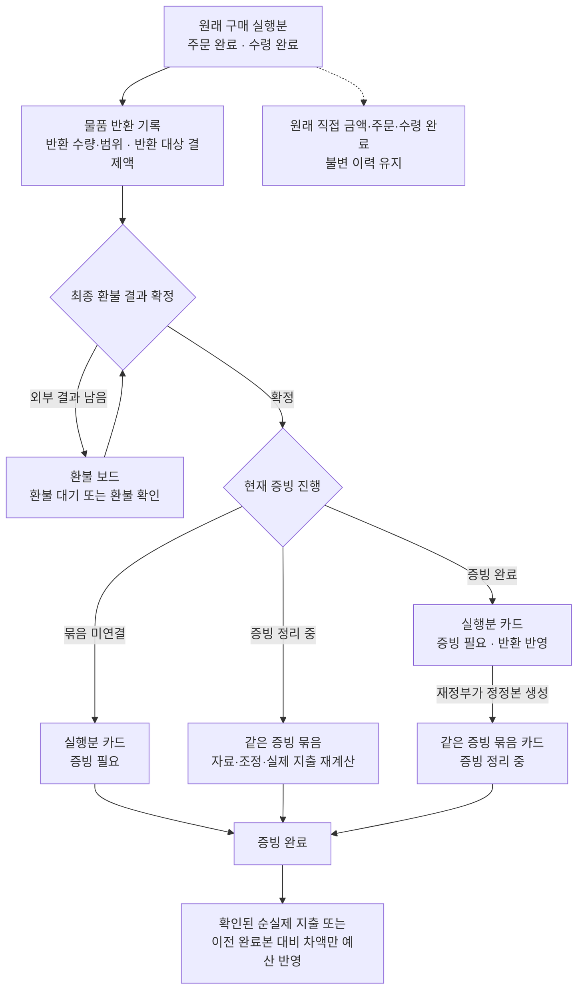
```mermaid
flowchart TD
    COMPLETE["원래 구매 실행분<br/>주문 완료 · 수령 완료"] --> RETURN["물품 반환 기록<br/>반환 수량·범위 · 반환 대상 결제액"]
    RETURN --> REFUND{"최종 환불 결과 확정"}
    REFUND -->|"외부 결과 남음"| REFUND_BOARD["환불 보드<br/>환불 대기 또는 환불 확인"]
    REFUND_BOARD --> REFUND
    REFUND -->|"확정"| EVIDENCE{"현재 증빙 진행"}
    EVIDENCE -->|"묶음 미연결"| NEED["실행분 카드<br/>증빙 필요"]
    EVIDENCE -->|"증빙 정리 중"| CURRENT["같은 증빙 묶음<br/>자료·조정·실제 지출 재계산"]
    EVIDENCE -->|"증빙 완료"| NEED_CORRECTION["실행분 카드<br/>증빙 필요 · 반환 반영"]
    NEED_CORRECTION -->|"재정부가 정정본 생성"| CORRECTION["같은 증빙 묶음 카드<br/>증빙 정리 중"]
    NEED --> FINISH["증빙 완료"]
    CURRENT --> FINISH
    CORRECTION --> FINISH
    FINISH --> BUDGET["확인된 순실제 지출 또는<br/>이전 완료본 대비 차액만 예산 반영"]
    COMPLETE -.-> HISTORY["원래 직접 금액·주문·수령 완료<br/>불변 이력 유지"]
```

예시:

```text
구매 요청 REQ-01
- 현수막
- 생수
- 안내판
- 조끼 20벌

조끼 구매 실행분 EX-VEST-01
- 원래 직접 금액·반환 전 실제 지출: 200,000원
- 반환: 5벌
- 근거로 확인한 반환 대상 결제액: 50,000원
- 실제 은행 환불: 45,000원
- 별도 결제한 반품 배송비: 3,000원
```

누적 환불액 45,000원이 반환 대상 결제액 50,000원보다 작고 추가 환불이 없으므로 최종 환불 결과는 `일부 환불`이다. 판매자 자료가 `총 환불 50,000원 - 공제 수수료 5,000원 = 실제 환불 45,000원`으로 구분하면 증빙 조정 내역은 `-50,000원`, `+5,000원`, `+3,000원`으로 기록한다. 순환불 45,000원만 확인되고 공제 수수료의 별도 근거가 없다면 `-45,000원`, `+3,000원`만 기록하고 5,000원 수수료를 추정하지 않는다. 두 경우 모두 반환 반영 후 실제 지출은 `200,000 - 45,000 + 3,000 = 158,000원`이다.

기존 증빙과 정산이 완료된 뒤 반환했다면 증빙 정정본 완료 시 실제 지출 차액 `-42,000원`만 행사 예산에 반영해 사용 가능 예산을 42,000원 늘린다. 정정본 완료 전에는 기존 200,000원이 계속 유효하다.

## 9. 증빙 묶음과 정산

### 9.1 기본 흐름

```text
재정부가 수령·이행 완료 실행분 또는 비용 잔존이 확인된 주문 취소 실행분을 하나 이상 선택
→ 구매처·구매 종류·결제·영수증 기준으로 증빙 묶음을 수동 생성
→ 선택한 실행분의 개별 증빙 필요 카드를 활성 처리 보드에서 제외
→ 증빙 묶음 카드 하나를 증빙 정리 중에 표시
→ 증빙 정리 중
→ 학교 감사 기준에서 실제 거래 상황에 적용되는 요구 항목 확인
→ 공통·구매 실행분·구매 품목 증빙 연결
→ 구매 실행분 직접 금액과 증빙 조정 내역 입력
→ 증빙 묶음 실제 지출액 계산
→ 일반 구매는 영수증·거래 내역 결제 금액, 주문 취소는 취소 순지출액, 물품 반환은 실제 환불·별도 반환 비용을 반영한 금액과 일치 확인
→ 필수 조건 충족
→ 증빙 묶음 완료
→ 연결된 구매 실행분 증빙 완료
→ 원래 품목의 모든 구매 실행분이 완료됐는지 확인
→ 일부만 완료됐으면 품목 일부 증빙 완료
→ 모두 완료됐으면 품목 증빙 완료
→ 품목의 예산 예약을 실제 지출로 전환
→ 예산 예약 정리까지 끝나면 정산 완료 결과 계산
→ 일반 사용자에게 처리 완료 표시, 재정부 활성 처리 단계에서는 제외
```

`증빙 정리 중`에 잘못 연결된 구매 실행분을 해제하면 해당 실행분은 `증빙 필요`로 돌아가고 묶음의 금액·조정 적용 관계·학교 감사 기준상 요구 항목 충족 여부를 다시 계산한다. 연결 해제된 실행분을 다른 증빙 묶음으로 자동 이동하지 않는다. 마지막 실행분을 해제하면 묶음을 현재 업무에서 제거하고 작성 취소 감사 기록만 보존하며 별도 빈 묶음 상태나 정식 아카이브 대상을 만들지 않는다.

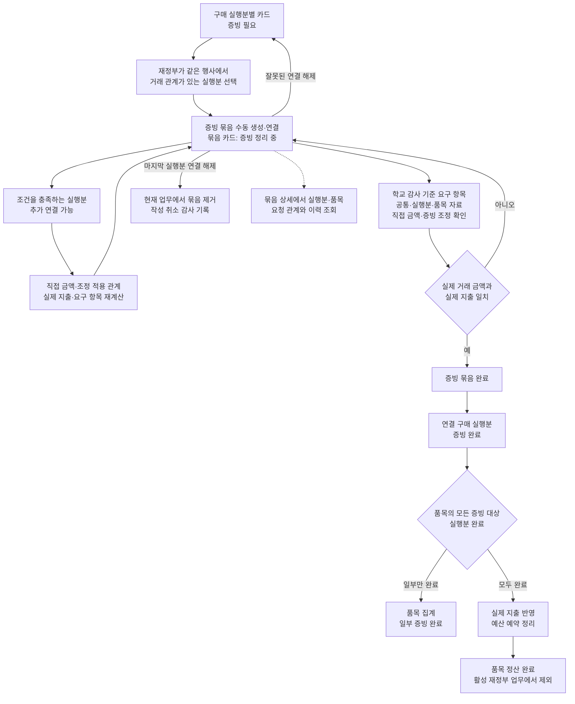
```mermaid
flowchart TD
    REQUIRED["구매 실행분별 카드<br/>증빙 필요"] --> SELECT["재정부가 같은 행사에서<br/>거래 관계가 있는 실행분 선택"]
    SELECT --> BUNDLE["증빙 묶음 수동 생성·연결<br/>묶음 카드: 증빙 정리 중"]
    BUNDLE --> ADD["조건을 충족하는 실행분<br/>추가 연결 가능"]
    ADD --> RECALC["직접 금액·조정 적용 관계<br/>실제 지출·요구 항목 재계산"]
    RECALC --> BUNDLE

    BUNDLE --> CHECK["학교 감사 기준 요구 항목<br/>공통·실행분·품목 자료<br/>직접 금액·증빙 조정 확인"]
    CHECK --> MATCH{"실제 거래 금액과<br/>실제 지출 일치"}
    MATCH -->|"아니오"| BUNDLE
    MATCH -->|"예"| COMPLETE["증빙 묶음 완료"]
    COMPLETE --> EXEC_COMPLETE["연결 구매 실행분<br/>증빙 완료"]
    EXEC_COMPLETE --> ITEM_AGG{"품목의 모든 증빙 대상<br/>실행분 완료"}
    ITEM_AGG -->|"일부만 완료"| PARTIAL["품목 집계<br/>일부 증빙 완료"]
    ITEM_AGG -->|"모두 완료"| BUDGET["실제 지출 반영<br/>예산 예약 정리"]
    BUDGET --> SETTLED["품목 정산 완료<br/>활성 재정부 업무에서 제외"]

    BUNDLE -->|"잘못된 연결 해제"| REQUIRED
    BUNDLE -->|"마지막 실행분 연결 해제"| CANCEL_DRAFT["현재 업무에서 묶음 제거<br/>작성 취소 감사 기록"]
    BUNDLE -.-> DETAIL["묶음 상세에서 실행분·품목<br/>요청 관계와 이력 조회"]
```

### 9.2 증빙 상태

다음 표는 구매 실행분의 원본 증빙 상태다. `증빙 완료`는 종결 상태이지만 완료 후 물품 반환의 확정 금액을 반영해야 하면 예외적으로 `증빙 필요`로 되돌아갈 수 있으며, 이는 완료본 무효화가 아니라 새 반영 업무의 발생이다(아래 설명 참조).

| 상태 | 정의 | 다음 처리 |
|---|---|---|
| 해당 없음 | 수령·이행 완료 전이거나 전액 환불·취소 비용 없음으로 실제 지출이 없는 주문 취소 실행분 | 수령·이행 완료 또는 취소 비용 확인 |
| 증빙 필요 | 수령·이행이 끝났거나 취소 비용이 남았지만 증빙 묶음에 정리되지 않았거나, 완료 후 물품 반환의 확정 금액을 기존 증빙에 반영해야 함 | 증빙 묶음 생성·연결 또는 기존 묶음의 증빙 정정본 생성 |
| 증빙 정리 중 | 증빙 묶음에 연결됐지만 완료 조건이 부족함 | 누락 보완·잘못된 연결 해제 |
| 증빙 완료 | 학교 감사 기준상 요구 항목과 직접 금액·증빙 조정액·실제 지출액 확인 완료 | 실제 지출 반영 |

`일부 증빙 완료`와 품목의 `증빙 완료`는 구매 실행분의 원본 상태가 아니라 구매 품목의 집계 결과다.

재정부 활성 처리 보드에서 `증빙 필요`는 증빙 묶음에 연결되지 않은 구매 실행분 카드로 표시한다. 실행분이 증빙 묶음에 연결되면 원본 증빙 상태는 `증빙 정리 중`으로 전환하되 해당 실행분의 개별 활성 카드는 제외하고 증빙 묶음 카드 하나만 `증빙 정리 중`에 둔다. 증빙 묶음에 실행분이 하나뿐이어도 같은 규칙을 적용한다.

마지막 실행분 연결 해제로 증빙 묶음 작성이 취소되면 묶음 카드는 활성 처리 보드에서 제거하고 연결 해제된 실행분 카드를 `증빙 필요`에 다시 표시한다. `작성 취소됨`이라는 별도 처리 상태나 칸반 열은 만들지 않는다.

증빙 완료 후 물품 반환의 최종 환불 결과가 확정되면 해당 실행분은 반환 반영 업무가 남았다는 의미로 `증빙 필요`에 다시 표시한다. 이전 완료본과 그 실제 지출은 계속 유효하다. 재정부가 같은 완료 묶음의 증빙 정정본을 생성하면 실행분 카드는 제외하고 묶음 카드 하나를 `증빙 정리 중`에 표시한다. 최초 구매와 반환의 결과가 모두 0원이더라도 실제 거래·수령·반환 이력은 증빙 집계 대상에서 제외하지 않는다.

| 구매 품목 집계 결과 | 조건 | 다음 처리 |
|---|---|---|
| 일부 증빙 완료 | 증빙 집계 대상 실행분 중 하나 이상이 `증빙 완료`지만 나머지 실행분이 미완료 | 나머지 실행분 증빙 처리 |
| 증빙 완료 | 성공 구매 실행분과 비용이 남은 주문 취소 실행분이 모두 `증빙 완료` | 예산 예약 정리 |

전액 환불되고 취소 비용이 없어 실제 지출이 0원인 주문 취소 실행분은 품목의 증빙 집계 대상에서 제외한다.

품목의 모든 증빙 집계 대상 실행분이 `증빙 완료`이고 실제 지출 반영과 예산 예약 정리까지 끝나면 `정산 완료` 결과를 계산한다. `정산 완료`는 구매 실행분의 새 증빙 상태나 재정부 처리 단계가 아니며, 일반 사용자에게는 `처리 완료`로 표시하고 재정부 활성 처리 보드에서는 제외한다. 원본 상태와 완료 처리 이력은 아카이브·상세와 사용 내역에 계속 보존한다.

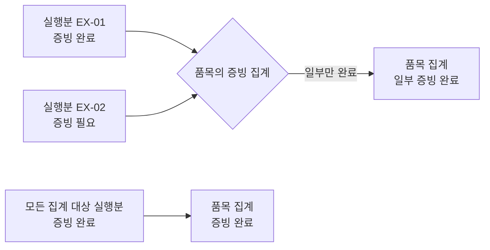
```mermaid
flowchart LR
    E1["실행분 EX-01<br/>증빙 완료"] --> AGG{"품목의 증빙 집계"}
    E2["실행분 EX-02<br/>증빙 필요"] --> AGG
    AGG -->|"일부만 완료"| PARTIAL["품목 집계<br/>일부 증빙 완료"]

    E3["모든 집계 대상 실행분<br/>증빙 완료"] --> COMPLETE["품목 집계<br/>증빙 완료"]
```

### 9.3 증빙 자료

VADA가 고정된 필수 자료 목록을 자체적으로 정하지 않는다. 모든 행사에 공통으로 적용되는 학교의 공식 감사 지침·제출 양식에서 요구하는 정보·자료·확인 조건을 빠짐없이 수집하고 확인한다. 대체 자료나 면제는 학교 감사 기준이 허용할 때만 적용한다.

다음은 기존 와이어프레임에 있던 증빙 자료 후보 예시다. 공식 학교 감사 지침을 아직 확보하지 못했으므로 이 목록을 필수 조건이나 학교 감사 기준으로 간주하지 않는다.

- 영수증
- 구매한 물품 사진
- 실제 사용 사진
- 은행 거래 내역 엑셀 또는 PDF
- 통장 사본
- 결제한 카드 사진
- 구매 사유

증빙 자료는 다음 연결 범위로 관리한다.

- 증빙 묶음 전체 또는 여러 구매 실행분에 공통인 거래·결제 사실은 `증빙 묶음 공통 자료`로 연결한다.
- 특정 실행분의 구매·수령·이행·취소·환불 사실은 `구매 실행분 자료`로 연결한다.
- 한 품목의 여러 실행분에 공통인 구매 목적·필요성·사용 사실은 `구매 품목 자료`로 연결한다.

자료 종류만으로 연결 범위를 정하지 않는다. 예를 들어 영수증도 한 실행분만 입증하면 구매 실행분 자료가 될 수 있고, 사용 사진도 여러 품목을 함께 입증하면 하나의 원본을 관련 품목 모두에 연결할 수 있다. 하나의 원본이 여러 대상이나 연결 범위의 사실을 입증하면 파일을 다시 등록하지 않고 관련 대상에 함께 연결한다.

구매처·구매 종류·영수증·결제 정보는 주문 단계가 아니라 증빙 묶음을 정리하는 시점에 입력한다.

결제 후 주문 취소에서는 재주문과 예산 판단을 위해 환불 확인 업무에서 취소 대상 결제액·개별 환불액·발생일과 근거 자료만 먼저 기록할 수 있다. 이 자료는 증빙 묶음에서 다시 입력하지 않고 공동 참조하며 구매처·주문번호·결제수단 등 전체 상업적 정보는 증빙 정리 시 입력한다.

### 9.4 완료 조건

- 학교 감사 기준에서 요구하는 정보·자료·확인 조건이 모두 충족돼야 한다.
- VADA 또는 재정부 담당자가 학교 감사 기준에 없는 자체 판단으로 필수 자료를 대체하거나 면제할 수 없다.
- 구매 실행분별 직접 금액과 증빙 조정 내역 입력이 완료돼야 한다.
- 영수증에서 구매 실행분에 명확히 귀속되는 상품·용역 금액만 직접 금액으로 입력한다.
- 공통 할인·배송비·수수료는 구매 실행분이나 품목에 배분하지 않는다.
- 각 증빙 조정 내역은 관련 구매 실행분 또는 증빙 묶음 전체를 적용 대상으로 연결한다.
- 적용 대상과의 관계는 기록하되 증빙 조정액을 대상별로 나누지 않는다.
- 시스템은 증빙 조정액의 비례 배분안이나 자동 배분안을 제시하지 않는다.
- `구매 실행분 직접 금액 합계 + 부호를 포함한 증빙 조정액 합계 = 증빙 묶음 실제 지출액`으로 계산한다.
- 비용이 남은 주문 취소 실행분에서는 직접 금액을 0원으로 두고 취소 수수료·환불 불가액을 양수 증빙 조정 내역으로 더한다.
- 주문 취소 증빙의 실제 지출액은 `취소 대상 결제액 - 누적 환불액`으로 계산한 취소 순지출액과 일치해야 한다.
- 일반 구매의 증빙 묶음 실제 지출액은 영수증·거래 내역의 결제 금액과 일치해야 한다.
- 주문 취소 환불이 포함된 증빙에서는 실제 지출액과 누적 환불액의 합이 원래 취소 대상 결제액과 일치해야 한다.
- 물품 반환이 포함된 증빙에서는 원래 구매 실행분의 직접 금액을 변경하지 않고, 실제 환불액을 음수 증빙 조정 내역으로, 별도로 추가 결제한 반환 비용을 양수 증빙 조정 내역으로 기록한다.
- 판매자 근거가 총 환불액과 공제 수수료를 분리할 때만 음수 총 환불액과 양수 공제 수수료를 각각 기록한다. 순환불액만 확인되면 근거 없는 수수료를 추정하지 않고 음수 순환불액만 기록한다.
- 반환 반영 후 실제 지출은 `반환 전 실제 지출 - 실제 환불액 + 별도 추가 결제한 반환 비용`과 일치해야 하며 증빙 조정 순액은 실제 은행·현금 이동과 대조한다.
- 반환 대상 결제액은 판매자 반환 안내·원래 영수증 항목 등 학교 감사 기준을 충족하는 근거로 확인하며, 공통 할인이나 원래 직접 금액을 수량 비율로 자동 배분하지 않는다.
- 물품을 모두 반환하고 전액 환불받아 최종 실제 지출이 0원이더라도 최초 구매·수령·반환 이력을 증빙 완료 대상으로 유지한다.
- 하나의 원본 영수증이 여러 행사에 걸치면 재정부가 행사별 실제 사용액을 직접 구분하고, 행사별 금액 합계가 원본 결제 금액과 일치해야 한다.
- 증빙 자료와 직접 금액·증빙 조정 내역이 연결 구매 실행분과 원래 품목을 설명할 수 있어야 한다.
- 증빙 묶음 완료는 묶음에 연결되지 않은 다른 구매 실행분과 품목의 상태를 변경하지 않는다.
- 구매 품목의 성공 구매 실행분과 비용이 남은 주문 취소 실행분이 모두 증빙 완료돼야 해당 품목을 최종 증빙 완료로 처리한다.
- 전액 환불되고 취소 비용이 없어 실제 지출 0원인 주문 취소 실행분은 품목의 증빙 완료 집계에서 제외한다.
- 일부 구매 실행분만 증빙 완료되면 해당 품목은 일부 증빙 완료로 처리한다.
- 구매 실행분별 직접 금액의 합계를 해당 품목의 실제 직접 금액으로 계산한다.

### 9.5 증빙 완료 후 정정

- 완료된 증빙 묶음의 완료본은 직접 편집하거나 덮어쓰지 않는다.
- 증빙 완료 후 연결 실행분의 물품 반환 결과가 확정되면 반환·환불·추가 비용을 반영하기 위해 같은 증빙 묶음의 증빙 정정본을 사용한다.
- 반환 환불 결과가 아직 미확정인 동안에는 예상 금액으로 정정본의 실제 지출이나 예산을 바꾸지 않는다.
- 최종 환불 결과가 확정되면 실행분을 `증빙 필요`에 표시하고, 재정부가 정정본을 생성하는 순간 해당 실행분 카드 대신 같은 증빙 묶음 카드 하나를 `증빙 정리 중`에 표시한다.
- 증빙 자료 추가·교체·비유효 처리, 구매처·구매 종류·영수증·결제 정보, 구매 실행분별 직접 금액, 증빙 조정 내역·적용 관계 또는 실제 지출을 바로잡아야 하면 재정부가 정정 사유를 기록해 같은 묶음의 새 `증빙 정정본`을 생성한다.
- 잘못된 자료도 물리적으로 삭제하지 않고 새 정정본에서 현재 유효하지 않은 자료로 처리하며 그 사유를 기록한다.
- 증빙 정정본은 새로운 증빙 묶음이 아니며 기존 증빙 묶음의 식별자와 연결 실행분 구성을 그대로 사용한다.
- `증빙 완료` 후 연결 실행분 구성은 불변이므로 누락 실행분은 정정본에 추가하지 않고 새 증빙 묶음을 생성해 필요한 원본 자료를 공동 참조한다.
- 정정본은 기존 원본 상태 `증빙 정리 중`에서 시작하고 연결 실행분의 현재 증빙 상태와 품목 집계·일반 사용자 대표 진행 상태를 다시 계산한다.
- 재정부 활성 처리 보드에는 같은 증빙 묶음 카드 하나를 `증빙 정리 중`으로 다시 표시하고 이전 완료본은 카드로 중복 표시하지 않는다.
- 자료나 금액이 바뀌지 않는 보완이라도 학교 감사 기준상 요구 항목을 다시 확인해야 정정본을 완료할 수 있다.
- 여러 품목·구매 요청의 실행분이 연결된 묶음도 공통 영수증·결제 합계를 포함한 묶음 전체 완료 조건을 다시 확인한다.
- 정정 중에는 마지막 완료본을 현재 유효본으로 유지하고 그 실제 지출을 제거하거나 예산으로 다시 풀지 않는다.
- 정정본 실제 지출이 증가해 행사 사용 가능 예산을 초과하면 예산 조정 전까지 정정본을 완료할 수 없고 마지막 완료본과 그 실제 지출이 계속 유효하다.
- 정정본 완료 시 이전 유효본의 실제 지출과 새 실제 지출의 차액만 추가 또는 차감하고, 새 정정본을 현재 유효본으로 전환한다.
- 물품 반환 정정본도 완료 시 이전 유효본과의 실제 지출 차액만 행사 예산에 반영하며, 반환 전용 새 증빙 묶음을 자동 생성하지 않는다.
- 정정 작업을 취소하면 취소자·시각·사유와 작성 중이던 정정본을 기록으로 보존하고 마지막 완료본을 계속 현재 유효본으로 사용한다.
- 정정이 반복되면 각 완료본과 정정본의 순서, 생성자·완료자·처리 시각·사유와 전후 값을 모두 보존한다.

```mermaid
flowchart LR
    V1["증빙 묶음 완료본 1<br/>현재 유효·실제 지출 유지"] -->|"정정 사유 기록"| V2["같은 묶음 정정본 2<br/>증빙 정리 중"]
    V2 -->|"학교 감사 기준·금액 재확인"| COMPLETE["정정본 2 완료<br/>새 현재 유효본"]
    COMPLETE --> DELTA["완료본 1과의 차액만<br/>실제 지출에 반영"]
    V2 -->|"정정 작업 취소"| V1
    V1 -.-> HISTORY["이전 완료본 불변 보존"]
```

## 10. 예산 처리

- 총예산은 학생회비·지원비 등 재원의 합으로 편성한다.
- 행사별 예산은 예산 항목별로 관리한다.
- 사용 가능 예산은 배정 예산에서 실제 지출과 품목별 예약액을 차감해 계산한다.
- 품목 승인 시 별도 승인액을 입력하지 않는다.
- 승인된 품목의 요청 금액을 해당 품목의 예산 예약액으로 사용한다.
- 사용 가능 예산을 초과하면 해당 품목을 승인할 수 없다.
- 승인 전 품목 반려 또는 실제 결제가 없는 품절 반려 시 해당 품목 예약을 해제한다.
- 주문 완료 실행분이 없는 품목을 요청자가 `요청 취소`하면 실제 지출이 없으므로 해당 품목 예약액 전액을 즉시 해제한다.
- 주문 취소만으로 예약을 해제하지 않고 환불 확인·취소 비용 증빙·재주문 여부가 확정될 때까지 품목 예약액 전체를 유지한다.
- 재주문하지 않아 품목을 반려할 때 취소 비용이 없으면 예약 전액을 해제한다.
- 품목 반려 시 취소 비용이 있으면 취소 순지출액의 실제 지출 전환과 남은 예약액 해제를 동시에 처리한다.
- 증빙 완료 시 구매 실행분 직접 금액과 증빙 조정액을 합친 실제 지출액을 반영하고, 증빙 완료 집계 대상인 모든 구매 실행분이 완료된 품목의 예약을 해제한다.
- 증빙 조정액은 행사별 시스템 예산 항목인 `공통 구매 조정`에 반영한다.
- `공통 구매 조정`은 일반 구매 품목이 아니며 증빙 정산에서만 생성되는 예산 항목이다.
- 배송비·일반 수수료·취소 수수료·환불 불가액은 `공통 구매 조정`에 양수, 할인은 음수로 반영한다.
- 물품 반환의 실제 환불은 `공통 구매 조정`에 음수, 별도로 결제한 반환 비용과 근거로 분리된 공제 수수료는 양수로 반영한다.
- 증빙 조정액을 포함한 실제 지출이 행사 사용 가능 예산을 초과하면 증빙 내용은 저장할 수 있지만 완료할 수 없다.
- 예산 초과 시 재정부가 사용 가능한 예산을 조정한 뒤 증빙을 완료한다.
- 예약액과 실제 지출액의 차이는 정산 기록에 남긴다.
- 증빙 정정본을 작성하는 동안에는 마지막 완료본의 실제 지출을 유지하고 예산으로 다시 풀지 않는다.
- 증빙 정정본 완료 시 이전 유효본과 새 유효본의 실제 지출 차액만 행사 예산에 추가 또는 차감한다.
- 증빙 정정으로 실제 지출이 증가해 행사 사용 가능 예산을 초과하면 예산 조정 전까지 정정본을 완료할 수 없다.
- 최초 증빙 완료 전 발생한 물품 반환은 예상·부분 환불만으로 예약이나 실제 지출을 줄이지 않고 품목 예약액 전체를 유지한다. 반환 환불·추가 비용을 포함한 증빙 완료 시 순실제 지출로 전환하고 예약액의 나머지를 해제한다.
- 정산 완료 후 발생한 물품 반환은 이미 해제한 예산 예약을 다시 만들지 않는다. 환불 결과가 확정돼도 증빙 정정본 완료 전에는 마지막 완료본의 실제 지출을 유지한다.
- 물품 반환 정정본 완료 차액이 음수면 행사 사용 가능 예산을 그만큼 늘리고, 양수면 그만큼 줄인다. 양수 차액이 사용 가능 예산을 초과하면 예산 조정 전까지 정정본을 완료할 수 없다.
- 예산 조정은 재정부만 수행하며 사용 가능한 예산만 이동할 수 있다.

```mermaid
flowchart TD
    APPROVE["구매 품목 승인"] --> RESERVE["요청 금액 전액<br/>예산 예약"]
    RESERVE --> PATH{"이후 결과"}

    PATH -->|"정상 구매"| NORMAL_EVIDENCE["증빙 완료<br/>순실제 지출 확인"]
    NORMAL_EVIDENCE --> CONVERT["예약액 중 실제 지출 전환<br/>나머지 예약 해제"]

    PATH -->|"주문 취소"| CANCEL_HOLD["환불·취소 비용·재주문<br/>확정 전까지 예약 전액 유지"]
    CANCEL_HOLD -->|"재주문"| KEEP_RESERVE["새 예약 없이<br/>기존 예약 계속 사용"]
    KEEP_RESERVE --> PATH
    CANCEL_HOLD -->|"재주문하지 않음·비용 없음"| RELEASE["예약 전액 해제"]
    CANCEL_HOLD -->|"재주문하지 않음·비용 있음"| CANCEL_SPEND["취소 순지출 반영<br/>나머지 예약 해제"]
    RELEASE --> REJECT["성공 구매분이 없으면<br/>품목 반려"]
    CANCEL_SPEND --> REJECT

    PATH -->|"최초 정산 전 물품 반환"| RETURN_HOLD["예상·부분 환불로 줄이지 않고<br/>예약 전액 유지"]
    RETURN_HOLD --> RETURN_EVIDENCE["환불·반환 비용 포함<br/>증빙 완료"]
    RETURN_EVIDENCE --> CONVERT

    CONVERT --> SETTLED["정산 완료<br/>예약 해제"]
    SETTLED -->|"이후 물품 반환"| CORRECTION["예약 복구 없음<br/>마지막 실제 지출 유지"]
    CORRECTION -->|"증빙 정정본 완료"| DELTA["이전 완료본 대비 차액만<br/>사용 가능 예산에 반영"]
```

## 11. 역할별 표시 상태

이 절의 `대표 상태`와 `처리 상태`는 별도 원본 상태가 아니라 구매 품목·구매 실행분·증빙 묶음의 원본 상태에서 계산한 칸반 표시 결과다. 같은 카드는 해당 보드의 계산 결과에 따라 하나의 열에만 배치한다.

### 11.1 일반 사용자 대표 상태

| 대표 상태 | 의미 |
|---|---|
| 검토 중 | 재정부의 검토를 기다리는 중(재정부 검토 대기) |
| 보완 필요 | 현재 사용자가 제출한 품목에 수정이 필요함 |
| 보완 중 | 다른 요청자가 품목을 보완 중 |
| 선진행 확인 필요 | 요청자가 보완 요청과 나머지 승인 품목의 선진행 여부를 확인해야 함 |
| 구매 진행 동의 대기 | 승인됐지만 선진행 동의 또는 보완 재검토 완료를 기다림 (재정부 처리 단계 `선진행 동의 대기`와 대응) |
| 구매 준비 | 승인 후 주문 전 |
| 주문 완료 | 주문은 끝났지만 배송·이행 전 |
| 요청 취소 | 주문 완료 전 원래 요청자가 품목 요청을 철회함. 활성 칸반 제외·전체 요청 아카이브 보존 |
| 주문 취소 요청 중 | 원래 요청자가 취소를 요청했고 재정부가 외부 취소 성립 여부를 확인 중 |
| 주문 취소 | 특정 구매 실행분의 주문 취소가 성립함 |
| 배송 중 | (물품) 배송·수령 진행 중 |
| 이행 중 | (대여·용역) 이행 진행 중 |
| 수령 완료 | (물품) 실제 수령 확인 완료 |
| 이행 완료 | (대여·용역) 이행 확인 완료 |
| 정산 중 | 증빙 묶음 정리 중 |
| 처리 완료 | 증빙 완료와 실제 지출 반영 완료 |
| 반려 | 성공적으로 구매된 실행분 없이 품목 구매 종료 |
| 구매 불가 | 품절 등으로 승인 후 구매 불가 |

일반 사용자 대표 상태는 요청자의 응답이 필요한 상태와 정상 흐름을 중단한 예외를 우선한다. 해당 사항이 없으면 정상 흐름에서 마지막으로 달성된 업무 결과를 표시한다. 따라서 물품의 `수령 완료`·대여·용역의 `이행 완료`와 재정부 내부 작업인 `증빙 필요`가 함께 있으면 대표 상태 `수령 완료`/`이행 완료`(품목 현황의 수령·이행 완료 열)에 두고, 증빙 묶음에 연결되어 실제 정리가 시작된 `증빙 정리 중`부터 `정산 중`으로 이동한다. 대표 상태는 구매 유형에 따라 물품은 `배송 중`·`수령 완료`, 대여·용역은 `이행 중`·`이행 완료`로 구분해 표시한다.

`요청 취소`는 종결 결과이므로 일반 사용자·재정부 활성 칸반 열로 유지하지 않는다. 전체 요청 아카이브에서 취소된 품목, 취소 직전 상태, 사유·취소자·취소 시각을 표시한다.

보완 재제출 직후 해당 품목은 일반 사용자 `품목 현황`의 `검토 중`에 두고 카드·상세에 `보완 재제출 완료`, 보완 회차와 마지막 재제출 시각을 보조 정보로 표시한다. 보완 회차마다 별도 칸반 열이나 새 품목 카드를 만들지 않는다.

파손·오배송 실행분은 정상 인수가 확정될 때까지 기존 일반 사용자 대표 상태 `배송 중`(물품)을 유지하고 카드·상세에 `수령 문제 있음`을 보조 표시한다. 별도 파손·오배송·교환 칸반 열은 만들지 않는다.

원래 요청자가 주문 취소 요청을 제출하면 외부 취소가 성립하거나 불성립으로 종료될 때까지 해당 요청자에게 `주문 취소 요청 중`을 우선 표시한다. 다른 일반 사용자에게는 기존 원본 상태에서 계산한 대표 진행 상태를 유지하고 취소 요청 진행 여부를 카드·상세의 보조 정보로만 표시한다. 취소가 성립하면 `주문 취소`로 전환하고, 불성립하면 별도 완료 상태를 만들지 않고 기존 대표 진행 상태로 돌아가며 요청과 결과는 상세 이력에 보존한다.

원본 주문 상태가 `주문 취소`인 실행분은 일반 사용자에게도 같은 이름의 대표 진행 상태 `주문 취소`로 표시한다. 환불 확인·취소 비용 증빙·재주문 판단 등 재정부 내부 후속 작업은 일반 사용자 칸반 열을 추가하지 않고 카드·상세의 보조 정보로만 제공한다. 새 재주문 실행분은 실제 주문 전까지 기존 `구매 준비`에 두되 원인이 된 취소 실행분과의 관계를 알 수 있도록 `재주문` 표시를 함께 제공한다. 재주문 실행분이 재정부에서 `재주문 보류`인지 실제 주문 가능한 `주문 대기`인지는 일반 사용자 대표 상태를 나누는 기준으로 사용하지 않는다.

주문 취소 후 물품이 도착해도 일반 사용자 대표 상태는 `주문 취소`를 유지하고 카드·상세에 `주문 취소 후 도착`을 보조 표시한다. 반송·처분 과정은 별도 일반 사용자 칸반 열로 만들지 않는다.

성공적으로 구매된 실행분 없이 품목이 원본 검토 상태 `반려`로 종결되면 일반 사용자에게 기존 대표 진행 상태 `반려`를 우선 표시하며, 이전 실행분의 주문 취소·환불·재주문 기록은 상세와 아카이브에 보존한다.

원본 주문 상태 `주문 완료`와 `배송 대기` 또는 `이행 대기`가 함께 있으면 일반 사용자는 마지막으로 달성된 결과인 `주문 완료`로 표시한다. 배송이 실제로 시작되면 물품은 `배송 중`, 용역·대여 이행이 시작되면 대여·용역은 `이행 중`으로 이동한다.

정산 완료 후 물품 반환의 환불을 기다리거나 반환 반영을 위한 증빙 정정본이 아직 생성되지 않은 동안에는 마지막 완료본과 실제 지출이 유효하므로 일반 사용자 대표 상태 `처리 완료`를 유지하고 반환·환불 후속 업무를 보조 정보로 표시한다. 재정부에서는 같은 실행분이 `환불 대기`·`환불 확인` 또는 `증빙 필요`에 다시 나타날 수 있지만, 이는 일반 사용자 완료 이력을 되돌리는 상태 전환이 아니다.

완료된 증빙 묶음에 증빙 정정본이 생성되면 연결 실행분의 현재 증빙 상태를 `증빙 정리 중`으로 다시 계산하고 일반 사용자에게 `정산 중`으로 표시한다. 이전 완료본과 실제 지출은 정정본 완료 전까지 유효하지만 정정 업무가 남았으므로 `처리 완료`로 표시하지 않는다.

```mermaid
flowchart LR
    COMPLETE["일반 사용자<br/>처리 완료"] -->|"정산 완료 후 물품 반환<br/>환불·정정 준비"| KEEP["처리 완료 유지<br/>후속 업무 보조 표시"]
    KEEP -->|"증빙 정정본 생성"| ORGANIZING["정산 중"]
    ORGANIZING -->|"정정본 완료·차액 반영"| COMPLETE

    KEEP -.-> FINANCE1["재정부<br/>환불 대기·환불 확인 또는 증빙 필요"]
    ORGANIZING -.-> FINANCE2["재정부<br/>증빙 정리 중"]
```

일반 사용자 `품목 현황`에서는 초기 구매 실행분이 하나뿐인 품목을 실행분 카드로 바꾸지 않고 품목 카드 하나의 `구매 준비`로 표시한다. 같은 품목의 구매 실행분이 둘 이상이 된 시점부터 실행분마다 대표 상태를 계산해 별도 카드로 표시하고 이후 다시 하나의 품목 카드로 합치지 않는다.

### 11.2 재정부 업무 영역과 처리 단계

`재정부 업무 영역`은 하나의 재정 알고리즘과 원본 데이터를 외부에 보여주는 관점을 다섯 가지로 나눈 것이다. 업무 영역별로 데이터를 복제하거나 별도 진행 상태를 저장하지 않으며, 한 영역의 처리 결과는 같은 원본 상태와 관계를 통해 다른 영역의 표시에도 즉시 반영한다.

같은 구매 품목·구매 실행분·증빙 묶음의 활성 카드는 여러 업무 영역 중 최우선 다음 업무가 속한 한 영역과 그 안의 한 처리 단계 열에만 표시한다. 한 구매 요청의 서로 다른 품목·실행분이 각자 다른 영역에 있는 것은 허용하며, 취소 실행분과 재주문 실행분처럼 별도 처리 단위인 카드도 각자의 영역에 표시할 수 있다.

업무 영역에서 사용하는 카드 단위는 다음과 같다.

| 업무 영역 | 카드 단위 | 전환 기준 |
|---|---|---|
| 요청 검토 | 구매 품목 | 품목별 검토·보완·재검토 결과를 처리 |
| 구매 준비 | 구매 품목 또는 구매 실행분 | 구매 승인 묶음 생성 전에는 품목, 생성 후에는 초기·재주문 실행분 |
| 물품 배송·수령 | 구매 실행분 | 주문 완료 후 물품·제작물 실행분의 배송·수령을 처리 |
| 대여 이행 | 구매 실행분 | 주문 완료 후 대여 실행분의 이행·반납을 처리 |
| 용역 이행 | 구매 실행분 | 주문 완료 후 용역 실행분의 이행을 처리(반납 없음) |
| 환불 | 구매 실행분 | 주문 취소 또는 물품 반환에 연결된 환불 확인 업무를 실행분별 추적 |
| 증빙 | 구매 실행분 또는 증빙 묶음 | 묶음 연결 전에는 실행분별 `증빙 필요`, 연결 후에는 묶음 카드 하나로 `증빙 정리 중` |

| 업무 영역 | 처리 단계 | 재정부의 다음 행동 |
|---|---|---|
| 요청 검토 | 검토 대기 | 품목 검토 후 승인·보완 요청·반려 결정 |
| 요청 검토 | 보완 응답 대기 | 요청자의 품목 보완 대기 |
| 요청 검토 | 재검토 대기 | 보완된 품목 재검토 |
| 구매 준비 | 선진행 동의 대기 | 승인 품목의 예산은 예약됐지만 요청자의 동의 또는 보완 재검토 완료를 기다림 |
| 구매 준비 | 주문 대기 | 구매 승인 묶음에 등록된 품목 주문 |
| 구매 준비 | 재주문 보류 | 미리 생성된 재주문 실행분의 환불·취소 비용 증빙·실제 지출·예산 차단 조건 해소 추적 |
| 구매 준비 | 구매 불가 처리 필요 | 품절 사유 반려와 예약 해제 |
| 물품 배송·수령 | 배송 대기 | 발송 여부 확인 |
| 물품 배송·수령 | 배송 중 | 배송 완료 여부 확인 |
| 물품 배송·수령 | 수령 확인 필요 | 재정부가 실제 수령자·수량·시각·이상 여부와 근거를 확인해 정상 수령 여부 판단 |
| 물품 배송·수령 | 주문 취소 요청 확인 | (물품 실행분) 요청자의 취소 대상·범위·사유와 외부 취소 성립 여부를 확인하고 성립·불성립 결과 기록 |
| 대여 이행 | 이행 대기 | 대여 시작 여부 확인 |
| 대여 이행 | 이행 중 | 반납 확인 요청 |
| 대여 이행 | 반납 확인 필요 | 대여물의 반납·회수와 상태를 확인하고 이행 완료 처리 |
| 대여 이행 | 주문 취소 요청 확인 | (대여 실행분) 요청자의 취소 대상·범위·사유와 외부 취소 성립 여부를 확인하고 성립·불성립 결과 기록 |
| 용역 이행 | 이행 대기 | 용역 시작 여부 확인 |
| 용역 이행 | 이행 중 | 이행 완료 확인(반납 없음) |
| 용역 이행 | 주문 취소 요청 확인 | (용역 실행분) 요청자의 취소 대상·범위·사유와 외부 취소 성립 여부를 확인하고 성립·불성립 결과 기록 |
| 환불 | 환불 대기 | 판매자의 환불·응답 또는 추가 입금처럼 외부 결과가 남아 최종 확인할 수 없는 건 추적 |
| 환불 | 환불 확인 | 외부 응답·입금 내역과 근거가 갖춰진 건의 금액 대조와 최종 환불 결과 확정 |
| 환불 | 재주문 판단 | 취소 실행분의 환불·비용·예산 정리 후 재주문 실행분 생성 또는 재주문 안 함 결정(환불 확인 직후 이어지며, 결정하면 종결) |
| 증빙 | 증빙 필요 | 증빙 묶음에 연결되지 않은 수령·이행 완료 실행분·비용이 남은 주문 취소 실행분을 묶음에 연결하거나 완료 후 물품 반환 실행분의 기존 묶음에 정정본 생성 |
| 증빙 | 증빙 정리 중 | 증빙 묶음 카드에서 누락 자료와 직접 금액·증빙 조정액·실제 지출액 확인 |

각 업무 영역 안에서는 정상 진행 흐름 열(순차로 이어지는 단계, 화살표로 연결)과 예외·후속 열(보완 응답 대기·재검토 대기·재주문 보류·구매 불가 처리 필요·주문 취소 요청 확인·재주문 판단)을 시각적으로 구분한다. 예외·후속 열은 흐름 열과 구분선으로 나누고 별도 강조(호박색 테두리·`예외` 태그)로 표시하되, 상태 정의와 계산은 동일하다.

`재검토 대기` 품목 카드에는 현재 품목명·구매 유형·수량·요청 금액·예산 항목, `보완 재제출` 표시, 보완 회차, 수정된 필드 수와 주요 변경 요약, 기존 보완 사유, 재제출자·재제출 시각, 사용 가능 예산과 시스템 자동 확인 결과를 표시한다. 카드나 상세에서 보완 전·후 비교로 이동할 수 있어야 한다.

보완 전·후 비교에서는 각 입력값의 추가·변경·제거와 첨부자료의 추가·교체·제외를 구분해 표시한다. 제외·교체된 이전 첨부자료는 과거 보완 제출본에서 계속 조회한다.

```mermaid
flowchart TD
    SOURCE["공통 원본 상태·관계<br/>구매 요청 · 구매 품목 · 구매 실행분 · 증빙 묶음"]
    SOURCE --> CALC["공통 재정 알고리즘<br/>처리 단계와 칸반 위치 계산"]
    CALC --> SELECT["처리 단위별 최우선 다음 업무 선택<br/>활성 영역 1곳 · 칸반 열 1곳"]
    SELECT --> REVIEW["요청 검토 보드"]
    SELECT --> PURCHASE["구매 준비 보드"]
    SELECT --> FULFILL["물품 배송·수령 / 대여 이행 / 용역 이행 보드"]
    SELECT --> REFUND["환불 보드<br/>환불 대기 · 환불 확인"]
    SELECT --> EVIDENCE["증빙 보드"]
    REVIEW -->|"처리 결과로 원본 변경"| SOURCE
    PURCHASE -->|"처리 결과로 원본 변경"| SOURCE
    FULFILL -->|"처리 결과로 원본 변경"| SOURCE
    REFUND -->|"처리 결과로 원본 변경"| SOURCE
    EVIDENCE -->|"처리 결과로 원본 변경"| SOURCE
```

재정부 처리 단계는 이전에 달성된 결과보다 현재 남아 있는 다음 미완료 업무를 표시한다. 원본 주문 상태 `주문 완료`와 `주문 취소`는 별도 처리 단계로 사용하지 않는다. 주문 완료 직후 물품·제작물은 `배송 대기`, 대여·용역은 `이행 대기`에 둔다. `수령 완료`·`이행 완료`와 `증빙 필요`가 함께 있으면 `증빙 필요`에 둔다.

요청자의 유효한 주문 취소 요청이 있으면 기존 `배송 대기`·`배송 중`·`이행 대기`·`이행 중`보다 `주문 취소 요청 확인`을 우선한다. 이는 원본 주문·배송·이행 상태를 덮어쓰지 않는 계산된 처리 단계다. 외부 취소가 성립하면 원본 `주문 취소`와 기존 취소 후속 업무로 재계산하고, 불성립하면 취소 요청을 종료한 뒤 기존 원본 상태에 맞는 배송·수령 또는 이행 단계로 복귀한다.

`환불` 업무 영역은 환불 결과가 미확정인 실행분을 `환불 대기` 또는 `환불 확인`에 표시한다. 판매자의 환불·응답이나 추가 입금처럼 외부 결과가 남아 있으면 `환불 대기`, 외부 자료가 갖춰져 재정부의 최종 대조·확정만 남으면 `환불 확인`에 둔다. 두 열은 공통 환불 자료에서 자동 계산하며 수동 이동하지 않는다. 환불 지연은 카드의 경과 정보로 표시하고 완료된 건은 활성 보드에서 제외하므로 `환불 지연`·`환불 완료` 열은 만들지 않는다.

물품 반환 기록을 만들 때 최종 환불 결과와 근거가 이미 확인된 실행분은 환불 영역에 표시하지 않고, 같은 처리에서 환불 확인 업무를 끝낸 뒤 공통 알고리즘으로 다음 업무 영역을 계산한다. 정산 완료 후 물품 반환이 발생해도 미확정 환불이 있으면 실행분 카드를 환불 영역에 다시 표시할 수 있으며 이는 완료 상태를 되돌리는 것이 아니라 새 후속 업무를 표시하는 것이다.

물품 반환의 최종 환불 결과가 확정되면 아직 증빙 묶음에 연결되지 않은 실행분은 기존 `증빙 필요`, 증빙 정리 중인 실행분은 같은 묶음의 `증빙 정리 중`에 둔다. 증빙이 이미 완료된 실행분은 반환 반영을 위해 `증빙 필요`에 다시 표시하고, 재정부가 같은 묶음의 증빙 정정본을 생성하면 실행분 카드 대신 묶음 카드 하나를 `증빙 정리 중`에 표시한다. 반환 전용 증빙 묶음·칸반 열은 만들지 않는다.

파손·오배송 실행분은 새 처리 단계를 만들지 않고 기존 `수령 확인 필요`에 두며 카드·상세에 `수령 문제 있음`과 이상 내용·근거를 표시한다. 정상 교환품 수령·그대로 인수 또는 주문 취소 같은 최종 결과가 확인되면 기존 원본 상태에서 처리 단계를 다시 계산한다.

증빙 묶음에 연결되지 않은 증빙 대상 실행분은 실행분별 `증빙 필요` 카드로 표시한다. 실행분이 증빙 묶음에 연결되면 해당 실행분의 개별 활성 카드는 제외하고 증빙 묶음 카드 하나만 `증빙 정리 중`에 표시한다. 이는 실행분 원본이나 연결 관계를 삭제하는 것이 아니며 묶음 상세에서 연결 실행분과 원래 품목·요청을 계속 조회한다. `증빙 정리 중`에 연결이 해제된 실행분은 다시 `증빙 필요` 카드로 표시한다.

완료된 증빙 묶음에 증빙 정정본이 생성되면 같은 증빙 묶음 카드 하나를 `증빙 정리 중`에 다시 표시한다. 이전 완료본은 활성 카드로 중복 표시하지 않고 묶음 상세의 불변 이력으로 조회한다.

증빙 묶음의 첫 완료본이 생성되면 해당 묶음은 재정부의 `증빙 아카이브`에 표시한다. 정정본 작성 중에도 마지막 완료본과 실제 지출을 현재 유효본으로 유지하며 아카이브에 `정정 진행 중`을 표시하고, 실제 정정 업무는 활성 증빙 보드의 `증빙 정리 중` 카드에서 처리한다. 정정본 완료 후 아카이브는 새 현재 유효본과 이전 버전 전체를 보여준다.

주문 취소 실행분은 결제 여부, 환불 확인 업무와 결과, 재주문 판단, 취소 비용 증빙 등 현재 남아 있는 정확한 후속 업무에 따라 재정부 처리 단계를 계산한다. 결제 후 취소의 환불 결과가 미확정이면 외부 결과의 잔존 여부에 따라 `환불 대기` 또는 `환불 확인`에 둔다. 등록된 환불 내역·추가 환불 예정 여부와 경과 기간은 카드·상세에서 함께 표시한다. 다만 주문 취소 후 물품이 도착해 반송·판매자 처분 지시가 미해결이면 기존 `수령 확인 필요`를 우선하고 `수령 문제 있음 · 주문 취소 후 도착`을 표시한다. 반송·처분이 해결되면 당시 처리 기록을 남기고 기존 취소 후속 단계 계산을 재개한다.

환불 결과가 확정된 뒤 취소 수수료·환불 불가액이 남은 실행분은 기존 `증빙 필요`에 둔다. 별도 `취소 비용 증빙` 처리 단계를 만들지 않으며 원본 주문 상태 `주문 취소`, 환불 결과와 취소 순지출액은 카드·상세에서 함께 표시한다. 전액 환불되고 취소 비용이 없는 실행분은 실제 지출 0원으로 증빙 대상에서 제외한다.

미리 생성된 재주문 실행분의 원본 주문 상태는 `주문 대기`로 유지한다. 다만 연결된 취소 실행분의 환불 결과가 미확정이거나 취소 비용 증빙·실제 지출 반영·행사 사용 가능 예산 확인 중 하나라도 남아 있으면 재정부 카드 하나를 `재주문 보류`에 두고 현재 남은 모든 차단 사유를 카드·상세에 표시한다. 원인이 된 취소 실행분은 자신의 `환불 대기`·`환불 확인`·`증빙 필요` 등 정확한 후속 처리 단계에 별도 카드로 유지한다.

모든 차단 조건이 해소되면 재주문 실행분은 별도의 수동 보류 해제나 새 원본 상태 전이 없이 기존 `주문 대기` 처리 단계로 자동 재계산한다. 자동 재계산 자체에 별도 처리자를 만들지 않고, 환불 확인·증빙 완료·실제 지출 반영·예산 확인 등 계산 근거를 바꾼 원본 처리의 담당자·시각과 변경 이력을 보존한다.

취소 실행분의 환불·비용 증빙·실제 지출·예산 문제가 모두 정리됐지만 재주문 실행분이나 `재주문하지 않음` 결정 기록이 없으면 `재주문 판단`에 둔다. 결정 결과는 새 재주문 실행분 생성 또는 결정자·시각·사유를 포함한 `재주문하지 않음` 기록이며 별도 원본 주문 상태를 만들지 않는다.

`정산 완료`는 학교 감사 기준상 요구 항목과 실제 지출이 확인되고 예산 예약이 정리됐음을 나타내는 구매 품목의 계산된 종결 결과다. 더 이상 재정부가 처리할 업무가 없으므로 활성 처리 단계에는 두지 않는다. 일반 사용자 `처리 완료`, 전체 요청·구매 승인 아카이브, 증빙 묶음 상세와 사용 내역에서는 완료 결과와 모든 이력을 계속 조회한다.

구매 품목의 원본 검토 상태 `반려`도 종결 후 별도 `반려 완료` 처리 단계로 이동하지 않는다. 승인 후 반려에 필요한 환불·취소 비용 증빙·실제 지출·예산 예약 정리가 남아 있으면 기존 미완료 단계에 유지하고, 모든 정리를 완료하는 처리와 함께 `반려`로 전환한 뒤 활성 처리 단계에서 제외한다. 반려 사유와 처리 이력은 전체 요청·구매 승인 아카이브와 상세에서 계속 조회한다.

## 12. 화면 및 메뉴 원칙

### 12.1 최상위 재정

- 최상위 재정 메뉴는 학생회 전체 재정을 열람하는 공간이다.
- `전체 재정 현황`과 `사용 내역`만 메뉴에 둔다.
- 구매 요청 작성·검토·주문·증빙은 각 `행사 > 재정`에서 시작한다.
- 감사보고서 기능은 추가하지 않는다.

### 12.2 행사 재정

- 일반 부원·부서장에게 `품목 현황`을 기본으로 표시한다.
- 재정부에게 `요청 검토`, `구매 준비`, `물품 배송·수령`, `대여 이행`, `용역 이행`, `환불`, `증빙`의 업무 영역별 작업 보드를 제공한다.
- 재정부에게 `전체 요청`, `구매 승인 아카이브`, `증빙 아카이브`의 세 기록 조회 관점을 제공한다.
- `증빙 아카이브`는 현재 선택된 행사에서 하나 이상의 완료본이 생성된 증빙 묶음을 조회한다.
- 일반 부원·부서장은 증빙 아카이브 원본 자료에 접근하지 않고 `품목 현황`, `전체 요청`과 `사용 내역`에서 확정 결과만 확인한다.
- `품목 현황`은 구매 품목을 일반 사용자용 대표 상태별 칸반으로 보여준다.
- 일반 사용자용 대표 상태와 재정부용 처리 단계는 원본 상태를 직접 대체하지 않으며 각 보드에서 별도로 계산한다.
- 재정부 업무 영역은 외부 표시를 나눈 것일 뿐 별도 데이터나 독립 업무 흐름을 갖지 않으며 모든 영역이 같은 원본 상태와 관계를 공동으로 사용한다.
- 어느 영역에서 처리하더라도 원본 상태와 관계를 먼저 갱신하고 그 결과로 모든 업무 영역의 카드 포함 여부와 칸반 위치를 다시 계산한다.
- 업무 영역 사이를 이동시키기 위한 수동 인계 상태나 중복 동기화 동작은 만들지 않는다.
- 같은 구매 품목·구매 실행분·증빙 묶음의 활성 카드는 재정부 업무 영역 전체에서 최우선 다음 업무가 속한 한 영역과 그 안의 한 칸반 열에만 배치한다.
- 같은 구매 요청에 속한 서로 다른 품목·실행분이 각자의 진행 상태에 따라 서로 다른 업무 영역에 동시에 표시되는 것은 허용한다.
- 취소 실행분과 재주문 실행분처럼 별도 처리 단위인 카드는 같은 품목에 연결돼 있어도 중복 카드로 보지 않는다.
- 카드의 칸반 위치와 다른 주문·수령 또는 이행·증빙 상태는 카드나 상세 정보에서 함께 표시할 수 있다.
- 원본 상태 전이 없이 칸반 위치만 독립적으로 변경하지 않는다.
- 구매 승인 묶음 생성 후에도 해당 품목과 철회되지 않은 묶음에 속한 구매 실행분이 하나뿐이면 일반 사용자 `품목 현황`에서는 품목 카드 하나를 유지하고 실행분 상태를 집계해 표시한다.
- 부분 주문·부분 취소·재주문 등으로 같은 품목의 구매 실행분이 둘 이상이 되면 그 시점부터 실행분마다 현재 상태에 맞는 별도 칸반 카드로 표시하고 이후 품목 카드 하나로 다시 합치지 않는다.
- 일반 사용자 `품목 현황`의 주문 취소 실행분은 `주문 취소`에 두고, 새 재주문 실행분은 주문 전까지 `구매 준비`에 두면서 `재주문` 관계를 표시한다.
- 원래 요청자에게는 품목의 어떤 실행분도 주문 완료되지 않은 동안 품목 카드·상세에 `요청 취소` 동작을 제공하고 사유 입력을 필수로 한다. 다른 요청자의 품목과 주문 완료 실행분이 있는 품목에는 노출하지 않는다.
- 요청 취소된 품목과 주문되지 않은 실행분은 모든 활성 칸반·현재 집계에서 즉시 제외하고 전체 요청 아카이브에만 취소 결과를 표시한다.
- 원래 요청자에게는 주문 완료 후 수령·이행 완료 전 실행분 카드·상세에 `주문 취소 요청` 동작을 제공하고, 다른 사용자의 요청이나 이미 취소·수령·이행 완료된 실행분에는 노출하지 않는다.
- 주문 취소 요청이 진행 중인 실행분은 요청자에게 `주문 취소 요청 중`, 재정부에게 실행분의 구매 유형에 따라 `물품 배송·수령`·`대여 이행`·`용역 이행` 영역의 `주문 취소 요청 확인`으로 표시하며 원본 배송·이행 상태와 외부 응답 대기 정보는 카드·상세에 함께 표시한다.
- `환불 대기`·`환불 확인`·`증빙 필요`·`재주문 보류`는 재정부 내부 처리 단계이므로 일반 사용자 칸반 열로 만들지 않고 관련 카드·상세의 보조 정보로만 제공한다.
- 재정부 `처리 단계`에서는 구매 승인 묶음 생성과 함께 만들어진 초기 구매 실행분을 각각 `주문 대기` 카드로 표시한다.
- 정산 완료 결과가 계산된 구매 품목과 그 소속의 완료된 구매 실행분·증빙 묶음 작업은 재정부의 다음 업무가 없으므로 활성 `처리 단계`에서 제외하고 기존 아카이브·상세와 사용 내역에서 조회한다.
- 구매 품목이 `반려`로 전환되면 별도 `반려 완료` 카드를 만들지 않고 활성 `처리 단계`에서 제외하며 반려 사유와 재정 정리 이력은 기존 아카이브·상세에서 조회한다.
- 원본 주문 상태가 `주문 취소`라는 이유만으로 재정부 카드를 같은 이름의 열에 두지 않고, 환불 확인 업무·재주문 판단·취소 비용 증빙 등 현재 남은 후속 업무에서 처리 단계를 계산한다.
- 결제 후 주문 취소 실행분의 환불 결과가 미확정이면 외부 환불·응답이 남은 동안 `환불 대기`, 외부 자료가 갖춰져 재정부의 최종 대조·확정만 남으면 `환불 확인`에 둔다.
- 두 환불 열은 환불 자료와 추가 환불 예정 여부에서 자동 계산하고 수동으로 이동하지 않으며, 지연은 카드 정보로 표시하고 완료 건은 활성 보드에서 제외한다.
- 환불 결과가 확정되고 취소 비용이 남은 실행분은 기존 `증빙 필요`에 두고 주문 취소·환불 결과·취소 순지출액은 카드·상세 정보로 표시하며 별도 `취소 비용 증빙` 열을 만들지 않는다.
- 비용이 남은 취소 실행분과 연결된 재주문 실행분은 미리 생성할 수 있지만 취소 실행분의 증빙 완료·실제 지출 반영·행사 사용 가능 예산 확인 전에는 실제 주문과 `주문 완료` 전환을 차단한다.
- 미리 생성됐지만 실제 주문 차단 조건이 남은 재주문 실행분은 원본 주문 상태 `주문 대기`를 유지하면서 재정부 `재주문 보류` 카드로 표시하고, 모든 차단 사유가 해소되면 별도 해제 처리 없이 재정부 `주문 대기`로 자동 재계산한다.
- 취소 실행분의 환불·비용·예산 문제가 정리됐지만 재주문 여부가 미결정이면 `재주문 판단`에 두고, 재주문 실행분 생성 또는 사유를 기록한 `재주문하지 않음` 결정으로 처리한다.
- 재주문 실행분은 새 카드로 표시하고 원인이 된 취소 실행분의 카드와 연결 이력을 조회할 수 있어야 한다.
- 재정부가 보는 품목 카드에는 재정부용 세부 상태와 담당자를 추가한다.
- `처리 단계`는 재정부가 다음 행동을 해야 하는 품목을 중심으로 구성한다.
- 증빙 묶음에 연결되지 않은 실행분은 재정부 `증빙 필요` 카드로 표시한다.
- 실행분이 증빙 묶음에 연결되는 순간 그 실행분의 개별 활성 카드를 제외하고 증빙 묶음 카드 하나만 `증빙 정리 중`에 표시한다.
- 증빙 묶음 카드에서는 연결된 실행분과 원래 품목·요청 관계를 조회하며, 연결 해제된 실행분은 다시 `증빙 필요` 카드로 표시한다.
- `전체 요청`은 구매 요청 단위의 제출 이력과 소속 품목별 현재 상태를 조회하는 아카이브다.
- `구매 승인 아카이브`는 현재 유효한 승인 묶음을 조회하며, 묶음을 열면 요청 취소되지 않은 소속 품목과 구매 실행분의 현재 상태를 함께 보여준다.
- `증빙 아카이브`는 완료 이력이 있는 증빙 묶음의 현재 유효본·이전 완료본·정정본, 연결 실행분·품목·요청, 증빙 자료·금액·처리 이력을 조회한다.
- 정정 중인 증빙 묶음은 증빙 아카이브에서 마지막 완료본과 `정정 진행 중`을 보여주고 활성 증빙 보드에서는 같은 묶음 카드 하나를 `증빙 정리 중`에 표시한다.
- 완료본이 없는 작성 중 묶음과 작성 취소된 묶음은 증빙 아카이브에 표시하지 않는다.
- 철회된 구매 승인 묶음은 삭제하지 않고 `철회됨` 행정 표시와 철회 사유를 함께 보여준다.
- 요청 취소된 품목은 구매 승인 아카이브의 목록·묶음 상세·현재 집계에서 자동 제외하고, 표시할 품목이 하나도 남지 않은 묶음도 목록에서 제외한다. 원래 승인 묶음 구성과 제외 이력은 전체 요청 아카이브·감사 기록에서 보존한다.

### 12.3 워크플로우 화면

- 구매 요청 작성 화면은 `요청 전체 정보`, 반복 가능한 `구매 품목`, 선택한 구매 유형의 `유형별 정보` 순서로 구분한다.
- 행사·요청자·요청 부서는 자동 설정 결과를 보여주고, 복수 요청 가능 소속이 있는 경우에만 요청 부서를 선택하게 한다.
- 우선순위는 `일반`을 기본값으로 두며 `긴급`을 선택한 경우에만 긴급 사유를 표시하고 필수로 전환한다.
- 구매 유형을 선택하면 해당 유형의 필수·조건부 필수 필드만 추가 표시하고, 제출 전 누락된 대상과 가격 근거 충족 방법을 품목별로 알려준다.
- 예상 합계와 요청 금액은 수량·예상 단가 변경 즉시 다시 계산하며 사용자가 직접 수정할 수 없게 한다.
- 최초 검토와 재검토 화면은 요청의 기본정보를 함께 보여주되 결과는 품목별로 처리한다.
- 보완 요청 화면에는 재정부가 품목별로 지정한 선진행 가능 여부와 보류 사유를 함께 표시한다.
- 보완 화면에서는 보완 대상 품목의 모든 품목 입력값과 첨부자료를 수정할 수 있고 보완 대상이 아닌 다른 품목은 읽기 전용으로 표시한다.
- 재제출 전에는 필드별 추가·변경·제거와 첨부자료별 추가·교체·제외를 요약해 요청자가 확인할 수 있게 한다.
- 요청 취소 확인 화면은 대상 품목·현재 상태·주문 완료 실행분 부재를 확인시키고 사유 입력 후 즉시 취소한다. 재정부 승인 단계나 취소 대기 상태를 추가하지 않는다.
- 재검토 화면에는 현재 품목 정보, 보완 회차, 기존 보완 사유, 재제출자·재제출 시각, 수정된 필드 수와 주요 변경 요약, 사용 가능 예산과 시스템 자동 확인 결과를 표시한다.
- 재검토자는 필드별 보완 전·후 값과 첨부자료 변경을 비교하고 이전 회차의 보완 제출본과 검토 결과를 조회할 수 있어야 한다.
- 요청자는 보완 요청을 확인하면서 선진행 제안 목록 전체에 동의하거나 거부한다.
- 요청자는 선진행 제안의 품목 구성을 직접 수정할 수 없으며, 거부된 제안은 재정부가 수정해 다시 보낼 수 있다.
- 구매 승인 묶음 생성 전 품목 카드는 해당 구매 요청·검토 상세로 이동한다.
- 구매 승인 묶음 생성 후 품목 카드 또는 구매 실행분 카드는 소속 구매 승인 묶음 상세로 이동한다.
- 구매 승인 묶음 상세에서는 묶음에 포함된 품목과 구매 실행분의 현재 상태를 표시하고 요청자에게 열람을 허용한다.
- 구매·발주 화면은 고정 샘플이 아니라 실제 승인 품목을 사용한다.
- 주문·배송·수령·이행 상태 변경은 선택한 구매 실행분에만 적용한다.
- 물품 수령 사실 입력·이상 확인과 `수령 완료` 전환은 재정부만 수행하며 정상 물품이면 한 번의 처리로 함께 완료한다.
- 재정부가 직접 받지 않은 경우에도 일반 구성원에게 VADA 입력을 요구하지 않고 재정부가 실제 수령자와 확인 근거를 기록한다.
- 재정부에서 일반 구성원으로의 내부 전달은 별도 재정 상태나 확인 절차로 만들지 않는다.
- 증빙 화면은 구매 요청 단건 처리 화면이 아니라 증빙 묶음과 연결 구매 실행분·원래 품목을 정리하는 화면으로 재정의해야 한다.
- 증빙 아카이브 상세에서는 현재 유효본을 기본으로 보여주고 이전 완료본·정정본의 순서, 전후 금액과 자료, 처리자·처리 시각·정정 사유를 버전별로 조회할 수 있어야 한다.
- 증빙 아카이브의 목록·상세는 읽기 전용이며 새 증빙 묶음 생성과 정정본 작성·완료는 활성 증빙 업무 화면에서 수행한다.
- 화면 목록과 화면 ID의 최종 구성은 도메인 미결정 사항을 모두 확정한 뒤 결정한다.

## 13. 기록 규칙

다음 정보는 삭제하지 않고 누적한다.

- 요청자는 자신이 제출한 구매 요청에 한해 아래 과거 기록을 회차별로 열람할 수 있다.
- 재정부의 검토 권한 보유자는 모든 구매 요청의 아래 과거 기록을 회차별로 열람할 수 있다.
- 열람 범위에는 수정 전·후 내용과 첨부자료, 검토 결과, 처리자와 처리 시각이 포함된다.

- 요청 생성자와 생성 시각
- 품목별 검토 담당자와 검토 시각
- 품목별 이전 상태와 변경 상태
- 승인·보완·반려·요청 취소 사유
- 품목 요청 취소자·취소 시각·취소 직전 상태와 주문 완료 실행분 부재 확인 결과
- 요청 취소 당시 예산 예약 해제액과 활성 칸반·현재 집계·구매 승인 아카이브 자동 제외 이력
- 재정부가 전달한 선진행 가능 여부와 전달 시각
- 선진행 제안별 대상 품목, 보류 품목과 보류 사유
- 요청자의 선진행 동의·미동의 결과와 처리 시각
- 거부 후 재제안된 목록과 이전 제안 이력
- 구매 승인 묶음 생성자·생성 시각·생성 사유와 소속 품목
- 구매 승인 묶음과 원래 구매 요청의 연결 관계
- 초기 구매 실행분의 생성 원인이 된 구매 승인 묶음, 원래 구매 품목과 전체 승인 범위
- 초기 구매 실행분의 생성 시각과 생성의 원인이 된 구매 승인 묶음 처리자
- 선진행 동의 철회 요청자·요청 시각·사유와 재정부 확인자·확인 시각
- 철회된 구매 승인 묶음과 이후 새로 생성된 묶음의 연결 이력
- 보완 제출본
- 보완 회차별 수정 필드, 추가·변경·제거 구분과 전·후 값
- 보완 회차별 첨부자료 추가·교체·제외 관계와 이전 원본 자료
- 대체 관계가 있는 새 구매 요청의 원래 요청·품목 또는 취소 실행분 연결, 새 요청 사유
- 주문 처리자와 주문 시각
- 주문 취소 요청의 대상 실행분, 전량·부분 범위와 수량, 사유, 요청자·요청 시각 및 요청자가 제출한 외부 요청·응답 근거
- 주문 취소 요청 확인 담당자·처리 시각, 외부 취소 성립·불성립 결과와 근거, 불성립 사유 및 마지막 외부 확인 시각
- 주문 완료 원본 상태와 같은 처리에서 시작된 물품·제작물 `배송 대기` 또는 대여·용역 `이행 대기` 상태의 연결 관계
- 실제 수령자, 실제 수령 수량·시각, 이상 여부·내용과 근거
- 재정부 수령 확인 기록 입력자·확인자·처리 시각과 재정부가 직접 받지 않은 경우의 확인 근거
- 수령 확인 기록 수정 전후 값, 수정자·수정 시각과 사유
- 같은 처리에서 수행된 수령 확인 기록과 `수령 완료` 상태 전환의 연결 관계
- 주문 취소 후 도착한 물품의 실제 도착 사실·시각·수령자·근거와 반송·판매자 처분 지시의 처리자·시각·근거
- 배송 또는 이행 처리자와 시각
- 구매 불가·주문 취소 사유
- 주문 취소 시 결제 여부
- 결제 후 주문 취소의 취소 대상 결제액
- 개별 환불액·환불 발생일·누적 환불액과 근거 자료
- 환불 결과와 개별 환불 등록자·최종 확인 처리자 및 각 처리 시각
- 환불 금액·결과 정정 사유와 변경 이력
- 취소 순지출액
- 취소 수수료·환불 불가액의 유형·금액·적용 대상과 근거 자료
- 구매 실행분 생성자와 분할 내역
- 부분 취소 전후의 수량·이행 범위와 원래 실행분–취소 실행분 연결 관계
- 취소 실행분–재주문 실행분의 연결 관계와 재주문 생성자·생성 시각·사유
- `재주문하지 않음` 결정자·결정 시각·사유와 결정 당시 성공 구매 실행분·환불·취소 비용·예산 확인 결과
- 재주문 예상 직접 금액·가격 근거·승인 범위 확인자와 확인 시각
- 승인 범위를 벗어난 새 구매 요청과 원래 취소 실행분의 연결 관계
- 구매 실행분별 주문·수령 또는 이행·정산 처리자와 시각
- 구매 실행분 원본 상태 전환과 그 전환으로 다시 계산된 구매 품목 집계 결과
- 증빙 묶음 생성자·생성 시각과 최초 연결 구매 실행분
- 증빙 정정본별 생성자·생성 시각·정정 사유, 완료자·완료 시각과 정정 작업 취소자·취소 시각·사유
- 증빙 정정본별 자료·거래 정보·직접 금액·증빙 조정 내역·실제 지출의 전후 값과 이전 완료본 대비 실제 지출 차액
- 증빙 묶음의 완료본·정정본 순서와 현재 유효본
- 구매 실행분 추가 연결 처리자·연결 시각과 연결 전후 구성
- 구매 실행분 연결 해제 처리자·처리 시각·사유와 연결 전후 구성
- 연결 해제 전 금액·자료·증빙 조정 적용 관계·학교 감사 기준상 요구 항목 충족 기록
- 마지막 실행분 연결 해제로 인한 증빙 묶음 작성 취소 시 묶음 식별자·연결 이력·처리자·시각·사유와 취소 당시 초안 내용
- 물품 반환 기록과 원래 구매 실행분의 연결, 반환 수량·범위·사유, 처리자·처리 시각 및 기록 생성·변경 이력
- 반환 대상 결제액, 금액 산정 근거와 정정 이력
- 물품 반환의 개별 환불액·발생일·누적 환불액·근거 자료와 최종 환불 결과
- 물품 반환의 음수 환불 조정, 양수 반환 비용·명시적 공제 수수료와 실제 은행·현금 이동 대조 기록
- 물품 반환 전후 실제 지출, 증빙 정정본 완료 차액과 행사 예산 반영 이력
- 학교 감사 기준상 요구 항목과 항목별 충족·확인 기록
- 증빙 자료의 연결 범위·대상과 등록·변경 이력
- 증빙 완료 처리자와 시각
- 구매 실행분별 직접 금액
- 증빙 조정 내역의 유형·금액·적용 대상
- 증빙 조정 내역과 관련 주문·결제·근거 자료
- 증빙 조정 내역 입력자·입력 시각과 변경 이력
- 증빙 묶음 실제 지출액
- 품목별 예산 예약·해제·실제 지출 전환 이력
- 승인 후 반려 시 성공적으로 구매된 실행분이 없다는 확인, 재주문하지 않기로 한 판단, 반려 전 환불·취소 비용 증빙·실제 지출·예산 예약 정리 확인

## 14. 결정 원장

이 절은 대화에서 확정한 결정을 날짜순으로 보존한다. 현행 업무 규칙은 2~13장에 통합되어 있으며, 같은 주제의 이전 결정이 뒤에서 수정되면 더 늦은 결정과 현행 상세 규칙을 적용한다. 따라서 이 절의 개별 문장을 화면 상태나 기능 요구사항으로 직접 구현하지 않는다.

<details>
<summary>날짜별 결정 원장 펼쳐보기</summary>

### 2026-07-29

- 재정 처리 권한은 재정부만 가진다.
- 일반 부원은 재정 현황·행사 재정·구매 요청을 열람한다.
- 부서장은 열람, 구매 요청 작성, 본인 요청 보완·재제출이 가능하다.
- 자기 요청 검토를 제한하지 않으며 처리 기록은 남긴다.
- 금액에 따라 요청 필수 정보를 다르게 제한하지 않는다.
- 승인액 입력 제도를 사용하지 않는다.
- 품목 승인 시 해당 품목의 요청 금액 그대로 예산 예약한다.
- 사용 가능 예산을 초과한 요청은 제출할 수 있으나 승인할 수 없다.
- 보완 기한이 지나도 자동 반려하지 않는다.
- 보완 전·후 내용과 첨부자료를 제출본으로 보존한다.
- 품절로 품목 전체를 구매할 수 없고 성공적으로 구매된 실행분이 없으면 반려 사유에 품절을 기록하고 예산 예약을 해제한다.
- 주문 완료 버튼을 누른 사람이 주문 처리 책임자로 기록된다.
- 증빙 완료 시 구매 실행분 직접 금액과 증빙 조정 내역 입력 및 실제 지출액 확인이 필수다.
- 증빙은 영수증, 구매 사진, 사용 사진, 거래 내역, 통장 사본, 결제 카드 사진, 구매 사유 등 여러 자료가 복합적으로 종속될 수 있다.
- 구매 요청은 여러 품목을 묶어 제출한다.
- 검토·승인·보완·반려·구매·주문·배송·수령·이행 상태는 품목별로 관리한다.
- 구매 요청은 검토 이후 통합 진행 상태를 갖지 않으며, 요청 아카이브에서 소속 품목의 상태를 개별 표시한다.
- 보완 요청 시 재정부는 승인 품목별로 선진행 가능 여부를 지정하고 보류 품목에는 사유를 기록한다.
- 요청자는 재정부가 제안한 선진행 품목 목록 전체에 동의하거나 거부하며 직접 목록을 수정하지 않는다.
- 요청자가 동의하면 제안에 포함된 승인 품목으로 구매 승인 묶음을 생성한다.
- 요청자가 거부하면 재정부가 품목 목록을 수정해 새 제안을 보낼 수 있으며 이전 제안 이력을 보존한다.
- 요청자가 선진행에 동의하지 않거나 응답하지 않으면 승인 품목의 예산 예약은 유지하되 주문은 보류하고 보완 품목의 최종 재검토 결과를 기다린다.
- 선진행 동의 후 보완 품목이 나중에 승인되면 기존 구매 승인 묶음에 합치지 않고 별도의 새 묶음에 등록한다.
- 구매 승인 묶음 자체에는 통합 진행 상태를 두지 않고 소속 품목과 구매 실행분의 현재 상태를 표시한다.
- 구매 승인 묶음은 생성 후 품목을 추가·제외하지 않는다.
- 어떤 소속 품목도 주문되지 않았다면 요청자가 사유를 입력해 선진행 동의 철회를 요청하고 재정부 확인 후 묶음 전체를 철회할 수 있다.
- 철회된 구매 승인 묶음은 삭제하지 않고 보존하며 소속 품목의 예산 예약은 유지한다.
- 철회 후 다시 진행하려면 새 선진행 제안, 새 동의와 새 구매 승인 묶음을 생성한다.
- 하나 이상의 품목이 주문된 뒤에는 묶음 전체를 철회하지 않고 품목별 주문 취소 절차를 사용한다.
- 구매 품목이 여러 실행분으로 나뉘면 실행분별로 현재 상태에 맞는 별도 칸반 카드를 표시한다.
- 현재 범위에서는 주문 묶음·주문 기록을 별도 단위나 화면으로 만들지 않으며 구매 실행분에도 상업적 주문 정보를 입력하지 않는다.
- 주문 단계에서는 주문 상태, 주문 완료 처리자와 상태 전환 시각만 기록한다.
- 구매처·구매 종류·영수증·결제 정보는 증빙 정리 시 입력한다.
- 같은 행사 안에서 서로 다른 구매 요청에 속한 품목도 같은 구매처·구매 종류·결제·영수증 관계가 있으면 재정부가 선택해 하나의 증빙 묶음으로 정리할 수 있다.
- 증빙 묶음에서도 각 구매 실행분과 원래 구매 품목·구매 요청의 연결 관계를 유지하고, 증빙 완료 결과는 선택한 구매 실행분과 그 품목에만 반영한다.
- 증빙 묶음은 하나의 행사에만 속하며 서로 다른 행사의 구매 실행분을 함께 연결할 수 없다.
- 하나의 영수증·결제가 여러 행사 품목을 포함하면 원본 자료와 결제 정보는 공동 참조하되 행사별 증빙 묶음, 품목, 실제 지출액과 정산 상태는 분리한다.
- 하나의 구매 품목을 여러 구매처·주문·결제·영수증에 따른 구매 실행분으로 나눌 수 있다.
- 구매 실행분은 실제 수량 또는 이행 범위와 직접 금액을 가지며 하나의 증빙 묶음에만 연결한다.
- 일부 구매 실행분만 증빙 완료되면 원래 품목은 일부 증빙 완료, 모든 실행분이 완료되면 최종 증빙 완료로 처리한다.
- 영수증에서 명확히 귀속되는 상품·용역 금액만 구매 실행분의 직접 금액으로 기록한다.
- 할인·배송비·수수료는 품목이나 구매 실행분에 배분하지 않고 개별 증빙 조정 내역으로 기록한다.
- 각 증빙 조정 내역은 관련 구매 실행분 또는 증빙 묶음 전체를 적용 대상으로 연결하되 금액은 대상별로 나누지 않는다.
- 여러 배송비가 발생하면 합산하지 않고 각각 별도 증빙 조정 내역으로 기록한다.
- 시스템은 증빙 조정액의 배분안을 제시하지 않으며, 구매 실행분 직접 금액과 증빙 조정액을 합친 실제 지출액이 영수증·거래 내역 금액과 일치하는지만 확인한다.
- 증빙 조정액은 행사별 `공통 구매 조정` 예산 항목에 반영하고, 실제 지출이 사용 가능 예산을 초과하면 예산 조정 전까지 증빙을 완료할 수 없다.
- 한 품목의 보완이 다른 승인 품목을 자동으로 막거나 자동으로 선진행시키지 않으며, 재정부의 선진행 판단과 요청자의 동의에 따라 결정한다.

### 2026-07-30

- `주문 취소`는 품목 전체가 아니라 완료한 주문이 취소된 특정 구매 실행분의 주문 상태로 관리한다.
- 한 구매 실행분의 주문 취소는 같은 품목의 다른 구매 실행분 상태를 변경하지 않는다.
- 주문 취소만으로 구매 품목 전체를 반려하지 않는다.
- 성공적으로 구매된 실행분이 하나라도 있으면 다른 실행분이 취소돼도 품목 전체를 반려하지 않는다.
- 성공적으로 구매된 실행분이 하나도 없고 해당 품목을 더 이상 구매하지 않기로 결정한 경우에만 품목 전체를 `반려`한다.
- `최종 반려`라는 별도 상태를 만들지 않고 기존 `반려`를 품목의 종결 결과로 사용한다.
- 주문 취소 또는 품목 반려 후에도 구매 승인 묶음의 품목 구성은 변경하지 않는다.
- 결제 여부와 관계없이 외부 주문의 취소가 성립한 시점에 해당 구매 실행분을 `주문 취소`로 전환한다.
- 결제 전 주문 취소에는 환불 확인 업무를 만들지 않는다.
- 결제 후 주문 취소의 환불 확인 업무는 주문 상태와 분리된 재정 후속 작업으로 관리한다.
- 환불 대기를 `주문 완료`로 표시하거나 `환불 완료`를 새로운 원본 주문 상태로 만들지 않는다.
- 취소 단계에서는 후속 작업 필요 여부를 판단하기 위한 결제 여부만 확인하고 주문번호·구매처·결제수단 등 상업적 상세 정보는 입력하지 않는다.
- `주문 취소`는 해당 구매 실행분의 수령 또는 이행이 완료되기 전에 외부 취소가 성립한 경우에만 적용한다.
- 수령 완료 후 물품 반환과 이행 완료 후 용역 해지는 완료된 상태를 되돌리지 않는 별도 절차로 관리한다.
- 일부 수량·이행 범위만 취소되면 기존 실행분은 계속 진행되는 범위로 조정하고 취소 범위는 새 `주문 취소` 실행분으로 분리한다.
- 부분 취소 전후의 총 수량·이행 범위와 원래 실행분–취소 실행분의 연결 이력을 보존한다.
- 전량 취소는 실행분을 새로 만들지 않고 기존 실행분 전체를 `주문 취소`로 전환한다.
- 재주문 시 취소 실행분을 되돌리지 않고 재주문 범위에 대한 새 구매 실행분을 만들어 연결한다.
- 재주문으로 구매 품목·구매 승인 묶음·예산 예약을 새로 만들지 않는다.
- 취소 실행분은 성공 구매 수량·이행 범위에서 제외하고 취소·환불 기록으로 보존한다.
- 결제 후 취소의 환불 결과가 확인되기 전에도 재주문 실행분을 `주문 대기`로 만들 수 있지만 실제 주문과 `주문 완료` 전환은 허용하지 않는다.
- 결제 전 취소에는 환불 확인에 따른 재주문 제한을 적용하지 않는다.
- 환불 확인에는 취소 대상 결제액, 개별 환불액·발생일, 누적 환불액, 근거 자료와 확인 처리 기록을 남긴다.
- 환불 결과는 `전액 환불`, `일부 환불`, `환불 없음`으로 계산하고 추가 환불이 예정돼 있으면 최종 결과를 확정하지 않는다.
- 요청자의 미응답이나 환불 지연만으로 `환불 없음`을 확정하지 않는다.
- 환불 확인 업무 자료는 증빙 정리에서 다시 입력하지 않고 공동 참조한다.
- 일부 환불·환불 없음의 차액은 취소 수수료나 환불 불가액으로 자동 확정하지 않는다.
- 전액 환불되고 취소 비용이 없으면 실제 지출 0원으로 환불 확인을 종료하고 별도 증빙 묶음에 연결하지 않는다.
- 일부 환불·환불 없음으로 비용이 남으면 취소 실행분의 직접 금액은 0원으로 두고 취소 수수료·환불 불가액을 양수 증빙 조정 내역으로 기록한다.
- 비용이 남은 취소 실행분은 기존 증빙 묶음에 연결하며 취소 전용 증빙 묶음을 만들지 않는다.
- 취소 실행분의 증빙 조정액 합계는 `취소 대상 결제액 - 누적 환불액`으로 계산한 취소 순지출액과 일치해야 한다.
- 주문 취소만으로 품목 예약을 해제하지 않고 환불 확인·취소 비용 증빙·재주문 여부가 확정될 때까지 예약액 전체를 유지한다.
- 재주문하지 않아 품목을 반려할 때 취소 비용이 없으면 예약 전액을 해제하고, 취소 비용이 있으면 실제 지출 전환과 남은 예약액 해제를 동시에 처리한다.
- 재주문은 원래 품목의 구매 목적·유형·필수 조건, 취소 범위와 요청 금액으로 이루어진 승인 범위 안에서만 허용한다.
- 승인 범위를 벗어나면 기존 품목·구매 승인 묶음을 수정하거나 재검토로 되돌리지 않고 새 구매 요청을 제출한다.
- 증빙 자료의 연결 범위는 `증빙 묶음 공통 자료`, `구매 실행분 자료`, `구매 품목 자료`로 구분한다.
- 증빙 자료의 종류가 아니라 입증하는 사실과 대상을 기준으로 연결 범위를 결정한다.
- 하나의 원본 자료가 여러 대상이나 연결 범위에 해당하면 중복 등록하지 않고 관련 대상에 함께 연결한다.
- 증빙의 필수 여부와 대체·면제 가능성은 VADA가 자체적으로 정하지 않고 모든 행사에 공통으로 적용되는 학교 감사 기준을 따른다.
- VADA는 학교 감사 기준의 정보·자료·확인 조건이 모두 충족됐을 때만 증빙 완료를 허용한다.
- 학교 감사 기준에 근거하지 않은 VADA 자체 대체·면제 규칙이나 재정부 담당자의 임의 면제는 두지 않는다.
- 학교 감사 기준을 별도 업무 단위로 등록하거나 행사·증빙 묶음에 지정하지 않는다.
- 증빙 묶음은 학교 감사 기준 중 실제 거래 상황에 적용되는 요구 항목과 항목별 충족 여부를 관리한다.
- 학교 감사 기준의 실제 요구 항목은 학교의 공식 감사 지침·제출 양식을 기준으로 확정하며, 공식 자료를 확보하기 전에는 기존 와이어프레임의 증빙 후보 목록을 필수 기준으로 사용하지 않는다.
- 물품 수령 사실 입력·이상 확인과 구매 실행분 `수령 완료` 전환은 재정부만 수행하고 일반 구성원에게 수령 관련 VADA 입력 권한을 주지 않는다.
- 수령 확인 기록은 실제 수령자·수량·시각, 이상 여부·내용과 근거를 가지며 재정부가 직접 받지 않은 경우 실제 수령자와 확인 근거를 함께 기록한다.
- 정상 물품이면 재정부가 한 번의 처리로 수령 확인 기록과 `수령 완료` 전환을 함께 수행한다.
- 수령 사실이나 근거가 확인되지 않으면 시간이 지나도 자동으로 `수령 완료` 처리하지 않는다.
- 재정부에서 일반 구성원으로의 내부 전달은 별도 재정 상태나 확인 절차로 관리하지 않는다.
- 재정부가 `수령 완료`, `이행 완료` 또는 주문 취소 후 비용 잔존이 확인된 구매 실행분을 하나 이상 선택해 실제 증빙 정리를 시작할 때 증빙 묶음을 수동 생성한다.
- 실행분 없는 빈 증빙 묶음과 주문·배송·수령·이행 상태 변경에 따른 자동 생성은 허용하지 않는다.
- 생성된 증빙 묶음은 즉시 `증빙 정리 중`으로 관리한다.
- 구매 실행분은 승인 품목의 수량·이행 범위 중 주문·수령 또는 이행·취소·재주문·증빙을 하나의 일관된 상태로 관리할 수 있는 최소 진행 단위다.
- 증빙 단계에서 기존 구매 실행분을 증빙 묶음의 정산 대상으로 지정하는 행위는 실행분 생성이나 추가가 아니라 `증빙 묶음 연결`이며, 그 관계를 푸는 행위는 `연결 해제`다.
- `증빙 정리 중`에는 재정부가 같은 행사·증빙 대상 상태·거래 관계·다른 묶음 미연결 조건을 모두 충족하는 기존 구매 실행분을 추가로 연결할 수 있다.
- 구매 실행분 추가 연결 시 직접 금액·증빙 조정 내역·실제 지출액과 학교 감사 기준상 요구 항목 충족 여부를 다시 계산한다.
- `증빙 정리 중`에는 재정부가 사유를 입력해 잘못 연결된 실행분의 연결을 해제할 수 있고, 마지막 실행분이면 묶음을 현재 업무에서 제거하고 작성 취소 감사 이력을 남기는 처리를 함께 수행한다.
- 연결 해제된 실행분은 `증빙 필요`로 돌아가고, 묶음은 남은 실행분을 기준으로 직접 금액·증빙 조정 적용 관계·실제 지출액과 학교 감사 기준상 요구 항목 충족 여부를 다시 계산한다.
- 연결 해제 전 연결·금액·자료 이력은 보존하되 원래 묶음의 현재값에서는 제외하고, 다른 묶음으로의 이동은 별도 연결로 기록한다.
- 학교 감사 기준상 부족한 자료를 우회하기 위한 연결 해제는 허용하지 않는다.
- `증빙 완료` 후에는 연결 구성을 변경하지 않으며 누락 실행분은 새 증빙 묶음에서 처리하고 필요한 원본 자료를 공동 참조한다.
- 일반 사용자용 대표 진행 상태와 재정부용 처리 단계는 별도 원본 상태로 저장하지 않고 각 보드의 목적에 맞게 원본 상태에서 계산한다.
- 일반 사용자 대표 진행 상태는 필요한 조치·정상 흐름을 중단한 예외를 우선하고, 그 외 정상 흐름에서는 마지막으로 달성된 업무 결과를 표시한다.
- 재정부 처리 단계는 달성된 이전 결과가 아니라 현재 남아 있는 다음 미완료 업무를 표시한다.
- 원본 주문 상태와 일반 사용자 대표 상태의 `주문 완료`는 유지하되 재정부 처리 단계에는 `주문 완료`를 두지 않는다.
- 주문 완료 처리 후 물품·제작물은 재정부 `배송 대기`, 대여·용역은 `이행 대기`로 표시한다.
- `수령 완료`·`이행 완료`와 `증빙 필요`가 함께 있으면 일반 사용자는 `수령·이행 완료`, 재정부는 `증빙 필요`로 표시한다.
- 같은 카드는 하나의 보드에서 반드시 하나의 칸반 열에만 배치하며 다른 원본 상태는 카드나 상세 정보에서 함께 표시한다.
- 원본 상태가 바뀌면 칸반 위치를 다시 계산하고 칸반 위치만 독립적으로 변경하지 않는다.
- 구매 품목은 검토 상태·승인 범위·예산 예약을 원본으로 가지며, 검토 이후 주문·수령 또는 이행·증빙 상태의 원본은 구매 실행분에 둔다.
- 구매 품목의 주문·수령 또는 이행·증빙 진행 결과는 소속 구매 실행분 원본 상태에서 계산하고 같은 상태를 품목에 중복 저장하거나 직접 수정하지 않는다.
- `일부 증빙 완료`와 품목의 `증빙 완료`는 구매 실행분의 원본 상태가 아니라 구매 품목의 증빙 집계 결과다.
- 승인 전 `해당 없음`과 승인 후 구매 승인 묶음 생성 전 `구매 진행 동의 대기`는 구매 실행분의 원본 주문 상태가 아니라 품목 관계에서 계산하는 표시다.
- 기준 문서의 주요 처리 단위·상태 소유 관계·상태 전이와 예외는 도식으로 설명하고 각 상태·명칭의 의미와 경계를 명시한다.
- 구매 승인 묶음이 생성되면 포함된 각 품목의 전체 승인 범위에 해당하는 초기 구매 실행분 하나를 자동 생성하고 `주문 대기`에서 시작한다.
- 초기 구매 실행분은 자신을 생성한 구매 승인 묶음과 구매 품목에 함께 연결하며 철회된 묶음의 실행분을 새 묶음에서 재사용하지 않는다.
- 재정부 `처리 단계`에서는 구매 승인 묶음 생성 후 초기 구매 실행분을 각각 `주문 대기` 카드로 표시한다.
- 일반 사용자 `품목 현황`에서는 실행분이 하나뿐인 동안 품목 카드 하나를 유지하고, 실행분이 둘 이상이 된 시점부터 실행분별 카드를 유지한다.
- `정산 완료`는 학교 감사 기준상 요구 항목과 실제 지출 확인 및 예산 예약 정리 결과에서 계산하는 구매 품목의 종결 결과이며 구매 실행분이나 증빙 묶음의 새 원본 상태 또는 재정부 처리 단계가 아니다.
- 정산 완료 대상은 일반 사용자에게 `처리 완료`로 표시하고 결과·이력을 아카이브·상세와 사용 내역에 보존하되 재정부 활성 `처리 단계`에서는 제외한다.
- 구매 품목의 원본 검토 상태 `반려`를 품목 구매의 종결 상태로 사용하며 `반려 완료`라는 별도 상태·처리 단계나 반려 후 추가 완료 처리를 두지 않는다.
- 검토 단계 반려는 예산 예약 없이 바로 종결하고, 승인 후 반려는 성공 구매 실행분이 없으며 환불·취소 비용 증빙·실제 지출·예산 예약 정리를 완료하거나 같은 처리에서 함께 완료할 때만 전환한다.
- 반려 품목은 활성 `처리 단계`에서 제외하되 반려 사유와 모든 처리 이력을 기존 아카이브·상세에 보존한다.
- 구매 실행분의 원본 주문 상태 `주문 취소`는 외부 취소 성립 사실로 유지하되 재정부 활성 처리 단계로 사용하지 않는다.
- 주문 취소 실행분의 재정부 처리 단계는 결제 여부·환불 확인 업무·재주문 판단·취소 비용 증빙 등에서 현재 남아 있는 정확한 후속 업무를 계산해 표시한다.
- 결제 후 주문 취소 실행분의 환불 결과가 미확정이고 외부 환불·응답이 남으면 `환불 대기`, 외부 자료가 갖춰져 재정부의 최종 대조·확정만 남으면 `환불 확인`으로 자동 계산한다. 다만 주문 취소 후 도착한 물품의 반송·처분이 미해결이면 기존 `수령 확인 필요`를 먼저 표시한다.
- `환불 지연`은 `환불 대기` 카드의 경과 정보로만 표시하고 `환불 지연`·`환불 완료` 열과 수동 카드 이동은 만들지 않는다.
- 환불 결과가 확정되고 취소 수수료·환불 불가액이 남은 주문 취소 실행분은 기존 원본 증빙 상태와 재정부 처리 단계 `증빙 필요`를 사용하고 별도 `취소 비용 증빙` 상태·열을 만들지 않는다.
- 전액 환불되고 취소 비용이 없는 실행분은 실제 지출 0원으로 증빙 대상에서 제외하고 `증빙 필요`로 전환하지 않는다.
- 취소 비용이 남은 경우 취소 실행분의 `증빙 완료`, 취소 순지출액 실제 지출 반영과 행사 사용 가능 예산 확인 후에만 연결된 재주문 실행분의 실제 주문과 `주문 완료` 전환을 허용한다.
- 미리 생성된 재주문 실행분은 원본 주문 상태 `주문 대기`를 유지하되 실제 주문 차단 조건이 남아 있으면 계산된 재정부 처리 단계 `재주문 보류`에 두고 모든 차단 사유를 표시한다.
- 차단 조건이 모두 해소되면 별도 보류 해제 처리나 원본 상태 전이 없이 재정부 처리 단계 `주문 대기`로 자동 재계산한다.
- 취소 실행분의 환불·비용·예산 문제가 모두 정리된 뒤 재주문 여부가 미결정이면 계산된 재정부 처리 단계 `재주문 판단`을 사용한다.
- `재주문 판단` 결과는 새 재주문 실행분 생성 또는 결정자·시각·사유를 남기는 `재주문하지 않음` 기록이며 새로운 원본 주문 상태를 만들지 않는다.
- 일반 사용자에게 주문 취소 실행분은 대표 진행 상태 `주문 취소`로 표시하고, 새 재주문 실행분은 주문 전까지 기존 `구매 준비`에 두면서 `재주문` 관계를 표시한다.
- `환불 대기`·`환불 확인`·`증빙 필요`·`재주문 보류`는 일반 사용자 칸반 열을 추가하지 않고 보조 정보로만 제공한다.
- 재정부 활성 처리 보드에서 증빙 묶음 연결 전에는 실행분별 `증빙 필요` 카드를 표시하고, 연결 후에는 개별 실행분 카드를 제외한 뒤 증빙 묶음 카드 하나로 `증빙 정리 중` 업무를 대표한다.
- 실행분의 원본 증빙 상태와 품목·요청 관계는 증빙 묶음 상세와 기존 아카이브에서 계속 조회한다.
- 증빙 완료 후 자료·거래 정보·금액을 바로잡을 때는 완료본을 덮어쓰지 않고 같은 증빙 묶음의 새 증빙 정정본을 `증빙 정리 중`으로 생성한다.
- 이전 완료본과 연결 실행분 구성은 불변으로 보존하고 정정본 완료 전에는 마지막 완료본의 실제 지출을 유지하며, 정정본 완료 시 전후 차액만 반영한다.
- 누락 실행분은 증빙 정정본에 추가하지 않고 새 증빙 묶음에서 처리한다.
- `증빙 정리 중` 묶음의 마지막 실행분 연결 해제를 허용하되 별도 상태·정식 아카이브 대상을 만들지 않고 묶음을 현재 업무와 금액 계산에서 제거한다.
- 마지막 연결 해제된 실행분은 `증빙 필요`로 돌아가며 묶음 식별자·연결 이력·처리자·시각·사유와 취소 당시 초안 내용만 감사 이력으로 보존하고 묶음을 재사용하지 않는다.

### 2026-07-31

- 재정부는 시스템 자동 확인 사항과 재정부 직접 판단 사항을 모두 충족한 품목에만 `승인`을 선택하며, 하나라도 충족하지 않으면 승인할 수 없다.
- 반려 여부는 재정부의 검토 권한 보유자만 품목별로 판단하며 시스템은 고정 반려 사유 목록·자동 반려 조건·반려 추천을 만들지 않는다.
- 승인 조건 미충족만으로 자동 반려하지 않고 재정부가 보완 요청과 반려 중 결과를 판단하며, 반려 시 판단 근거를 기록한다.
- 요청자는 자신이 제출한 구매 요청의 과거 보완·검토 이력만 열람할 수 있다.
- 재정부의 검토 권한 보유자는 모든 구매 요청의 과거 보완·검토 이력을 열람할 수 있다.
- 과거 이력의 열람 범위에는 회차별 수정 전·후 내용과 첨부자료, 검토 결과, 처리자와 처리 시각이 포함된다.
- 요청자는 보완 대상 품목의 모든 품목 입력값과 첨부자료를 수정할 수 있고, 보완 대상이 아닌 다른 품목은 수정할 수 없다.
- 보완 대상 품목의 변경 정도와 관계없이 기존 구매 요청·구매 품목을 유지하고 새 구매 요청·새 품목으로 자동 이동하거나 복제하지 않는다.
- 보완 재제출은 같은 품목의 새 불변 보완 제출본을 생성하며 재제출 직후 원본 검토 상태 `검토 대기`, 재정부 처리 단계 `재검토 대기`, 일반 사용자 대표 상태 `검토 중`으로 계산한다.
- 재검토 카드와 상세에는 보완 회차, 수정된 필드 수와 주요 변경 요약, 보완 사유, 재제출자·재제출 시각, 사용 가능 예산, 시스템 자동 확인 결과와 전·후 비교 진입점을 제공한다.
- 필드의 추가·변경·제거와 첨부자료의 추가·교체·제외를 구분하고 이전 값과 자료를 삭제하지 않는다.
- 기존 요청에 없던 독립 구매 또는 승인 범위를 벗어난 재주문은 같은 행사에서 일반적인 새 구매 요청으로 제출한다.
- 새 구매 요청은 기존 요청·품목·이력을 이동하거나 복사하지 않고, 대체 관계가 있으면 원래 대상과 새 요청 사유를 연결해 표시한다.
- 새 요청의 품목은 재정부 `요청 검토 > 검토 대기`, 일반 사용자 `품목 현황 > 검토 중`에 표시하고 요청은 `전체 요청` 아카이브에 별도 보존한다.
- 하나 이상의 완료본이 생성된 증빙 묶음과 현재 유효본·이전 완료본·정정본·연결 실행분·품목·요청·자료·금액·처리 이력을 조회하는 재정부 전용 `증빙 아카이브`를 제공한다.
- 증빙 아카이브는 별도 처리 단위·원본 상태·처리 단계가 아닌 읽기 전용 기록 관점이며 기존 증빙 묶음 데이터를 복제하지 않는다.
- 완료본이 없는 작성 중 묶음과 작성 취소된 묶음은 증빙 아카이브 대상에서 제외한다.
- 증빙 정정 중에는 마지막 완료본을 현재 유효본으로 유지해 아카이브에 `정정 진행 중`을 표시하고 실제 업무는 활성 증빙 보드의 `증빙 정리 중`에서 처리한다.
- 일반 부원·부서장은 증빙 아카이브 원본 자료에 접근하지 않고 기존 품목 현황·전체 요청·사용 내역에서 확정 결과를 확인한다.
- 물품 수령 사실 입력·이상 확인과 구매 실행분 `수령 완료` 전환은 재정부만 수행한다.
- 일반 구성원에게 수령 보고·확인이나 상태 전환 권한을 주지 않고, 재정부가 직접 받지 않은 경우에도 재정부가 실제 수령자와 확인 근거를 기록한다.
- 정상 물품이면 재정부가 한 번의 처리로 수령 확인 기록과 `수령 완료` 전환을 함께 수행한다.
- 수령 사실이나 근거가 확인되지 않으면 `수령 확인 필요`를 유지하고 자동 완료하지 않는다.
- 재정부가 물품을 일반 구성원에게 넘기는 내부 전달에는 별도 재정 상태나 확인 절차를 만들지 않는다.
- 파손·오배송은 새 원본 상태나 처리 단계를 만들지 않고 기존 `수령 확인 필요`와 보조 표시 `수령 문제 있음`으로 관리한다.
- 같은 거래의 정상 교환품은 새 실행분을 만들지 않으며, 정상 교환품 수령·그대로 인수 또는 외부 주문 취소가 확인될 때 기존 상태를 전환한다.
- 일부 수량 파손·오배송에 따른 실행분 분할은 기존 보류 범위를 유지한다.
- 주문 취소 후 물품이 도착해도 원본 `주문 취소`를 유지하고 새 상태 없이 기존 `수령 확인 필요`와 `수령 문제 있음 · 주문 취소 후 도착`을 사용한다.
- 반송·판매자 처분 지시가 미해결이면 재정부 `수령 확인 필요`를 환불 확인·재주문 판단보다 우선하고, 해결 후 기존 취소 후속 절차를 재개한다.
- 일반 사용자는 `주문 취소`를 유지하며 주문 취소 후 도착 사실만 보조 정보로 확인한다.
- 주문 취소 후 도착한 물품을 판매자가 반송 없이 보유하도록 허용하고 조직이 사용하는 사례는 특수 사례로 보류하며, 현재 범위에서는 별도 상태·수령 성공 판정·직접 금액·증빙 자동 처리 규칙을 만들지 않는다.
- 위 특수 사례가 실제로 발생하면 재정부가 판매자의 허용 근거와 개별 처리 판단을 감사 이력의 메모로 남긴다.
- 수령 완료 후 물품 반환은 원래 구매 실행분에 연결되는 재정부 전용 `물품 반환 기록`으로 관리한다.
- 물품 반환 기록은 새 원본 상태나 재정부 처리 단계가 아니며 반환을 위한 별도 칸반 열을 만들지 않는다.
- 물품 반환 후에도 기존 구매 실행분의 `주문 완료`와 `수령 완료`를 되돌리지 않는다.
- 물품 반환에 따른 환불 추적에는 주문 취소와 같은 `환불 대기`·`환불 확인` 계산 규칙을 재사용한다.
- `반환 환불 대기`·`반환 환불 완료` 같은 별도 원본 상태·처리 단계·칸반 열은 만들지 않고 주문 취소 전용 재주문·반려 규칙을 물품 반환에 자동 적용하지 않는다.
- 물품 반환에도 기존 `전액 환불`, `일부 환불`, `환불 없음`을 계산된 최종 결과로 재사용하되 환불 보드의 열이나 별도 원본 상태로 만들지 않는다.
- 재정부 처리 화면은 `요청 검토`, `구매 준비`, `물품 배송·수령`, `대여 이행`, `용역 이행`, `환불`, `증빙`의 일곱 업무 영역으로 나누고 각 영역에서 관련 처리 단계만 별도 칸반 보드 또는 대기열로 제공한다.
- 재정부 업무 영역은 원본 상태나 독립된 도메인·권한 단위가 아닌 외부 표시 구분이며 모든 영역은 하나의 재정 알고리즘과 원본 상태·관계를 공동으로 사용한다.
- 한 업무 영역의 처리 결과는 별도 인계나 동기화 상태 없이 공통 원본을 갱신하고 모든 업무 영역의 카드와 칸반 위치를 다시 계산한다.
- `환불` 업무 영역은 외부 환불·응답을 기다리는 `환불 대기`와 외부 자료가 갖춰져 재정부의 최종 확정이 필요한 `환불 확인` 두 칸반 열로 제공한다.
- 두 환불 열은 원본 상태가 아니며 공통 환불 자료에서 자동 계산하고 수동 이동하지 않는다.
- `환불 지연`은 카드 경과 정보로 표시하고 완료된 건은 다음 업무를 계산하거나 활성 보드에서 제외하므로 `환불 지연`·`환불 완료` 열은 만들지 않는다.
- 같은 구매 품목·구매 실행분·증빙 묶음의 활성 카드는 최우선 다음 업무에 따라 여러 업무 영역 중 한 곳과 그 안의 한 칸반 열에만 표시한다.
- 같은 구매 요청의 서로 다른 품목·실행분이나 서로 연결된 취소 실행분·재주문 실행분은 별도 처리 단위이므로 각자 다른 업무 영역에 표시할 수 있다.
- 물품 반환의 환불 결과가 미확정인 실행분만 외부 결과의 잔존 여부에 따라 `환불` 영역의 `환불 대기` 또는 `환불 확인`에 표시하고, 반환 시점에 최종 결과와 근거가 확인됐다면 같은 처리에서 환불 확인 업무를 끝낸 뒤 다음 업무 영역을 재계산한다.
- 정산 완료 후 물품 반환으로 미확정 환불이 발생하면 기존 완료 상태를 되돌리지 않고 해당 실행분에 새로 계산된 `환불 대기` 또는 `환불 확인` 카드만 활성화한다.
- `반환 대상 결제액`은 반환 수량·범위에 대해 판매자가 반환 대상으로 인정한 원래 결제 금액으로 정의하고, 판매자 반환 안내·원래 영수증 항목 등 학교 감사 기준을 충족하는 근거로 확인한다.
- VADA는 반환 대상 결제액을 만들기 위해 원래 직접 금액이나 공통 할인을 수량 비율로 자동 배분하지 않는다.
- 물품 반환의 전액·일부·없음 결과는 반환 대상 결제액과 누적 환불액 및 추가 환불 가능성을 비교해 계산한다.
- 일부 물품 반환만으로 구매 실행분을 분할하지 않고 반환 기록에 반환 수량·범위를 남기며, 원래 직접 금액과 주문·수령 완료 이력을 유지한다.
- 실제 물품 반환 환불은 음수 증빙 조정 내역, 별도로 결제한 반환 비용은 양수 증빙 조정 내역으로 기록한다.
- 총 환불액과 공제 수수료가 근거에서 명시적으로 분리될 때만 각각 음수 환불과 양수 수수료로 기록하고, 순환불액만 확인되면 근거 없는 수수료를 추정하지 않는다.
- 물품 반환 후 실제 지출은 `반환 전 실제 지출 - 실제 환불액 + 별도 추가 결제한 반환 비용`으로 계산하고 증빙 조정 순액을 실제 은행·현금 이동과 대조한다.
- 물품 전부를 반환하고 전액 환불받아 실제 지출이 0원이 돼도 최초 구매·수령·반환이 발생했으므로 증빙 이력을 보존한다.
- 최초 증빙 전 반환은 같은 일반 증빙 묶음에서 구매·반환·환불을 함께 정리하고, 증빙 정리 중 반환은 같은 묶음의 금액과 요구 항목을 다시 계산한다.
- 증빙 완료 후 반환은 최종 환불 결과 확정 시 실행분을 `증빙 필요`로 다시 표시하고, 재정부가 같은 완료 묶음에 증빙 정정본을 생성하면 묶음 카드 하나를 `증빙 정리 중`에 표시한다.
- 물품 반환 전용 증빙 묶음이나 자동 생성 묶음을 만들지 않고, 증빙 정정본 완료 전에는 마지막 완료본과 실제 지출을 유효하게 유지한다.
- 최초 정산 전에는 예상·부분 환불로 예약이나 실제 지출을 줄이지 않고 예약액 전체를 유지하며, 증빙 완료 시 순실제 지출 전환과 나머지 예약 해제를 함께 처리한다.
- 정산 완료 후 물품 반환은 예산 예약을 복구하지 않고 증빙 정정본 완료 시 실제 지출 차액만 행사 예산에 반영한다.
- 반환 정정 차액이 음수면 사용 가능 예산을 늘리고 양수면 줄이며, 양수 차액이 사용 가능 예산을 초과하면 예산 조정 전까지 정정본을 완료하지 않는다.
- 물품 반환 기록·환불·증빙·예산 처리는 재정부만 수행하고 원본 기록을 삭제·덮어쓰지 않으며 정정 이력을 보존한다.
- 용역 이행 완료 전 전체·일부 미이행 범위 취소는 기존 주문 취소·부분 취소 규칙으로 처리한다.
- 이행 완료 후 환불·감액·배상은 계약 종료를 뜻하는 `용역 해지`가 아니라 `이행 완료 후 용역 대금 조정`으로 부른다.
- 이행 완료 후 용역 대금 조정은 특수 사례로 보류하고 현재 범위에 전용 상태·기록 단위·처리 단계·칸반 열이나 환불·증빙·실제 지출·예산 자동 처리 규칙을 추가하지 않는다.

### 2026-08-01

- 원래 요청자는 잘못 제출했거나 더 이상 필요하지 않은 구매 품목을, 해당 품목의 어떤 구매 실행분도 주문 완료되기 전까지 사유를 입력해 품목별로 즉시 `요청 취소`할 수 있다.
- 요청 취소는 재정부 반려나 외부 주문 취소와 구분되는 구매 품목의 원본 종결 상태이며 재정부 승인 대기 단계를 두지 않는다.
- 요청 취소된 품목은 활성 검토·구매 준비·현재 집계에서 제외하고 예약액을 전액 해제하며 전체 요청 아카이브에 원래 내용·검토 이력·취소 사유·취소자·취소 시각을 보존한다.
- 승인 묶음 생성 후 요청 취소돼도 원래 묶음 관계는 감사 이력에서 삭제하지 않지만, 취소 품목·주문되지 않은 실행분과 표시 대상이 없는 묶음은 구매 승인 아카이브에서 자동 제외한다.
- 주문 완료 실행분이 하나라도 있으면 품목 요청 취소를 차단하고 해당 실행분에는 기존 주문 취소 요청 흐름을 사용한다.
- 원래 구매 요청의 요청자는 주문 완료 후 수령·이행 완료 전 구매 실행분에 전량 또는 일부 `주문 취소 요청`을 제출할 수 있다.
- 주문 취소 요청은 원본 주문 상태나 외부 취소 성립 사실이 아니며, 재정부가 외부 성립 여부를 확인한 뒤에만 구매 실행분을 `주문 취소`로 전환한다.
- 요청자의 취소 요청은 재정부 `물품 배송·수령`·`대여 이행`·`용역 이행` 영역의 `주문 취소 요청 확인`에서 우선 처리하고 성립·불성립 후 기존 흐름을 재계산한다.
- 외부 주문 취소의 성립 확인, 부분 취소 분할, 환불·재주문·증빙·예산 처리는 재정부만 수행하며 요청자와 재정부의 요청·확인·결과 이력을 모두 보존한다.

### 2026-08-02

- 구매 요청 전체 정보는 행사·요청 부서·요청자·요청 제목·구매 목적·필요한 날짜·우선순위·하나 이상의 구매 품목으로 구성하고, 요청 참고사항과 요청 공통 첨부자료는 선택으로 확정한다.
- 행사·요청자·기본 요청 부서는 시스템이 자동 설정하고, 요청 가능 소속이 둘 이상인 경우에만 요청 부서를 선택한다.
- 요청 제목·구매 목적·필요한 날짜는 필수 직접 입력으로 확정하고, 우선순위는 기본값 `일반`인 선택 정보로 두되 `긴급` 선택 시 긴급 사유를 필수로 한다.
- 모든 품목에 품목명·구매 유형·수량·단위·예상 단가·예산 항목·가격 근거를 필수로 하고 예상 합계·요청 금액은 자동 계산한다.
- 가격 근거는 가격 설명·상품 또는 서비스 URL·견적서 또는 가격표 중 하나 이상을 허용하되, 유형상 견적서가 필수인 경우 다른 방법으로 대체하지 않는다.
- 품목 필요 사유·희망 구매처·상품 또는 서비스 URL·품목 참고사항은 선택으로 하고 품목 첨부자료는 구매 유형 조건에 따라 필수로 한다.
- `일반 구매`, `제작·인쇄`, `대여`, `용역`별 필수·조건부 필수 정보를 5.1에 확정하고 용역은 수량 `1`·단위 `건`을 기본 설정한다.
- 요청 단계의 유형별 첨부자료와 증빙 단계의 학교 감사 필수자료를 구분하고, 후자의 필수 여부는 계속 학교 감사 기준을 따른다.
- 구매 요청·품목 식별자, 작성·제출 시각, 검토 상태·처리 기록, 보완 회차·전후 이력, 예산 예약액과 칸반 위치는 시스템이 생성·기록·계산한다.

</details>

## 15. 미결정 사항

현재 활성 미결정 사항은 없다.

새 쟁점이 발견되면 이미 확정된 원본 상태·계산 표시·감사 기록으로 해결할 수 있는지 먼저 확인한다. 독립 규칙이 필요할 때만 미결정 사항으로 추가하고, 서로 강하게 연관된 세부 규칙은 하나의 상위 항목으로 묶어 검토한다.

### 15.1 보류 사항

- `주문 묶음` 또는 공통 `주문 기록` 도입은 현재 범위에서 제외한다.
- 구매 실행분에도 상업적 주문번호·구매처·주문자·주문 시각을 입력하지 않는다.
- 향후 주문 단계에서 주문번호·운송장·공통 취소 등 상업적 주문 추적이 실제로 필요해지면 공통 주문 기록 도입을 재검토한다.
- 하나의 행사에 여러 감사 기준을 동시에 적용하거나 행사 안의 구매·증빙 묶음별로 서로 다른 감사 기준을 적용하는 경우는 현재 범위에서 제외한다.
- 학교 감사 기준이 변경될 때 진행 중·완료 건에 새 기준을 적용할지와 과거 기준 적용 기록을 별도로 보존할지는 현재 범위에서 제외한다.
- 일부 수령 시 실행분 분할 여부·시점, 진행 중 잔여 범위와 수령 완료 범위의 칸반 카드 표시, 분할 후 수량 오류 정정과 무효화 규칙은 현재 범위에서 제외한다.
- 잘못 처리한 품목 `반려`의 정정과 다시 진행하는 경우의 구분, 정정 권한, 상태 복원·새 요청 여부, 예산 예약 복구와 감사 기록 규칙은 현재 범위에서 제외한다.
- 반려 정정을 다시 검토하기 전에는 반려된 품목을 되돌리거나 다시 여는 상태·처리·동작을 구현하지 않는다.
- 주문 취소 후 도착한 물품을 판매자가 반송 없이 보유하도록 허용하고 조직이 사용하는 사례의 상태·수령 성공 판정·직접 금액·증빙 자동 처리 규칙은 현재 범위에서 제외하며, 실제 발생 시 판매자 근거와 재정부 판단을 감사 이력의 메모로 남겨 개별 처리한다.
- 이행 완료 후 품질 문제·합의 등에 따라 이미 지급한 용역 대금을 환불·감액·배상하는 `이행 완료 후 용역 대금 조정`은 특수 사례로 현재 범위에서 제외한다.
- 이행 완료 후 용역 대금 조정에는 전용 상태·기록 단위·처리 단계·칸반 열이나 환불·증빙·실제 지출·예산 자동 처리 규칙을 만들지 않는다. 실제 운영 빈도와 학교 회계 처리 근거가 확인되면 별도 확장 여부를 검토한다.
- 대여의 반납 지연 연체료와 반납 시 파손·분실 배상은 현재 범위에서 제외한다. 반납 자체는 `반납 확인 필요` 단계로 처리하되, 연체·배상 금액은 전용 상태·처리 단계·칸반 열이나 자동 환불·증빙·예산 처리 규칙을 만들지 않고 실제 발생 시 근거와 재정부 판단을 증빙·실제 지출 흐름에서 개별 처리한다.
- 대여 보증금의 예치·환입은 전용 상태를 만들지 않고 실제 지출과 환불(환입)의 증빙 흐름으로 처리하며, 보증금 계정 분리·자동 환입 판정은 현재 범위에서 제외한다.
- 보류 사항은 확정 기능처럼 화면이나 데이터 단위로 구현하지 않는다.

### 15.2 외부 기준 확인 대기

- 학교의 공식 감사 지침·제출 양식을 현재 확보하지 못했다.
- 공식 자료를 확보한 뒤 학교 감사 기준에서 요구하는 정보·자료·확인 조건과 상황별 적용 범위를 기준 문서에 반영한다.
- 그전까지 기존 와이어프레임의 영수증·구매 물품 사진·실제 사용 사진·은행 거래 내역·통장 사본·결제 카드 사진·구매 사유 목록은 후보 예시로만 취급하고 필수 기준으로 구현하지 않는다.

## 16. 기존 문서·구현과의 충돌·정리 기록

<details>
<summary>충돌·정리 기록 펼쳐보기</summary>

| 기존 내용 | 문제 | 기준 문서 결정 |
|---|---|---|
| `VADA_FINANCE_ITEM_STATUS.md`를 별도 상태 기준 문서로 유지 | 재정 상태·권한·예외가 여러 문서에서 따로 바뀌면 단일 기준이 깨짐 | 해당 파일은 기존 링크를 위한 안내만 유지하고 모든 현행 재정 규칙은 `VADA_FINANCE_SPEC.md`에서 관리 |
| 한 품목이 보완 중이면 구매 요청 전체 구매 중지 또는 승인 품목을 즉시 선진행 | 요청자의 묶음 구매 의사와 품목별 독립 처리 원칙을 함께 반영하지 못함 | 재정부가 선진행 가능 여부를 알리고 요청자가 동의한 승인 품목만 구매 승인 묶음으로 진행 |
| 승인 시 구매 요청 전체 금액 예약 | 품목별 승인과 충돌 | 승인된 품목의 요청 금액만 예약 |
| 증빙 자료가 구매 요청에 종속 | 재증빙 묶음 원칙과 충돌 | 증빙 묶음을 별도 단위로 두고 구매 실행분을 연결 |
| 처리 단계가 요청 카드 단위 | 재정부의 품목별 다음 행동을 정확히 표현하지 못함 | 품목 작업 중심으로 재정의하고 증빙 묶음 작업을 병행 |
| 구매·발주 화면이 고정 샘플 목록 사용 | 실제 품목 상태와 연결되지 않음 | 실제 승인 품목을 원본으로 사용 |
| 주문·수령·증빙 버튼이 요청 전체 품목을 일괄 변경 | 품목별 상태를 덮어씀 | 선택한 품목 또는 명시적 증빙 묶음에만 적용 |
| 수령 완료와 증빙 필요를 동시에 처리 | 일반 사용자에게 수령 완료 단계가 보이지 않음 | 수령·이행 완료와 증빙 연결을 별도 전환으로 유지 |
| 구매 품목을 증빙 묶음에 직접 연결 | 한 품목의 분할 구매에서 수량·금액·영수증 관계를 구분할 수 없음 | 구매 실행분을 두고 증빙 묶음에는 구매 실행분을 연결 |
| 공통 할인·배송비·수수료를 품목별로 자동 배분 | 실제 근거가 없는 임의 원가를 만들고 재정부 확인 부담을 늘림 | 증빙 조정 내역으로 유지하고 적용 대상 관계와 결제 총액 일치만 확인 |
| VADA가 고정 증빙 목록이나 자체 대체·면제 기준을 결정 | 실제 학교 감사 기준과 다르거나 필요한 정보·자료가 누락될 수 있음 | 학교 감사 기준을 따르고 VADA는 요구 항목별 충족 여부만 관리 |
| 행사마다 감사 요구사항을 등록·지정하고 증빙 묶음이 상속 | 모든 행사에 같은 학교 감사 기준이 적용되는 현재 운영에서 중복 설정과 불필요한 단위가 생김 | 별도 감사 요구사항 단위와 행사별 지정을 제거하고 학교 감사 기준을 전 행사 공통 외부 기준으로 사용 |
| 기존 와이어프레임의 7개 증빙 자료 목록을 학교 감사 필수 기준으로 사용 | 공식 학교 감사 지침 출처와 상황별 적용 조건이 확인되지 않음 | 후보 예시로만 보존하고 공식 감사 지침·제출 양식을 확보한 뒤 필수 항목을 확정 |
| 생성된 구매 승인 묶음의 소속 품목을 직접 수정 | 당시 동의한 품목 목록과 승인 기록이 달라짐 | 소속 품목은 변경하지 않고 주문 전 전체 철회 후 새 묶음 생성 |
| 품절 또는 일부 구매 실행분의 주문 취소만으로 구매 품목 전체 반려 | 성공적으로 구매된 다른 실행분까지 종료된 것으로 표시되고 구매 실행분별 상태 원본과 충돌 | 주문 취소는 해당 실행분에만 적용하고, 성공적으로 구매된 실행분이 없으며 더 이상 구매하지 않을 때만 품목 전체 반려 |
| 결제 후 취소 건을 환불 완료 전까지 `주문 완료`로 유지하거나 `환불 완료`를 주문 상태로 추가 | 외부 주문의 취소 사실과 자금 반환 사실이 하나의 상태 축에 섞임 | 외부 취소 성립 시 `주문 취소`로 전환하고 환불 확인 업무는 별도 재정 후속 작업으로 관리 |
| 수령·이행 완료 후 반환·환불·감액을 `주문 취소`나 `용역 해지`로 처리하거나 각각 별도 상태·칸반 열을 추가 | 완료된 수령·이행 및 증빙·실제 지출 기록을 되돌려야 하고 주문 취소·해지의 의미가 달라지며 예외 처리용 상태가 과도하게 늘어남 | 주문 취소는 수령·이행 완료 전으로 제한하고 물품 반환만 기존 완료 상태를 유지한 후속 기록으로 관리하며, 이행 완료 후 용역 환불·감액·배상은 `용역 대금 조정` 특수 사례로 보류 |
| 한 구매 실행분에 계속 진행 수량과 취소 수량을 함께 두고 하나의 주문 상태로 표시 | 한 실행분이 주문 완료와 주문 취소를 동시에 가져 배송·수령·환불·증빙 대상이 모호해짐 | 계속 진행 범위는 기존 실행분에 유지하고 취소 범위는 새 `주문 취소` 실행분으로 분리 |
| 주문 취소된 구매 실행분을 `주문 대기`로 되돌려 재사용 | 이전 취소·환불·수수료와 새 주문·결제·증빙이 한 실행분에 섞이고 상태 이력이 반복됨 | 취소 실행분은 보존하고 재주문 범위에 대한 새 구매 실행분을 연결해 생성 |
| 결제 후 취소 건을 환불 결과 확인 전에 실제 재주문 | 기존 결제액과 새 결제액이 동시에 지출될 수 있지만 품목 예산 예약은 한 번만 유지돼 재정 노출을 통제할 수 없음 | 재주문 실행분의 `주문 대기` 생성만 허용하고 환불 결과 확인 전 실제 주문·`주문 완료` 전환은 차단 |
| 주문 취소 후 환불 여부만 체크하거나 환불 합계만 입력 | 부분·분할 환불과 추가 환불 가능성을 구분할 수 없고 차액의 근거와 정정 이력이 사라짐 | 취소 대상 결제액과 개별 환불액·발생일·근거 자료를 누적하고 환불 결과를 계산 |
| 주문 취소 후 남은 결제액을 구매 실행분 직접 금액으로 기록하거나 취소 전용 정산 묶음을 생성 | 취득하지 않은 상품·용역 금액이 직접 금액에 포함되고 기존 증빙 묶음과 역할이 중복됨 | 취소 실행분 직접 금액은 0원으로 두고 근거가 있는 취소 수수료·환불 불가액을 기존 증빙 묶음의 양수 증빙 조정 내역으로 기록 |
| 주문 취소 또는 부분 환불 시 품목 예약액을 즉시·단계적으로 해제 | 재주문이나 취소 비용 실제 지출 전에 다른 구매가 예산을 사용해 품목 정산을 완료하지 못할 수 있음 | 환불 확인·취소 비용 증빙·재주문 여부 확정까지 예약액 전체를 유지하고 품목 반려 시 실제 지출 전환과 남은 예약 해제를 함께 처리 |
| 승인 범위를 벗어난 재주문을 기존 품목 수정이나 재검토로 처리 | 이미 생성된 구매 승인 묶음의 당시 승인 내용이 달라지고 요청 금액 그대로 예약한다는 원칙이 깨짐 | 승인 범위 안에서만 재주문하고 범위를 벗어나면 기존 기록을 유지한 채 새 구매 요청 제출 |
| 주문·수령·증빙 원본 상태를 각각 칸반 열로 직접 사용하거나 같은 카드를 여러 열에 중복 표시 | 한 실행분이 여러 상태 축을 동시에 가져 카드 위치와 실제 작업 수가 모호해짐 | 원본 상태는 분리해 유지하고 보드별 대표 진행 상태·처리 단계를 계산하며 같은 카드는 한 보드의 한 열에만 배치 |
| 구매 품목과 구매 실행분에 주문·수령·증빙 상태를 각각 원본으로 중복 저장 | 실행분이 분할·취소·재주문될 때 품목의 단일 상태가 여러 실행분의 서로 다른 상태와 충돌하고 동기화가 필요해짐 | 구매 품목에는 검토·승인 범위·예산 예약만 원본으로 두고 주문·수령 또는 이행·증빙 원본은 구매 실행분으로 일원화하며 품목은 집계 |
| 실제 주문이 발생할 때 최초 구매 실행분 생성 | 주문 전 `주문 대기`의 원본 단위와 처리 범위가 없고 품절·부분 주문 시 실행분 생성과 상태 전환이 한꺼번에 발생함 | 구매 승인 묶음 생성 시 품목별 전체 승인 범위의 초기 구매 실행분 하나를 자동 생성 |
| 구매 승인 묶음 생성 즉시 일반 사용자 품목 카드를 모두 실행분 카드로 교체 | 실행분이 하나인 정상 품목까지 내부 처리 단위를 노출해 기존 품목 중심 현황이 불필요하게 복잡해짐 | 일반 사용자는 실행분이 하나인 동안 품목 카드 하나를 보고, 실행분이 둘 이상이 된 시점부터 실행분별 카드를 유지 |
| 일반 사용자와 재정부 칸반에 같은 상태 우선순위 적용 | `증빙 필요` 같은 내부 후속 작업이 일반 사용자에게 수령·이행 완료 결과를 가리고, 재정부에는 다음 할 일보다 이전 달성 결과가 표시됨 | 일반 사용자는 필요한 조치·예외 또는 마지막 달성 결과를 보고 재정부는 다음 미완료 업무를 보도록 역할별로 계산 |
| 재정부 처리 단계에 `주문 완료`와 `배송 대기`·`이행 대기`를 모두 유지 | `주문 완료`는 달성 결과이고 그 다음 행동이 `배송 대기`·`이행 대기`와 중복돼 별도 전환만 늘어남 | 원본 주문 상태와 일반 사용자 `주문 완료`는 유지하되 재정부는 주문 완료 직후 물품·제작물 `배송 대기`, 대여·용역 `이행 대기`로 표시 |
| 재정부 활성 처리 단계에 후속 업무가 없는 `정산 완료` 열 유지 | 완료 카드가 계속 쌓이고 다음 미완료 업무를 보여준다는 처리 단계의 의미와 충돌 | 정산 완료는 원본 상태·실제 지출·예산 처리에서 계산한 종결 결과로 유지하되 재정부 활성 처리 단계에서 제외하고 일반 사용자 처리 완료와 아카이브·상세·사용 내역에서 조회 |
| 구매 품목의 원본 `반려`와 재정부 처리 단계 `반려 완료`를 함께 유지 | 품목이 이미 종결됐는데 예약 해제·기록 확인 업무가 남는 모순이 생기고 같은 결과를 두 상태로 표현 | 승인 후에는 남은 환불·증빙·예산 업무를 먼저 처리하고 정리를 완료하는 처리와 함께 원본 `반려`로 전환하며 별도 `반려 완료` 없이 활성 처리 단계에서 제외 |
| 구매 실행분의 원본 주문 상태와 재정부 처리 단계에 모두 `주문 취소` 사용 | 외부 취소가 성립했다는 사실과 환불 확인·재주문 판단·취소 비용 증빙이라는 서로 다른 다음 업무가 한 열에 섞임 | 원본 `주문 취소`는 유지하되 재정부 활성 처리 단계에서는 제거하고 취소 실행분마다 현재 남은 정확한 후속 업무를 계산 |
| 환불 영역을 `환불 확인` 한 열로만 두거나 `환불 확인 필요`·`환불 확인 중`·`환불 지연`·`환불 완료`로 세분화 | 한 열은 외부 결과를 기다리는 건과 재정부가 지금 확정할 건을 섞고, 과도한 세분화는 같은 업무에 상태와 완료 카드를 누적함 | 외부 환불·응답이 남은 `환불 대기`와 외부 자료가 갖춰진 `환불 확인` 두 열만 자동 계산하고 지연은 카드 정보로, 완료 건은 다음 업무나 아카이브로 처리 |
| 비용이 남은 주문 취소 실행분에 별도 `취소 비용 증빙` 상태·열 또는 전용 증빙 묶음 사용 | 기존 `증빙 필요`·증빙 묶음과 다음 행동이 같아 상태와 정산 단위가 이중화됨 | 환불 결과 확정 후 비용이 남으면 기존 `증빙 필요`로 전환하고 주문 취소·환불 결과·취소 순지출액은 보조 정보로 표시 |
| 취소 비용이 남았지만 증빙·실제 지출 반영 전에 연결된 재주문 실행분을 실제 주문 | 취소 손실과 새 구매액을 합친 재정 노출이 확정되지 않아 기존 예약액과 행사 사용 가능 예산을 초과할 수 있음 | 취소 실행분의 증빙 완료·실제 지출 반영·행사 사용 가능 예산 확인 후에만 재주문 실행분의 실제 주문을 허용 |
| 환불·비용·예산 정리 후에도 재주문 여부를 별도 업무로 추적하지 않음 | 취소 실행분은 남아 있지만 재주문 실행분 생성이나 구매 종료 판단이 누락돼 예산 예약이 계속 유지될 수 있음 | 원본 상태를 추가하지 않고 계산된 `재주문 판단` 처리 단계에서 재주문 실행분 생성 또는 재주문하지 않음 결정을 기록 |
| 실제 주문이 차단된 재주문 실행분을 `주문 대기`에 두거나 원인이 된 취소 실행분의 `환불 대기`·`환불 확인`·`증빙 필요`에 중복 배치 | 지금 주문 가능한 카드와 불가능한 카드가 섞이거나 서로 다른 실행분의 업무 주체가 뒤섞임 | 재주문 실행분의 원본 `주문 대기`는 유지하되 계산된 `재주문 보류`에 한 번만 표시하고 모든 차단 조건 해소 시 `주문 대기` 처리 단계로 자동 재계산 |
| 일반 사용자에게 주문 취소 후 환불·증빙·재주문 보류를 각각 별도 칸반 열로 표시 | 일반 사용자 보드가 재정부 내부 대기열과 중복되고 같은 취소 실행분이 여러 후속 작업 사이를 이동해 취소 사실이 가려짐 | 취소 실행분은 일반 사용자 `주문 취소`, 새 재주문 실행분은 기존 `구매 준비`와 `재주문` 관계 표시를 사용하고 내부 후속 단계는 보조 정보로 제공 |
| 증빙 묶음에 연결된 실행분의 개별 카드와 증빙 묶음 카드를 재정부 활성 처리 보드에 함께 표시 | 같은 증빙 정리 업무가 실행분 수만큼 중복돼 업무량과 책임 단위가 모호하고 서로 다른 카드에서 동시에 수정할 수 있음 | 연결 전에는 실행분별 `증빙 필요` 카드, 연결 후에는 증빙 묶음 `증빙 정리 중` 카드 하나만 표시하고 실행분 관계는 묶음 상세에서 조회 |
| 완료된 증빙 묶음의 자료·거래 정보·금액을 직접 덮어쓰거나 정정마다 새 증빙 묶음을 생성 | 과거 완료 근거를 복원할 수 없거나 하나의 실행분이 하나의 증빙 묶음에만 연결된다는 원칙과 충돌하고 실제 지출 이력이 분산됨 | 같은 증빙 묶음 안에 불변 증빙 정정본을 누적하고 정정 중에는 마지막 완료본의 실제 지출을 유지한 뒤 새 정정본 완료 시 차액만 반영 |
| 마지막 실행분 연결 해제 시 빈 증빙 묶음을 삭제하거나 별도 `작성 취소됨` 상태·정식 아카이브 대상으로 유지 | 완전 삭제는 감사 이력을 잃고 별도 상태·조회 대상은 미완료 초안을 정식 재정 기록처럼 누적해 사용 복잡도를 높임 | 묶음을 현재 업무·금액 계산에서 제거하고 실행분을 `증빙 필요`로 복귀시키되 묶음 식별자·연결·처리·초안 내용만 작성 취소 감사 이력으로 보존 |
| 일반 구성원이 수령 보고를 제출하고 재정부가 다시 확인하는 절차를 모든 물품에 적용 | 재정부가 직접 받는 일반적인 운영에서도 같은 사실을 두 번 처리하고 일반 구성원에게 불필요한 입력 권한과 학습 부담을 줌 | 수령 사실 입력·이상 확인·완료 전환을 재정부의 한 처리로 통합하고 비재정부 수령 시 실제 수령자와 확인 근거만 재정부가 기록 |
| 파손·오배송·교환·반송마다 별도 원본 상태와 칸반 열 추가 | 모두 정상 인수가 아직 확정되지 않은 같은 상황인데 판매자 대응 방식마다 상태 선택과 이동이 늘어남 | 기존 `수령 확인 필요`를 유지하고 `수령 문제 있음`을 보조 표시하며 최종 결과가 확인될 때 기존 상태 전환 |
| 주문 취소 후 도착·반송 대기·반송 완료를 별도 상태와 칸반 열로 추가하거나 도착 사실을 무시하고 환불 확인만 표시 | 드문 예외를 위해 상태가 늘어나거나 실제 물품 반환을 놓쳐 환불·재주문 판단이 잘못될 수 있음 | 원본 `주문 취소`와 기존 `수령 확인 필요`를 함께 사용하고 반송·처분 해결 전에는 수령 업무를 우선한 뒤 기존 취소 흐름 재개 |
| 주문 취소 후 도착한 물품을 판매자가 반송 없이 보유하도록 허용한 사례에 수령 성공·직접 금액·증빙 자동 처리 규칙 추가 | 드문 사례 하나 때문에 주문 취소와 수령 성공의 관계, 0원 취득과 실제 지출, 증빙·예산 판정을 함께 확장해야 해 복잡도가 과도하게 증가함 | 특수 사례로 보류하고 자동 규칙을 만들지 않으며 실제 발생 시 판매자 근거와 재정부 판단을 감사 이력의 메모로 남겨 개별 처리 |
| 물품 반환의 환불에 `반환 환불 대기`·`반환 환불 완료` 같은 전용 상태·처리 단계·칸반 열 추가 | 자금 반환 내역과 최종 결과를 확인한다는 업무가 주문 취소의 환불 확인 업무와 같아 중복 상태와 사용 부담만 늘어남 | 물품 반환에도 공통 `환불 대기`·`환불 확인` 계산 규칙을 재사용하고 반환 전용 환불 상태·처리 단계·칸반 열은 만들지 않음 |
| 물품 반환에 전용 환불 결과를 추가하거나 `전액 환불`·`일부 환불`·`환불 없음`을 환불 보드 열로 사용 | 주문 취소와 같은 금전 결과에 중복 용어가 생기거나 업무 진행 단계와 최종 결과가 한 보드에 섞임 | 기존 세 환불 결과를 계산된 최종 결과로 재사용하되 원본 상태·처리 단계·칸반 열로 만들지 않음 |
| 일부 물품 반환 때 구매 실행분을 분할하거나 원래 직접 금액을 반환 후 금액으로 수정 | 완료된 주문·수령·최초 거래 사실이 달라지고 반환 처리만으로 실행분과 칸반 카드가 늘어남 | 실행분은 분할하지 않고 반환 기록에 수량·범위를 남기며 원래 직접 금액은 유지하고 환불·반환 비용을 증빙 조정 내역으로 반영 |
| 물품 반환 대상 금액이나 공제 수수료를 원래 직접 금액·공통 할인에서 자동 배분·추정 | 판매자 인정 금액이나 실제 거래 근거와 다른 가공 금액이 생길 수 있음 | 반환 대상 결제액은 판매자·영수증 등 근거로 확인하고, 총 환불·수수료 구분 근거가 없으면 순환불액만 기록 |
| 증빙 완료 후 물품 반환 때 완료본을 덮어쓰거나 반환 전용 증빙 묶음을 자동 생성 | 과거 완료 근거가 사라지거나 하나의 실행분 증빙 이력이 여러 묶음에 분산됨 | 같은 완료 묶음의 증빙 정정본에 반환·환불을 반영하고 완료 전에는 마지막 완료본을 유지하며 완료 시 차액만 반영 |
| 물품 반환의 예상·부분 환불 시 예약 또는 실제 지출을 즉시 줄여 예산을 먼저 가용 처리 | 환불 미입금·추가 비용 발생 시 실제 자금보다 사용 가능 예산이 커짐 | 최초 정산 전에는 예약 전액을 유지하고, 정산 후에는 예약을 복구하지 않은 채 증빙 정정 완료 시 확인된 차액만 행사 예산에 반영 |
| 재정부의 모든 처리 단계를 하나의 긴 칸반 보드에 나열하거나 업무 영역마다 별도 원본 상태·데이터를 운영 | 한 보드는 열이 과도하게 늘어나고 영역별 데이터 분리는 같은 구매 건의 상태를 동기화하는 추가 업무와 불일치를 만듦 | 하나의 재정 알고리즘과 원본 상태를 유지한 채 처리 단계를 여러 업무 영역의 별도 보드·대기열로 나누어 표시하고 모든 영역을 원본 변경 결과로 함께 재계산 |
| 같은 구매 품목·실행분·증빙 묶음 카드를 조건이 맞는 여러 재정부 업무 영역에 동시에 표시하거나 구매 요청 전체를 한 영역에만 고정 | 전자는 같은 업무의 중복 처리 위험을 만들고 후자는 한 요청 안의 품목·실행분별 독립 진행을 가림 | 동일 처리 단위의 활성 카드는 최우선 다음 업무 영역 한 곳에만 표시하되 같은 요청의 서로 다른 품목·실행분은 각자 다른 영역에 표시 |
| 모든 물품 반환 기록을 환불 결과 확정 여부와 관계없이 환불 보드에 표시하거나 정산 완료 실행분의 새 환불 업무를 숨김 | 이미 끝난 업무가 보드에 쌓이거나 완료 후 발생한 실제 자금 회수 업무를 놓칠 수 있음 | 환불 결과가 미확정인 반환 실행분만 `환불 대기` 또는 `환불 확인`에 표시하고 결과가 이미 확정되면 같은 처리에서 끝내며, 정산 완료 후 새 미확정 환불은 완료 이력을 유지한 채 다시 활성화 |

</details>

## 17. 구현 보류와 시작 조건

현재 활성 미결정 사항은 없고 구매 요청·품목·승인 묶음·실행분·증빙 묶음·실제 지출의 관계와 주요 상태 전이·예외 전이는 현행 범위에서 정리됐다. 다만 현재 재정 화면은 이 문서와 완전히 일치하지 않으며, 문서 정리가 화면 구현을 자동으로 승인하지 않는다.

화면 구현은 다음 조건을 모두 충족하고 사용자가 별도로 구현을 요청한 뒤 시작한다.

1. 15.1의 보류 사항을 구현 범위에서 제외한다.
2. 학교 공식 감사 지침을 확보하기 전에는 기존 증빙 후보 목록을 고정 필수 항목으로 만들지 않는다.
3. 2~13장의 현행 규칙에서 역할별 표시 정보·처리 동작·권한을 파생한다.
4. 필요한 화면 목록과 기존 화면의 수정·대체 범위를 별도로 확정한다.
5. 구현 전 기준 문서와 대상 화면 요구사항 사이의 추적 관계를 확인한다.

## 18. 문서 변경 이력

<details>
<summary>문서 변경 이력 펼쳐보기</summary>

| 날짜 | 내용 |
|---|---|
| 2026-08-02 | 구매 요청 전체·품목 공통·구매 유형별 정보를 필수·자동·직접 입력·조건부 필수·선택·자동 계산으로 구분하고, 가격 근거·긴급 사유·유형별 검증 및 시스템 생성 정보 기준을 확정 |
| 2026-08-01 | 요청자가 주문 완료 전 본인 요청의 품목을 사유 입력 후 개별 요청 취소하고, 전체 요청 아카이브 보존·예약 해제·활성 업무와 구매 승인 아카이브 표시 자동 제외를 수행하는 흐름 추가 |
| 2026-08-01 | 요청자가 본인 구매 요청의 주문 완료 실행분에 전량·부분 주문 취소를 요청하고, 재정부가 외부 취소 성립 여부를 확인해 원본 상태와 후속 재정 처리를 확정하는 권한·기록·칸반 흐름을 추가 |
| 2026-07-29 | 기존 재정 상태·권한·예산·보완·증빙 합의 내용을 단일 기준 문서로 통합 |
| 2026-07-29 | 구매 요청 묶음 → 품목별 처리 → 증빙 재묶음 원칙 확정 |
| 2026-07-29 | 같은 행사 안에서 서로 다른 구매 요청의 품목을 하나의 증빙 묶음으로 정리할 수 있도록 확정 |
| 2026-07-29 | 증빙 묶음을 행사별로 분리하고 여러 행사에 걸친 영수증 원본은 공동 참조하도록 확정 |
| 2026-07-29 | 한 구매 품목의 분할 구매와 구매 실행분–증빙 묶음 관계 확정 |
| 2026-07-29 | 구매 실행분 직접 금액과 증빙 조정액을 분리하고 자동 배분을 하지 않도록 확정 |
| 2026-07-29 | 증빙 조정 내역의 적용 대상 연결과 행사별 공통 구매 조정 예산 항목 확정 |
| 2026-07-29 | 구매 승인 묶음, 보완 품목 제외 선진행 동의와 미동의·미응답 시 주문 보류 원칙 확정 |
| 2026-07-29 | 품목별 선진행 가능 여부 지정, 제안 목록 전체 동의·거부와 재제안 규칙 확정 |
| 2026-07-29 | 주문 전 선진행 동의 철회, 구매 승인 묶음 불변성과 새 묶음 재생성 원칙 확정 |
| 2026-07-29 | 주문 묶음·주문 기록 도입을 현재 범위에서 제외하고 보류 사항으로 이동 |
| 2026-07-29 | 상업적 주문 정보는 구매 실행분에 기록하지 않고 증빙 정리 시 구매처·구매 종류·영수증·결제 정보로 입력하도록 확정 |
| 2026-07-30 | 주문 취소를 구매 실행분 상태로, 반려를 성공적으로 구매된 실행분이 없는 구매 품목의 종결 결과로 구분 |
| 2026-07-30 | 외부 취소 성립 시점의 주문 상태 전환과 결제 후 환불 확인 후속 작업을 분리 |
| 2026-07-30 | 주문 취소를 수령·이행 완료 전으로 제한하고 완료 후 물품 반환·용역 해지를 별도 절차로 분리 |
| 2026-07-30 | 부분 주문 취소 시 계속 진행 범위와 취소 범위를 구매 실행분으로 분리하고 분할 이력을 보존 |
| 2026-07-30 | 재주문 시 취소 실행분을 보존하고 새 구매 실행분을 연결하며 품목·승인 묶음·예약을 재생성하지 않도록 확정 |
| 2026-07-30 | 결제 후 취소의 환불 결과 확인 전에는 재주문 실행분 준비만 허용하고 실제 재주문은 차단 |
| 2026-07-30 | 환불 확인의 필수 금액·근거 자료와 전액·일부·없음 결과 계산 및 증빙 공동 참조 규칙 확정 |
| 2026-07-30 | 취소 비용을 직접 금액이 아닌 양수 증빙 조정 내역으로 처리하고 비용이 남은 취소 실행분만 기존 증빙 묶음에 연결 |
| 2026-07-30 | 주문 취소 중 품목 예약액 전체를 유지하고 품목 반려 시 취소 실제 지출 전환과 남은 예약 해제를 함께 처리 |
| 2026-07-30 | 재주문의 승인 범위를 목적·유형·필수 조건·취소 범위·요청 금액으로 제한하고 범위 밖 변경은 새 구매 요청으로 처리 |
| 2026-07-30 | 증빙 자료 연결 범위를 증빙 묶음 공통·구매 실행분·구매 품목으로 구분하고 하나의 원본을 관련 대상에서 공동 참조하도록 확정 |
| 2026-07-30 | 증빙 필수 여부와 대체·면제는 재정부가 적용받는 감사 요구사항을 따르고 VADA는 요구사항별 충족 여부만 관리하도록 확정 |
| 2026-07-30 | 행사에 하나의 감사 요구사항을 연결하고 증빙 묶음은 이를 상속해 적용 항목별 충족 여부를 관리하도록 확정하며 행사 내 복수 감사 기준 적용은 보류 |
| 2026-07-30 | 행사별 감사 요구사항 연결 결정을 철회하고 학교 감사 기준을 전 행사 공통 외부 기준으로 적용하며 별도 등록·지정 단위를 두지 않도록 재확정 |
| 2026-07-30 | 학교 공식 감사 지침·제출 양식을 필수 증빙의 기준으로 삼고 현재 출처가 없는 기존 7개 자료 목록은 후보 예시로만 유지 |
| 2026-07-30 | 실제 수령자·현장 담당자의 수령 보고와 재정부의 구매 실행분 `수령 완료` 상태 전환 권한을 분리 |
| 2026-07-30 | 일부 수령 보고만 있을 때는 실행분 카드 하나를 유지하고 재정부가 일부 범위를 수령 완료로 확정하면 진행 중 잔여 범위와 수령 완료 범위로 의무 분할해 별도 칸반 카드로 표시 |
| 2026-07-30 | 일부 수령에 따른 실행분 분할·칸반 카드·수량 정정 규칙을 현재 확정 범위에서 제거하고 보류 사항으로 이동 |
| 2026-07-30 | 재정부가 수령·이행 완료 또는 취소 비용 잔존이 확인된 실행분을 하나 이상 선택할 때 증빙 묶음을 수동 생성하고 빈 묶음·자동 생성을 금지 |
| 2026-07-30 | 구매 실행분을 품목의 주문·수령 또는 이행·취소·재주문·증빙을 일관된 상태로 관리하는 최소 진행 단위로 명확히 하고 증빙 단계의 `추가·제외`를 `연결·연결 해제`로 정리 |
| 2026-07-30 | 증빙 정리 중에는 조건을 충족하는 기존 구매 실행분의 추가 연결을 허용하고 재계산하며 증빙 완료 후에는 연결 구성을 불변으로 유지 |
| 2026-07-30 | 증빙 정리 중 잘못 연결된 실행분의 사유 기반 연결 해제, 증빙 필요 전환, 묶음 재계산과 이력 보존 원칙 확정 |
| 2026-07-30 | 칸반 위치를 원본 상태가 아닌 보드별 계산 결과로 정의하고 같은 카드는 한 보드의 한 열에만 배치하도록 확정 |
| 2026-07-30 | 처음 읽는 사람도 재정 알고리즘을 이해할 수 있도록 기준 문서에 처리 단위·상태 소유·전이·예외 도식과 명확한 용어 정의를 유지하는 문서 기준 추가 |
| 2026-07-30 | 구매 품목에는 검토·승인 범위·예산 예약을 원본으로 두고 검토 이후 주문·수령 또는 이행·증빙 상태 원본은 구매 실행분으로 일원화 |
| 2026-07-30 | `일부 증빙 완료`와 품목 `증빙 완료`를 실행분 상태가 아닌 구매 품목 집계 결과로 분리 |
| 2026-07-30 | 구매 승인 묶음 생성 시 품목별 전체 승인 범위의 초기 구매 실행분을 자동 생성하고 재정부 주문 대기 카드로 표시 |
| 2026-07-30 | 일반 사용자 품목 현황은 실행분이 하나인 동안 품목 카드 하나를 유지하고 실행분이 둘 이상이 된 시점부터 실행분별 카드를 유지하도록 확정 |
| 2026-07-30 | 일반 사용자는 필요한 조치·예외 또는 마지막 달성 결과를, 재정부는 다음 미완료 업무를 표시하는 보드별 상태 선택 원칙 확정 |
| 2026-07-30 | 원본·일반 사용자 `주문 완료`는 유지하고 재정부의 중복 `주문 완료` 처리 단계를 제거해 배송 대기·이행 대기로 직접 표시 |
| 2026-07-30 | `정산 완료`를 증빙·실제 지출·예산 정리에서 계산한 종결 결과로 유지하되 재정부 활성 처리 단계에서는 제외하고 일반 사용자 처리 완료와 기존 조회 기록에 보존 |
| 2026-07-30 | 별도 `반려 완료` 상태·처리 단계를 제거하고 검토 단계 또는 승인 후 재정 정리를 완료한 처리에서 구매 품목 원본 `반려`로 종결한 뒤 활성 처리 단계에서 제외 |
| 2026-07-30 | 잘못 처리한 품목 반려의 정정·재진행·상태 및 예산 복원 규칙을 현재 범위에서 제외하고 보류 사항으로 이동 |
| 2026-07-30 | 원본 주문 상태 `주문 취소`는 유지하되 재정부의 같은 이름 처리 단계를 제거하고 환불 확인·재주문 판단·취소 비용 증빙 등 실제 후속 업무를 계산해 표시하도록 확정 |
| 2026-07-30 | 결제 후 취소의 환불 결과가 미확정인 동안 재정부 처리 단계를 `환불 확인` 하나로 통합하고 다른 취소 후속 판단보다 우선하도록 확정 |
| 2026-07-30 | 환불 결과 확정 후 비용이 남은 취소 실행분은 별도 취소 증빙 상태·열 없이 기존 `증빙 필요`를 사용하고 비용 없는 전액 환불 실행분은 증빙 대상에서 제외 |
| 2026-07-30 | 취소 비용이 남은 경우 취소 실행분의 증빙 완료·실제 지출 반영·행사 사용 가능 예산 확인 후에만 연결된 재주문 실행분의 실제 주문을 허용 |
| 2026-07-30 | 기준 문서의 활성 미결정 사항을 재점검해 파생 질문을 독립 항목으로 세지 않고 역할별 표시·증빙 보드·증빙 수정·수령 및 이행 예외의 네 주제로 재분류 |
| 2026-07-30 | 취소 실행분의 환불·비용·예산 문제가 정리된 뒤 재주문 여부가 미결정이면 `재주문 판단` 처리 단계에서 재주문 실행분 생성 또는 재주문하지 않음 결정을 기록 |
| 2026-07-30 | 미리 생성됐지만 실제 주문이 차단된 재주문 실행분을 계산된 `재주문 보류`에 표시하고 차단 조건 해소 시 별도 해제 처리 없이 `주문 대기` 처리 단계로 자동 재계산 |
| 2026-07-30 | 일반 사용자에게 취소 실행분은 `주문 취소`, 주문 전 재주문 실행분은 기존 `구매 준비`와 `재주문` 관계로 표시하고 재정부 내부 후속 단계를 보조 정보로 제한 |
| 2026-07-30 | 재정부 활성 처리 보드에서 증빙 묶음 연결 전에는 실행분별 `증빙 필요`, 연결 후에는 증빙 묶음 카드 하나만 `증빙 정리 중`으로 표시해 중복 업무 카드를 제거 |
| 2026-07-30 | 증빙 완료 후 직접 덮어쓰기 대신 같은 묶음의 불변 증빙 정정본을 생성하고 이전 실제 지출을 유지한 채 재확인 후 차액만 반영하도록 확정 |
| 2026-07-30 | 마지막 실행분 연결 해제 시 별도 상태·정식 아카이브 없이 묶음을 현재 업무에서 제거하고 실행분을 `증빙 필요`로 복귀시키며 최소 작성 취소 감사 이력만 보존 |
| 2026-07-30 | 새 상태·기능·화면은 기존 상태·계산 표시·감사 기록으로 해결할 수 없는 필요성이 입증될 때만 추가하는 최소화 원칙 확정 |
| 2026-07-31 | 일반 구성원의 수령 보고 절차를 제거하고 물품 수령 사실 입력·이상 확인·수령 완료 전환을 재정부의 단일 처리로 통합하며 내부 전달은 추적하지 않도록 확정 |
| 2026-07-31 | 파손·오배송에 새 상태를 추가하지 않고 기존 `수령 확인 필요`와 `수령 문제 있음` 보조 표시를 사용하며 정상 교환품·그대로 인수·주문 취소 결과에서 기존 상태를 전환하도록 확정 |
| 2026-07-31 | 주문 취소 후 물품 도착 시 원본 취소를 유지하고 기존 `수령 확인 필요`와 보조 표시를 사용하며 반송·처분 해결 후 환불·재주문 등 취소 흐름을 재개하도록 확정 |
| 2026-07-31 | 판매자가 반송 없이 보유하도록 허용한 주문 취소 후 도착 물품은 특수 사례로 보류하고 별도 상태·수령 성공·금액·증빙 자동 규칙 없이 판매자 근거와 재정부 판단을 감사 이력의 메모로 남겨 개별 처리하도록 확정 |
| 2026-07-31 | 수령 완료 후 물품 반환을 원래 구매 실행분에 연결한 재정부 전용 기록으로 관리하고 주문·수령 완료를 유지하며 별도 원본 상태·처리 단계·칸반 열은 만들지 않도록 확정 |
| 2026-07-31 | 물품 반환의 환불 추적에 기존 재정부 `환불 확인`을 재사용하고 반환 전용 환불 상태·처리 단계·칸반 열과 주문 취소 전용 후속 규칙의 자동 적용은 배제하도록 확정 |
| 2026-07-31 | 재정부 처리 단계를 하나의 보드에 나열하지 않고 `요청 검토`, `구매 준비`, `배송·수령·이행`, `환불`, `증빙`의 다섯 업무 영역별 보드·대기열로 나누되 하나의 재정 알고리즘과 원본 상태를 공동 사용하도록 확정 |
| 2026-07-31 | 동일 구매 품목·구매 실행분·증빙 묶음의 활성 카드는 최우선 다음 업무 영역과 그 안의 한 열에만 표시하고 같은 요청의 서로 다른 처리 단위는 각자 다른 영역에 존재할 수 있도록 확정 |
| 2026-07-31 | 물품 반환의 환불 결과가 미확정인 실행분만 환불 영역에 표시하고 이미 결과와 근거가 확인된 반환은 같은 처리에서 환불 확인을 끝내며, 정산 완료 후 새 미확정 환불은 완료 이력을 유지한 채 다시 활성화하도록 확정 |
| 2026-07-31 | 기존 환불 확인 단일 대기열 결정을 수정해 환불 영역을 자동 계산되는 `환불 대기`와 `환불 확인` 두 열로 구성하고 지연은 카드 정보로, 완료 건은 다음 업무 또는 아카이브로 처리하도록 확정 |
| 2026-07-31 | 물품 반환에도 기존 `전액 환불`, `일부 환불`, `환불 없음`을 상태나 칸반 열이 아닌 계산된 최종 결과로 재사용하도록 확정 |
| 2026-07-31 | 물품 반환 대상 결제액의 근거 기반 산정, 실행분·직접 금액 유지, 환불·반환 비용의 증빙 조정, 증빙 진행 시점별 최초 정리·정정본 처리와 확인된 실제 지출 차액의 예산 반영 규칙을 확정 |
| 2026-07-31 | 이행 완료 전 용역 취소는 기존 주문 취소·부분 취소 규칙을 사용하고, 이행 완료 후 환불·감액·배상은 `이행 완료 후 용역 대금 조정` 특수 사례로 보류해 전용 상태·기록·칸반·자동 재정 규칙을 추가하지 않도록 확정 |
| 2026-07-31 | 현행 규칙과 결정 원장을 분리해 읽는 순서를 명시하고, 전체 알고리즘·예외 진입점·혼합 품목 예시·상태 소유표·보완·증빙·역할별 카드 단위 도식을 보강 |
| 2026-07-31 | 시스템 자동 확인 사항과 재정부 직접 판단 사항을 모두 충족한 품목만 승인하도록 하고 하나라도 충족하지 않으면 승인을 차단하도록 확정 |
| 2026-07-31 | 반려 여부를 재정부 검토 권한자의 품목별 판단으로 한정하고 고정 사유 목록·자동 반려 조건·반려 추천을 두지 않되 판단 근거는 기록하도록 확정 |
| 2026-07-31 | 요청자는 본인 요청의 과거 보완·검토 이력만, 재정부 검토 권한자는 모든 요청의 과거 이력을 열람하도록 권한 범위를 확정 |
| 2026-07-31 | 보완 대상 품목의 모든 품목 필드·첨부자료 수정을 허용하고 다른 품목은 잠그며 필드·자료별 전후 변경과 보완 회차를 보존·표시하도록 확정 |
| 2026-07-31 | 보완 내용의 변경 정도로 새 요청·품목을 만들지 않고 같은 품목의 재검토 흐름을 유지하며, 독립 구매와 승인 범위 밖 재주문만 일반 새 요청 흐름으로 처리하도록 확정 |
| 2026-07-31 | 대체 관계가 있는 새 요청은 기존 기록을 이동·복사하지 않고 원래 대상과 사유를 연결해 행사 재정의 기존 검토 보드·품목 현황·전체 요청 아카이브에 표시하도록 확정 |
| 2026-07-31 | 완료 이력이 있는 증빙 묶음의 현재 유효본·이전 완료본·정정본과 연결 관계·자료·금액·처리 이력을 조회하는 재정부 전용 증빙 아카이브를 추가 |
| 2026-07-31 | 증빙 아카이브를 새 처리 단위나 상태가 아닌 읽기 전용 기록 관점으로 두고, 작성 중·작성 취소 묶음은 제외하며 정정 중에는 마지막 완료본과 진행 표시를 유지하도록 확정 |
| 2026-07-31 | 주문 취소 도식의 미정의 노드 `예산 조정 대기`를 정정: 예산 확인을 증빙 완료 앞으로 옮기고, 예산 부족 시 재정부 예산 조정 수행(별도 처리 단계·칸반 열 아님) 후 다시 확인하도록 도식을 본문 규칙과 일치시킴 |
| 2026-07-31 | 11.1 일반 사용자 대표 상태의 `구매 진행 대기`를 본문·도식과 같은 `구매 진행 동의 대기`로 통일하고 재정부 처리 단계 `선진행 동의 대기`와의 대응을 명시 |
| 2026-07-31 | 8.1 주문 상태표의 미정의 용어 `재구매 판단`을 정정: 구매 불가의 후속을 정의된 `구매 불가 처리 필요`(품절 사유 반려·예약 해제, 성공 실행분이 있으면 영향분만 후속 처리)와 일치시킴 |
| 2026-07-31 | 표기·도식 보강: 1.1 읽는 순서에 4·12·16·17장 안내를 추가하고, 8.3 이행 상태 도식을 추가했으며, 8.4 품절 표기의 곡선 따옴표를 정리하고, `증빙 완료`가 완료 후 물품 반환 반영 시 `증빙 필요`로 되돌아가는 예외를 2.3·9.2에 명시 |
| 2026-08-02 | 기존 `배송·수령·이행` 단일 업무 영역을 구매 유형에 따라 `물품 배송·수령`(배송 대기·배송 중·수령 확인 필요)과 `대여·용역 이행`(이행 대기·이행 중) 두 영역으로 분리해 5개 영역을 6개로 확정. 실행분은 한 유형만 사용하므로 트랙 혼재를 없애 가독성을 높이며, `주문 취소 요청 확인`은 해당 실행분 유형의 영역에 표시한다(원본 상태·계산 알고리즘은 그대로) |
| 2026-08-02 | 대여의 반납을 정식 단계로 정의: 이행 상태에 `반납 확인 필요`를 추가해 대여는 이행 중 → 반납 확인 필요 → 이행 완료(반납·회수 완료)를 거치고, 반납이 없는 용역은 이 단계를 건너뛰도록 확정. 보증금은 전용 상태 없이 증빙·실제 지출·환불(환입) 흐름으로 흡수하고, 반납 지연 연체료·파손·분실 배상은 특수 사례로 15장에 보류 등록 |
| 2026-08-02 | 구매 유형 `대여·용역`을 `대여`와 `용역`으로 분리 확정. 대여는 반납·회수(반납 확인 필요)가 있고 용역은 없으므로, 유형에 따라 이행 흐름과 요청 입력 필드(대여처·수령·반납 일시·보증금 / 용역 제공자·수행 일시)를 자동으로 구분한다 |
| 2026-08-02 | 재정부 처리 영역 `대여·용역 이행`을 `대여 이행`과 `용역 이행` 두 영역으로 분리해 6개 영역을 7개로 확정. 반납이 있는 대여와 반납이 없는 용역을 같은 탭에 섞지 않고 구매 유형별 별도 탭으로 나눈다(대여 이행은 반납 확인 필요 포함, 용역 이행은 미포함). 원본 상태·계산 알고리즘은 그대로 |
| 2026-08-02 | 물품·대여·용역을 별도 영역으로 나눈 것과 정합되게 일반 사용자 대표 상태 `배송·이행 중`을 물품 `배송 중`·대여·용역 `이행 중`으로, `수령·이행 완료`를 물품 `수령 완료`·대여·용역 `이행 완료`로 트랙별 라벨로 분리 확정. 대여·용역 카드에 `배송`이 붙던 오표기 해소. 품목 현황 칸반은 `배송 중`·`이행 중`을 `진행 중` 열, `수령 완료`·`이행 완료`를 `수령·이행 완료` 열로 묶어 일반 사용자 화면의 단순함은 유지 |
| 2026-08-02 | 선진행 동의 대기 오작동 수정: 요청 검토에서 전량 승인(보완·검토 대기 품목 없음)해도 승인 품목이 `선진행 동의 대기`에 갇히던 문제를 고쳐, 전량 확정 시 승인 품목을 바로 구매 승인 묶음·주문 대기로 진행하도록 확정(§7.1). `선진행 동의 대기`는 보완 품목이 함께 남은 부분 승인에서만 발생하며, 재정부 처리 단계 카드의 `구매 진행 동의` 빠른 처리로 진행한다 |
| 2026-08-02 | 주문 단계의 부분 주문 수량 분할을 구현(§8.1). 주문 대기 실행분을 지정 수량만 주문 완료로 전환하고 남은 수량은 새 주문 대기 실행분으로 분할한다. 실행분에 `quantity` 필드를 추가하고(미지정 시 품목 전체 수량), 실행분별 수량·승인액(수량×단가)을 표시한다. 실행분이 2개 이상이 되는 경우는 재주문과 부분 주문 두 가지다. 부분 수령·부분 반환에 따른 분할은 계속 보류(15장) |
| 2026-08-02 | 재주문 판단 종결 처리 추가: 취소 실행분이 환불·증빙 정리 후에도 `재주문 판단`에 무기한 남던 문제를 고쳐, `재주문`(재주문 실행분 생성) 또는 `재주문 안 함`(reorderDeclined)을 결정하면 취소 실행분을 종결(정산 완료)해 활성 처리에서 제외한다. `재주문 판단` 열은 결정이 남은 취소 건만 표시한다 |
| 2026-08-02 | `재주문 판단`을 `구매 준비`에서 `환불` 업무 영역으로 이동. 환불 확인 직후 이어지는 취소 실행분 후속 결정이므로 취소→환불 대기→환불 확인→재주문 판단을 한 영역에 모은다. 이미 생성돼 주문을 기다리는 `재주문 보류`(재주문 실행분)는 주문 준비 성격이라 `구매 준비`에 유지한다 |
| 2026-08-02 | 처리 단계 각 영역 안에서 정상 진행 흐름 열(순차, → 연결)과 예외·후속 열(보완 응답 대기·재검토 대기·재주문 보류·구매 불가 처리 필요·주문 취소 요청 확인·재주문 판단)을 시각적으로 구분(예외·후속은 구분선 뒤 호박색 테두리·‘예외’ 태그). 상태 정의·계산은 그대로이며 표시만 구분 |
| 2026-08-02 | 재정부 처리 단계에서 `검토 중`을 제거. 담당자 배정(claim) 액션이 없어 검토는 `검토 대기 → 결정(승인/보완/반려)` 단발이므로 별도 `검토 중` 단계를 두지 않는다. `financeOwner`는 상태가 아닌 담당 표시 필드로만 사용한다. 요청자·일반 사용자 대표 상태 `검토 중`(재정부 검토 대기 의미)은 유지 |
| 2026-08-02 | 칸반 카드 스택(표시): 처리 단계·품목 현황 보드의 한 열에서 같은 구매 요청(REQ)의 카드가 2개 이상이면 반쯤 겹친 스택(📦 N)으로 묶어 표시하고, 호버하면 개별 카드로 펼쳐지고 묶음 밖으로 커서가 나가면(또는 바깥 클릭 시) 접힌다. 펼침 시 같은 요청·같은 상태의 상태 칩과 상세보기는 스택 헤더에 한 번만 두고 개별 카드에선 뺀다. 순수 표시이며 상태·집계·계산은 바꾸지 않는다 |
| 2026-08-02 | 일반 사용자 대표 상태 `승인·구매 준비`를 `구매 준비`로 명칭 변경. 승인은 이미 끝난 결과이므로 현재 진행 상태(구매 준비)만 표기한다. 상태 정의·계산은 동일 |
| 2026-08-02 | 진행 상태 계산 버그 수정: 상태 계산이 `request.status`가 `보완 요청`·`재검토 대기`면 요청의 **모든 품목**을 보완/재검토로 밀어내던 문제를 고쳐 **품목 단위**로만 판정하도록 함. 부분 보완 시 보완 품목만 `보완 응답 대기`(또는 재제출 후 `재검토 대기`)로 가고, 같은 요청의 승인 품목은 `선진행 동의 대기`로 진행한다(commitFinalStatus가 승인 품목 agreedForPurchase=false로 설정) |
| 2026-08-02 | 증빙 임시 저장 추가: 결제·증빙 정리(FIN-EVID-01)에서 `임시 저장`을 누르면 선택한 개별 실행분의 `evidenceStatus`가 `증빙 필요`→`증빙 정리 중`으로 바뀌어 처리 단계 보드 `증빙` 영역의 `증빙 정리 중` 열에 표시된다. 폼 값(구매처·결제수단·영수증번호·실제 지출·증빙 체크·선택 실행분)은 행사당 하나의 초안(`evidenceDrafts`, id `EVD-<eventId>`)으로 보관돼 화면을 다시 열면 복원되고, 후보 목록에는 `증빙 필요`뿐 아니라 `증빙 정리 중` 실행분도 포함(‘정리 중’ 배지 표시)해 이어서 정리할 수 있다. `증빙 묶음 완료` 시 해당 행사 초안은 제거된다. 상태·집계·계산 알고리즘은 그대로이며 저장 지점만 추가 |

</details>
