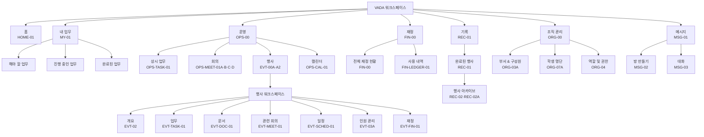
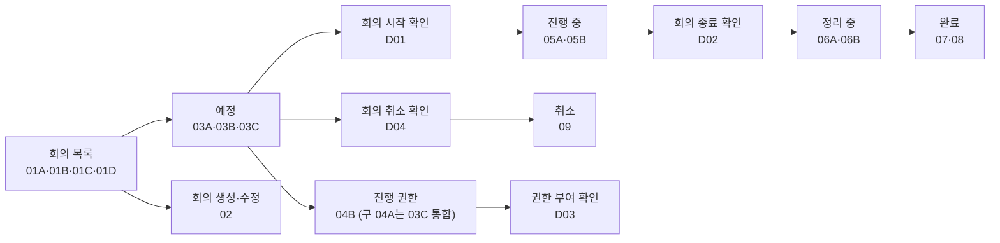
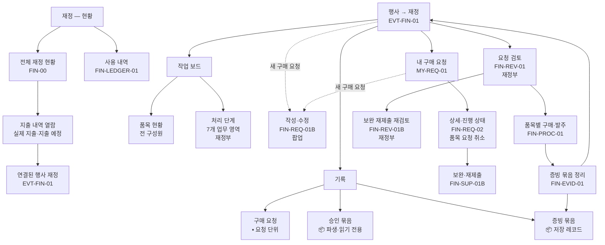
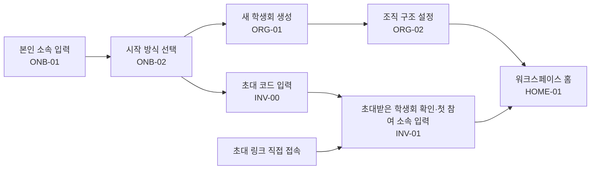

# VADA 메뉴 구조도 (v7)

기준일: 2026-07-21
기준 소스: 현재 VADA 와이어프레임 87개 화면과 화면 정의서

v7 변경: 최상위 메뉴에 `메시지`를 추가하고(2026-07-21 채택), 홈 검토안 `HOME-01K`를 화면 집계에 포함했다.

이 문서는 사용자가 실제로 탐색하는 **제품 메뉴 구조**와, 각 메뉴에서 이어지는 **역할·상태별 작업 화면**을 구분한다.

## 1. 구조 요약

- 워크스페이스의 최상위 메뉴는 `홈 / 내 업무 / 운영 / 재정 / 기록 / 조직 관리 / 메시지` 7개다.
- 사이드바에는 최상위 메뉴만 표시하며, `메시지`는 `조직 관리` 다음 마지막에 둔다.
- `운영`과 `조직 관리`는 진입 허브를 거쳐 하위 공간으로 이동한다.
- `메시지`는 허브 없이 방 목록으로 바로 진입하고, 방을 선택하면 대화 화면으로 이동한다.
- 특정 행사에 들어가면 `개요 / 업무 / 문서 / 관련 회의 / 일정 / 인원 관리 / 재정` 7개 탭을 사용한다.
- 역할별 화면, 상세 화면, 작성 화면, 패널, 모달, 확인 대화상자는 메뉴로 추가하지 않는다.
- 온보딩·학생회 생성·초대 참여·외부 학생용 모바일 화면은 워크스페이스 메뉴 밖의 독립 진입 흐름이다.

## 2. 전체 메뉴 구조도



## 3. 최상위 메뉴 정의

| 1차 메뉴 | 진입 화면 | 사용자 목적 | 하위 탐색 방식 |
|---|---|---|---|
| 홈 | `HOME-01` | 학생회 전체 운영 현황과 주요 알림 확인 | 요약 카드와 바로가기 |
| 내 업무 | `MY-01` | 여러 행사·상시 업무에서 내 담당 업무만 모아 처리 | 상태 탭과 범위·상태 필터 |
| 운영 | `OPS-00` | 상시 업무·회의·행사·캘린더 진입 | 4개 공간 선택 허브 |
| 재정 | `FIN-00` | 학생회 전체 재정 현황을 한눈에 확인 | 전체 재정 현황과 사용 내역 |
| 기록 | `REC-01` | 완료된 행사와 인수인계 아카이브 열람 | 완료 행사 목록에서 상세 진입 |
| 조직 관리 | `ORG-00` | 조직·학생 명단·역할 및 권한 확인 | 3개 공간 선택 허브 |
| 메시지 | `MSG-01` | 부서·구성원 단위 소통 방 확인과 대화 | 방 목록에서 대화 화면으로 진입 |

## 4. 운영

### 4.1 운영 홈

`운영 → OPS-00`

운영 홈은 다음 네 공간을 같은 위계로 보여주는 선택 허브다.

| 2차 공간 | 대표 화면 | 설명 |
|---|---|---|
| 상시 업무 | `OPS-TASK-01` | 행사에 속하지 않는 반복·상시 업무 칸반 |
| 회의 | `OPS-MEET-01A/B/C/D` | 역할에 맞는 전체 회의 목록 (미참가자 `01D` 포함) |
| 행사 | `EVT-00A/A2` | 진행 중인 행사 목록과 행사 워크스페이스 진입 |
| 캘린더 | `OPS-CAL-01` | 행사·상시 업무 마감과 회의 일정을 통합 열람. 행사에 연결된 일정은 `행사 일정 보기` 보조 행동으로 소유 행사의 일정 탭(`EVT-SCHED-01`)으로 이동 |

운영 홈에서는 회의 생성·행사 생성 같은 권한 행동을 제공하지 않는다. 해당 행동은 각 하위 공간에서만 노출한다.

### 4.2 상시 업무

```text
운영
└─ 상시 업무
   └─ OPS-TASK-01 상시 업무 칸반
      ├─ 전체 업무 / 내 업무
      ├─ 예정 / 진행 중 / 검토 필요 / 완료
      ├─ 업무 추가
      └─ 업무 상세 패널
```

상세는 같은 화면의 오른쪽 패널로 열리므로 별도 메뉴나 화면 ID를 만들지 않는다.

### 4.3 회의

회의 메뉴의 첫 화면은 사용자 권한에 따라 달라진다.

| 사용자 관계 | 목록 화면 | 제공 행동 |
|---|---|---|
| 일반 참가자 | `OPS-MEET-01A` | 회의 확인·참가·완료 기록 열람 |
| 진행 권한자 | `OPS-MEET-01B` | 회의 시작·진행·정리 |
| 회장단·부서장 | `OPS-MEET-01C` | 새 회의 생성 |

회의의 상태 흐름은 다음과 같다.



`OPS-MEET-02~09`와 `OPS-MEET-D01~D04`는 회의 메뉴에서 이어지는 상태·작업 화면이며 사이드바 하위 메뉴가 아니다.

역할·상태별 화면의 정확한 대응은 다음과 같다.

- 예정: 일반 참가자 `OPS-MEET-03A`, 생성자 `OPS-MEET-03B`, 진행 권한자 `OPS-MEET-03C`
- 진행 권한: 생성자 관리 `OPS-MEET-04B` (진행 권한자용 읽기 전용 현황은 `OPS-MEET-03C`에 인라인 통합 — 구 `OPS-MEET-04A`)
- 진행 중: 일반 참가자 `OPS-MEET-05A`, 진행 권한자 `OPS-MEET-05B`
- 정리 중: 일반 참가자 `OPS-MEET-06A`, 진행 권한자 `OPS-MEET-06B`
- 완료·취소: 참석자 `OPS-MEET-07`, 불참자 `OPS-MEET-08`, 취소 회의 `OPS-MEET-09`
- 확인 상태: 시작 `OPS-MEET-D01`, 종료 `OPS-MEET-D02`, 진행 권한 부여 `OPS-MEET-D03`, 취소 `OPS-MEET-D04`

### 4.4 행사

```text
운영
└─ 행사
   ├─ EVT-00A  행사 목록 — 일반 구성원
   ├─ EVT-00A2 행사 목록 — 운영진
   ├─ EVT-00B  새 행사 만들기
   └─ 선택한 행사 워크스페이스
      ├─ 개요
      ├─ 업무
      ├─ 문서
      ├─ 관련 회의
      ├─ 일정
      ├─ 인원 관리
      └─ 재정
```

행사 목록은 진행 중인 행사만 담당한다. 완료된 행사는 `기록 → 완료된 행사`에서 확인한다.

#### 행사 탭

| 순서 | 탭 | 대표 화면 | 연결되는 작업 화면 |
|---:|---|---|---|
| 1 | 개요 | `EVT-02` | 정보 편집 `EVT-02B`, 종료 `EVT-02C`, 후속 정리 `EVT-02D`, 완료 확인 `EVT-02E` |
| 2 | 업무 | `EVT-TASK-01` | 업무 상세 `EVT-TASK-02` |
| 3 | 문서 | `EVT-DOC-01` | 연결된 업무 문서·결과물 |
| 4 | 관련 회의 | `EVT-MEET-01` | 연결된 회의의 현재 상태 화면 |
| 5 | 일정 | `EVT-SCHED-01` | 원본 업무 상세 또는 회의 상세. `전체 캘린더 보기`는 통합 캘린더(`OPS-CAL-01`)로 이동하며 이 행사 시점을 강조 |
| 6 | 인원 관리 | `EVT-03A` | 운영 조직·행사 참가자·참여 설문 |
| 7 | 재정 | `EVT-FIN-01` | 내 구매 요청 `MY-REQ-01`, 구매 요청 작성·상세·보완 |

#### 인원 관리 내부 구조

```text
인원 관리
├─ 운영 조직
│  ├─ EVT-03C 빈 상태
│  ├─ EVT-01  최초 조직 설정
│  ├─ EVT-03A 보기
│  └─ EVT-03B 수정
└─ 행사 참가자
   ├─ EVT-04C 빈 상태
   ├─ EVT-04  참가자 명단
   ├─ EVT-04B 참석 확인 QR
   ├─ EVT-05  참여 설문 생성·관리
   └─ EVT-05B 기존 설문 교체
```

`운영 조직`과 `행사 참가자`는 행사 탭 아래의 내부 탭이다. 참여 설문과 QR은 참가자 관리에서 시작하는 작업 화면이다.

## 5. 재정

재정은 **학생회 전체 재정을 한눈에 보는 공간**이다. 구매 요청을 제출하려고 들어오는 곳이 아니다. 요청 제출은 행사 탭의 재정에서 시작한다.

재정 메뉴는 전 구성원에게 같은 두 현황 화면을 제공한다.

```text
재정                                   전 구성원 · 현황
├─ 전체 재정 현황      FIN-00          예산·집행률·행사별·부서별
└─ 사용 내역           FIN-LEDGER-01   시간순 지출 열람
```



### 재정 메뉴 원칙

- 재정의 목적은 **현황 열람**이다. 기본 노출은 `전체 재정 현황`과 `사용 내역` 둘뿐이다.
- 구매 요청은 각 `행사 > 재정(EVT-FIN-01)`에서만 작성·조회·처리한다. 행사에 연결되지 않은 통합 구매 요청함은 만들지 않는다.
- 행사 재정은 재정부에게만 탭을 **`작업 보드`(품목 현황·처리 단계)** 와 **`기록`(구매 요청·승인 묶음·증빙 묶음)** 두 그룹으로 나눈다. 일반 부원·부서장은 `품목 현황`만 보고(본인 요청은 `내 구매 요청`에서), 재정부는 `처리 단계`를 기본으로 본다. 작업 보드는 별도 상태를 저장하지 않고 같은 품목 상태를 역할별로 해석한다.
- `품목 현황`은 품목 카드를 진행 단계별 열에 배치하는 전 구성원용 칸반보드다. `처리 단계`는 재정부가 다음으로 처리할 실행분을 7개 업무 영역(요청 검토·구매 준비·물품 배송·수령·대여 이행·용역 이행·환불·증빙) 하위 탭으로 찾는 내부 칸반보드다. 배송·수령·이행은 구매 유형에 따라 물품·대여·용역 세 영역으로 나뉜다(대여는 반납 확인 포함, 용역은 미포함).
- **`기록` 그룹은 재정부 전용 요청·묶음 단위 아카이브다.** `구매 요청`은 요청 단위(▪, 취소 품목도 보존), `승인 묶음`은 선진행 동의된 승인 품목 묶음(📦, 파생·읽기 전용, 요청 취소·미동의 품목 자동 제외), `증빙 묶음`은 완료 저장된 실행분 재구성 레코드(📦)다. 각 탭에 건수 배지를 표시하고 묶음(📦)과 개별(▪)의 경계를 시각적으로 구분한다. 일반 구성원·부서장에게는 기록 그룹을 노출하지 않는다(본인 요청은 `내 구매 요청`, 확정 지출은 `사용 내역`에서 열람).
- `FIN-REV-01`·`FIN-REV-01B`·`FIN-PROC-01`·`FIN-EVID-01`은 행사 재정에서 시작하는 구매 워크플로우의 단계이며 메뉴에 올리지 않는다. `FIN-EVID-01`에서 증빙 묶음을 완료하면 `기록 > 증빙 묶음`에 레코드로 쌓여 다시 열람된다.
- **`증빙 관리`를 별도 메뉴로 만들지 않는다.** 증빙이 필요한 품목과 진행 중인 증빙 묶음은 각 행사 재정에서 처리하고, 완료된 증빙 묶음은 `기록 > 증빙 묶음`에서 열람한다.
- `FIN-00`의 요약 카드에서 실제 지출·지출 예정 내역을 열고, 각 지출에서 연결된 행사 재정으로 이동한다. 상시 지출은 연결할 행사가 없다.
- 일반 부원은 행사 재정에서 품목 진행과 요청을 조회한다. 부서장과 재정부는 새 구매 요청을 작성할 수 있다.
- `FIN-REQ-01B` 구매 요청 작성은 **독립 화면이 아니라 팝업이다.** `행사 재정(EVT-FIN-01)`과 `내 구매 요청(MY-REQ-01)`의 오른쪽 위 `새 구매 요청`이 여는 화면 위에 뜨고, 닫으면 여는 화면이 그대로 남는다. 메뉴에 올리지 않는다.
- `MY-REQ-01`은 이름과 달리 `내 업무`의 하위 메뉴가 아니다. 경로는 `운영 → 행사 → 재정 → 내 구매 요청`이다.
- 기존의 `재정 처리함` 명칭은 사용하지 않는다.
- `감사 보고서`는 메뉴·버튼·문서·내보내기 형태를 포함해 구현하지 않는다.
- 재정 처리 단위와 상태의 단일 기준은 `docs/VADA_FINANCE_SPEC.md`다. 이 문서는 메뉴 위치만 정의한다.

## 6. 기록

```text
기록
└─ 완료된 행사                     REC-01
   ├─ 발행·검토 중 아카이브 열람   REC-02
   └─ 초안 작성·검토·승인·발행     REC-02A
```

- 행사 완료와 아카이브 발행은 별개의 상태다.
- 아카이브 상태는 `미발행 → 초안 → 검토 중 → 발행` 순서다.
- `회의·결정 기록`은 별도 메뉴로 만들지 않는다. 완료 회의의 단일 원본은 `OPS-MEET-07 완료 회의록`이다.
- 완료 행사 상세의 업무·회의·문서·정산 항목은 원본 화면으로 연결한다.

## 7. 조직 관리

```text
조직 관리                         ORG-00
├─ 부서 & 구성원                  ORG-03A
│  ├─ 조직 수정                   ORG-03B
│  └─ 구성원 초대                 ORG-03C
├─ 학생 명단                      ORG-07A
│  ├─ 학생 명단 업로드·갱신       ORG-07B
│  └─ 학생회비 납부 명단 업로드   ORG-07C
└─ 역할 및 권한                   ORG-04
   └─ 기본 역할 변경              ORG-04B
```

- `ORG-00`은 세 하위 공간을 선택하는 허브다.
- 부서 & 구성원, 학생 명단, 역할 및 권한은 같은 위계다.
- 수정·초대·업로드·역할 변경은 권한이 있을 때만 보이는 작업 화면이다.

## 8. 메시지

```text
메시지                            MSG-01
├─ 새 메시지 방 만들기            MSG-02
└─ 대화                           MSG-03
   ├─ 인원 추가
   └─ 방 나가기
```

- `MSG-01`은 허브가 아니라 방 목록 그 자체다. 방이 하나도 없으면 같은 화면이 빈 상태로 바뀐다.
- 방은 분류(`일반` 또는 행사)로 묶어 보여준다. 분류는 목록을 묶는 기준일 뿐이며, 행사 워크스페이스의 7개 탭 구성은 바꾸지 않는다.
- `MSG-02`는 학생회 조직도를 그대로 사용한다. 부서를 통째로 선택하거나, 부서를 펼쳐 개별 구성원을 선택한다. 개인 한 명이면 개인 대화, 여러 명이면 그룹 대화가 된다.
- 방 생성은 전 구성원이 할 수 있다. 회의·행사와 달리 공식 기록이 남는 절차가 아니므로 생성 권한을 제한하지 않는다.
- `MSG-03`은 왼쪽 방 목록과 오른쪽 대화로 구성한다. 방을 열면 안 읽음 표시가 지워지고 홈의 메시지 알림에 반영된다.
- 메시지 첨부는 대화 공유용이며 정산 증빙이 아니다. 증빙 등록은 재정의 `FIN-EVID-01`에서만 한다.

## 9. 워크스페이스 메뉴 밖의 진입 흐름

### 9.1 온보딩·학생회 생성·참여



이 흐름은 워크스페이스에 들어오기 전 단계이므로 사이드바 메뉴에 포함하지 않는다.

### 9.2 외부 학생 모바일 참여

```text
공개 참여 설문 링크
├─ EXT-02A 참여 설문
├─ EXT-02B 신청 완료
└─ EXT-02C 예외·종료 상태

현장 QR
├─ EXT-01A 참석 확인
└─ EXT-01B 참석 결과
```

외부 화면은 가입이나 워크스페이스 메뉴 없이 공개 링크·QR로 진입한다.

## 10. 화면 87개와 메뉴의 관계

| 영역 | 화면 수 | 메뉴 구조에서의 위치 |
|---|---:|---|
| 온보딩·학생회 생성·참여 | 6 | 워크스페이스 진입 전 |
| 홈·내 업무 | 3 | 최상위 메뉴 (`HOME-01K` 검토안 포함) |
| 운영 홈·상시 업무 | 2 | 운영 |
| 회의 | 20 | 운영 → 회의의 역할·상태 흐름 |
| 행사 | 24 | 운영 → 행사 목록과 7개 탭 |
| 캘린더 | 1 | 운영 → 캘린더 |
| 재정 | 11 | 전체 재정과 행사 재정의 연결 흐름 (`FIN-00B`, 구매 요청 작성·보완 재제출은 권한 보유 변형만, 재검토 화면 포함) |
| 기록 | 3 | 기록 → 완료된 행사 |
| 조직 관리 | 9 | 조직 관리 허브와 세 하위 공간 |
| 메시지 | 3 | 메시지 → 방 목록·만들기·대화 |
| 외부 참여 | 5 | 공개 링크·QR |
| **합계** | **87** | 화면·정의서·컴포넌트 1:1 |

87개 화면은 87개 메뉴가 아니다. 메뉴는 사용자의 정보 탐색 구조이고, 나머지 화면은 역할 분기·상태 변화·작성·검토·확인 과정이다.

화면 총수는 이 표를 유일한 기준으로 삼는다. 다른 문서는 숫자를 중복 기재하지 말고 이 절을 참조한다.

`HOME-01K`는 홈에 끼룩이 브리핑을 얹은 검토안이며, 채택 여부가 정해지기 전까지 `HOME-01`과 병존한다. 채택하면 `HOME-01`을 대체하고 합계는 88개가 된다.

## 11. 확정 제외·중복 방지 원칙

- `홈 > 내 업무`처럼 내 업무를 홈 아래에 두지 않는다. 홈과 내 업무는 각각 최상위 메뉴다.
- `내 업무 > 내 구매 요청`을 만들지 않는다. 내 구매 요청은 행사 재정에 속한다.
- `기록 > 회의·결정 기록`을 별도 메뉴로 만들지 않는다.
- 행사 목록에 완료 행사 필터를 만들지 않는다. 완료 행사는 기록으로 이동한다.
- 행사 일정·관련 회의·문서 탭에서 원본을 중복 수정하지 않는다.
- 역할별 화면과 확인 모달을 사이드바 메뉴로 만들지 않는다.
- `재정 처리함`과 `감사 보고서` 메뉴를 만들지 않는다.
- `증빙 관리`를 재정의 하위 메뉴로 만들지 않는다. 증빙이 필요한 품목과 증빙 묶음 작업은 각 행사 재정 안에서 처리하며, 기존 `FIN-EVID-01`의 수정·대체 여부는 재정 기준 문서 확정 후 결정한다.
- 재정 메뉴에 구매 요청 제출 진입점을 만들지 않는다. 요청 제출은 `운영 → 행사 → 재정`에서 시작한다.
- 행사 워크스페이스에 `메시지` 탭을 만들지 않는다. 행사 관련 방도 메시지 메뉴에서 분류로 묶어 본다.
- 메시지를 `조직 관리` 아래 하위 메뉴로 넣지 않는다. 메시지는 독립된 최상위 메뉴다.
